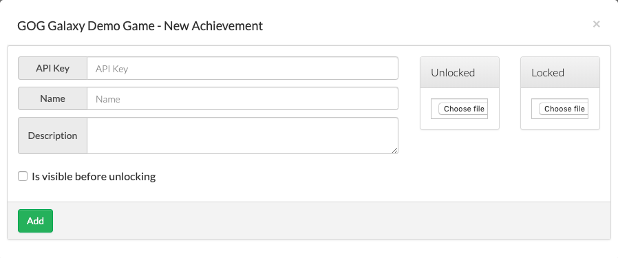
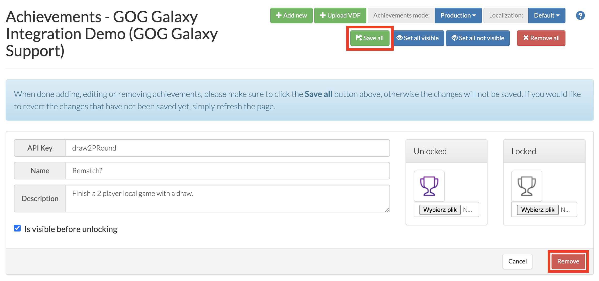
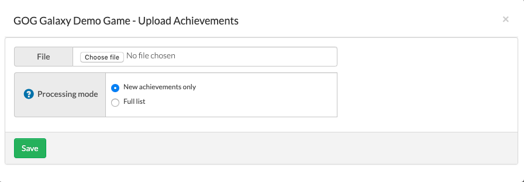
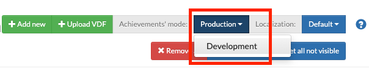
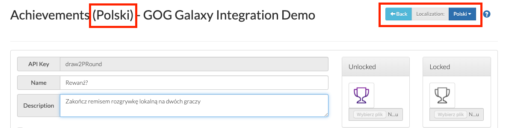

# Achievements Screen

This is the place in the Developer Portal for setting up and managing achievements implemented with the [GOG GALAXY SDK](sdk-stats-and-achievements.md) in your game. You can add new achievements and their icons or edit/remove existing ones. It is also possible to upload a [VDF file](sdk-steam-import.md) imported from Steam, as well as define different achievement names and descriptions based on a chosen game language (localization) or set all achievements as visible or not.

## Adding a New Achievement

To add a new achievement:

1. Click the green *Add new* button.

2. In the resulting *New Achievement* window, fill in the following fields:

    

    - *API Key* — a unique key used in the source code of your game; please note that it shouldn’t contain any special characters except dots (.) and underscores (_)
    - *Name* — the name of the achievement
    - *Description* — a short explanation of what this achievement means.

3. Choose and upload icon files for both the locked and the unlocked versions of an achievement:

    - allowed image types: JPEG, PNG (**lossless PNG recommended**)
    - minimum resolution: 60 x 60 px (**240 x 240 px recommended**)
    - maximum size: 2 MB

4. Decide on whether this achievement should or should not be visible before unlocking by checking the *Is visible before unlocking* box.

5. Click the green *Add* button.

!!! Important "Save Changes Before Adding a New Achievement"
    Any newly added achievement is saved immediately and the page is reloaded, thus discarding all changes that were not saved with the green *Save All* button prior to adding this achievement.

## Editing an Existing Achievement

It’s done exactly as with adding a new achievement, only without steps #1 and #5, obviously.

## Removing an Achievement

After you have deleted an achievement by clicking the red *Remove* button and confirming the operation, please make sure to click the green *Save All* button to implement the removal. Otherwise, the deleted achievement will be restored with the next page refresh.

## Adding Achievements Imported From Steam

To add achievements imported from Steam:

1. Import a VDF file as described in [*Importing Achievements Using the Steam VDF File*](sdk-steam-import.md).

2. On the *Achievements* screen of Developer Portal, click the green *Upload VDF* button.

3. In the resulting Upload Achievements window, select your VDF file and decide on how the imported list should be processed:

    

    - *New achievements only* — only the achievements that are present in the VDF file, but not in GOG GALAXY, will be created
    - *Full list* — besides creating new achievements, the whole list will be processed, updating the existing items and deleting the ones not present in the VDF file.

4. Click the green *Save* button.

!!! Warning "Potential Conflicts in Released Builds"
    When importing achievements from a VDF file to an already released game, please bear in mind that:

    - [localized versions](#setting-localized-versions-of-achievements) of achievements which are absent in the VDF file will be deleted from the DevPortal,
    - all unlocked achievements will be replaced with the ones from the file. As a result, current stats will also be affected.

## Setting Achievements Mode

Achievements can be available in two modes: Production or Development. The chosen mode affects how locked achievements are displayed to players in the GOG GALAXY client:

- *Production* — all visible achievements are shown
- *Development* — users can see only achievements they’ve already unlocked.

To set a mode, just click the blue button next to *Achievements Mode* and select the desired mode:

## Setting Localized Versions of Achievements

If you want to provide localized names and descriptions for achievements in your game, you can do it here:

1. Click the blue button next to *Localization* (labelled *Default* by default 😉).

2. Select the desired language from a drop-down list of languages supported by GOG GALAXY. The page title will change to reflect the chosen language:

    

3. Enter the localized version of a name and description for a particular achievements (all other fields and options are unavailable for editing).

4. Make sure to click the blue *Save* button for each localized achievement.

5. If you want to create more localizations, just repeat the above steps. When you’re done, click the blue *Back* button at the top of the screen to return to the main *Achievements* screen.
