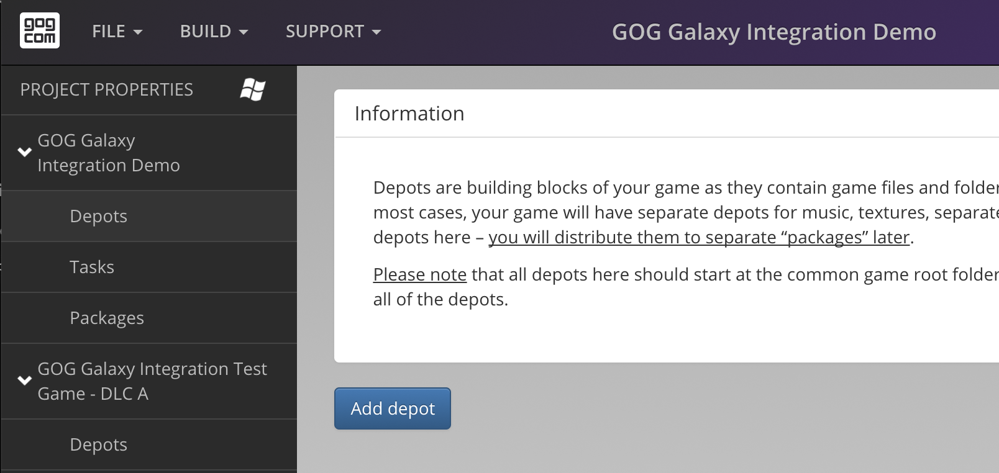
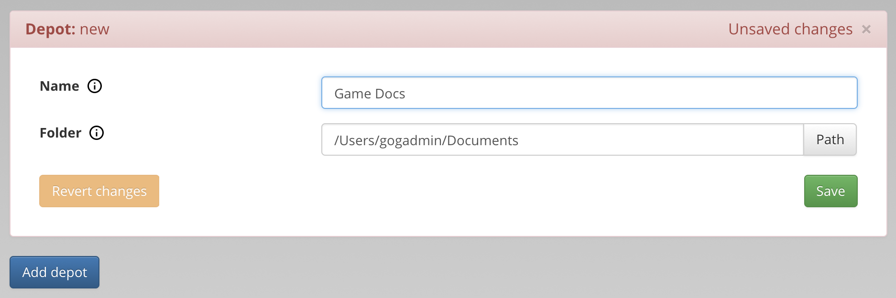

# Adding Depots

To add a new depot, click the blue *Add depot* button:

You will be prompted to select a folder that contains the files that you want to be in the depot. All files and folders in the selected folder will be added to the depot:

Once you select a folder, its name will default to the name of the folder you selected, however you can change it. We encourage you to name depots based on their contents, for example:

- *main* — for a depot containing universal files required to play the game, or
- *french* — for files required to play the game in French.

!!! Info
    The blue *Add depot* button will be disabled, if any of the existing depots uses an invalid path or is not saved.

Please note that files and folders from each depot will be installed into the target directory, preserving the source structure. It is possible to have multiple depots in one file tree (the same file path) on a user’s machine. For example, folders with assets named “*base*”, “*language-spanish*”, “*language-french*” can all be placed in the same *game_content/assets/* directory. When preparing packages, the developer should include the first depot in all packages, and the second and the third in the relevant language packages. The content of these two depots from one package will be installed (merged) to *game_dir/game_content/assets/* on a user’s machine.

!!! Warning
    It is not allowed to put files with the same names but different content in one package.

!!! Important
    Files from base depots in a game can be overwritten by depots from a DLC.
    

    Similarly to depots in one package, depots from different DLCs cannot have the same names but different content.