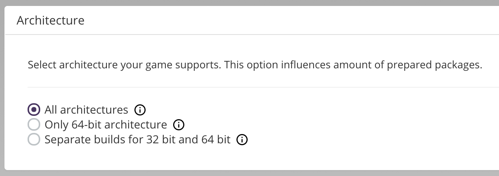

# Architecture (Windows Only)

This section describes what operating system architectures your game will run on.

### All architectures

- Your game has only a 32-bit executable and therefore can be launched on both 32- and 64-bit operating systems.
- Your product will be available to all end-users, regardless of their system architecture, as 32-bit executables run on 64-bit machines.
- Choosing this option doesn’t create additional packages.

### Only 64-bit architecture

- Your game has only a 64-bit executable and therefore can only be launched on 64-bit operating systems.
- Your product will be available only to users using 64-bit operating systems.
- Choosing this option doesn’t create additional packages.

### Separate builds for 32-bit and 64-bit

- Your game has separate executables for both 64-bit and 32-bit operating systems, and, thus, different executables will be used on different systems.
- Choosing this option will split every existing package into two (one for each architecture).
- Your product will be available to all end-users, regardless of their system architecture, as 32-bit and 64-bit executables will be provided in separate packages.