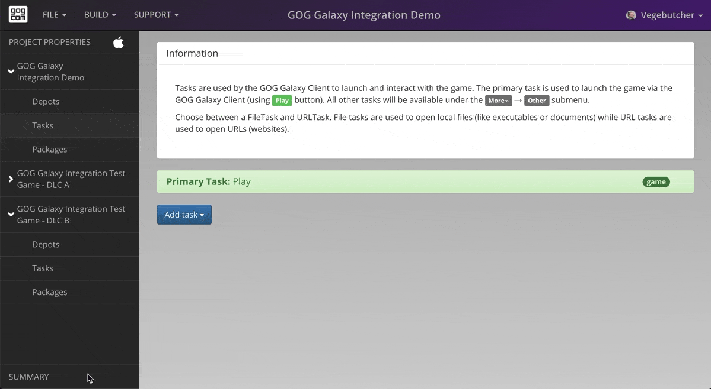

# Build Your Game

Build Creator uses GOG GALAXY Pipeline Builder to process your game files and deliver the whole build into the GOG GALAXY Content System, which is included by default. Each build is a full game with all the package variants and can be published on any branch.

To build a game:

1. Go to [*Summary*](bc-summary-issues.md) window and click the green *Build game* button or select *Build→Build game* option from the top menu.
2. Select a branch that you would like to publish the uploaded build to. [Learn more about branches](bc-branches.md).

    !!! Attention
        For security reasons, you cannot publish to the Master or any Public branch from GOG GALAXY Build Creator.

    !!! Tip "Using *Builds & Branches* Page in the GOG Developer Portal"
        You can always publish or unpublish your build to any branch on  [*Builds* tab](build-branches.md) of the *Builds & Branches* page (go to the [Games page](https://devportal.gog.com/panel/games) of the GOG Developer Portal and click *Builds* button next to a desired product).

3. Enter a [Version](bc-version.md) name. For your convenience, when the *Version* input field is active, GOG GALAXY Build Creator will display version names of the latest published builds and their branches.

    !!! Info "Version Name, Branches and Operating Systems"
        If you want to publish your build to a branch, then the version name must be unique across all branches, but can be shared with other platforms (operating systems supported by GOG, i.e. Windows, macOS, and Linux). This means that you can have up to three builds with the same version name – say, “0.4.4” – but each for a different OS.

4. Optionally, change the *Cache folder* directory of GOG GALAXY Build Creator. The cache is used to store processed files before being sent to the GOG Content Delivery network. Use the same cache folder for a particular game to speed up its build process.

    !!! Caution "Cache Folder Size"
        Make sure you have enough disk space, since the cache folder can grow big.

5. Click the green *Build game* button.

