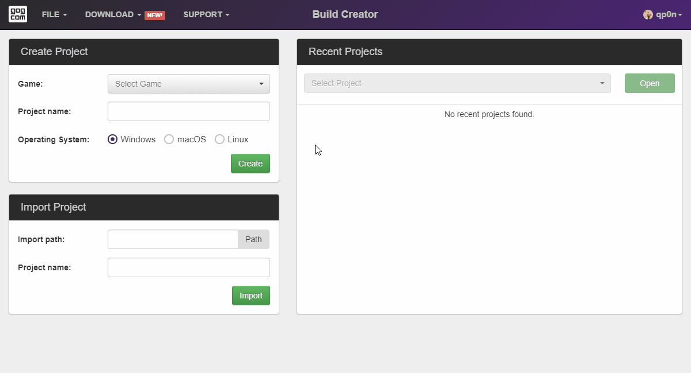

# Creating a Project

1. Click *Game* drop-down menu in the *Create Project* section of the starting screen and select your game. Make sure that the correct operating system (Windows, macOS or Linux) is selected.
2. The *Project name* field will be filled out automatically using the game name, but you can change it to whatever you want.
3. Once you’re ready, click *Create* button.

!!! Info "Separate Project for Each OS"
    You will have to prepare a separate project for the Windows, macOS, and Linux versions of your game.

!!! Tip
    Project name is your internal name for the project and does not have to match the game name. It is here mostly for your convenience.

Alternatively, you can:

- import an existing JSON project using the [*Import Project*](bc-import-project.md) section, or
- continue working on a locally saved project by choosing it in the [*Recent Projects*](bc-open-project.md) section.