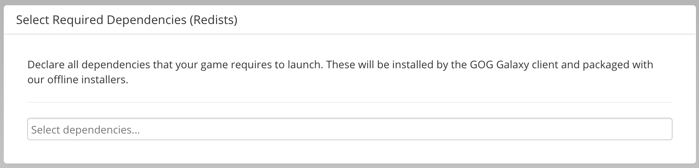

# Dependencies (Windows Only)

This section describes all dependencies (redists) that your game requires to launch. Those will be installed by the GOG GALAXY client and packaged with our offline installers.

To add new dependencies, click the *Select dependencies…* input field. You can either scroll through the drop-down list or narrow the search by typing any words/numbers of the dependency name. Repeat until all required dependencies are added to the project.

!!! Important
    If your game requires a dependency that is not listed here, please contact[our support team](https://devportal.gog.com/support/contact)
!!! Attention
    Please note that Linux games should be distributed with all necessary packages supplied in the depot. For more information, see [Guidelines for Linux Games on GOG](linux-guidelines.md).