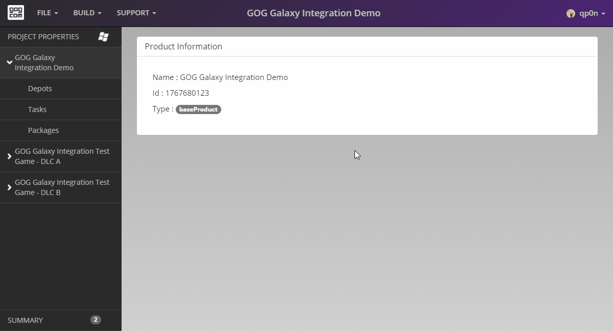

# Depots

Depots are folders that contain the core game data and assets required to run a game, such as executables or textures. In fact, a depot is just a directory/folder on a developer’s hard drive.

To add a depot to a game:

1. Click *Depots* button on the left pane.
2. Click the blue *Add depot* button. A prompt will appear asking you to select a folder containing files that you want to include in the depot. Navigate to the game root directory and select it as the main depot.
3. Now you can enter your depot *Name* (this name will not be displayed to the end user and is here for your convenience). We advise you to name your depots according to their contents as this will prove useful later. Name your depot “main” as it contains all of the game files necessary to play the game.
4. Once your depot is ready, click the green *Save* button and the depot will be created.

In this example we are adding only one depot to our game, but this process can be repeated as many times as required. You can find more information in [*Adding Depots*](bc-adding-depots.md).

In case of macOS application bundles, please refer to the [*Preparing Depots for macOS Application Bundle*](bc-macos-depot.md) article.