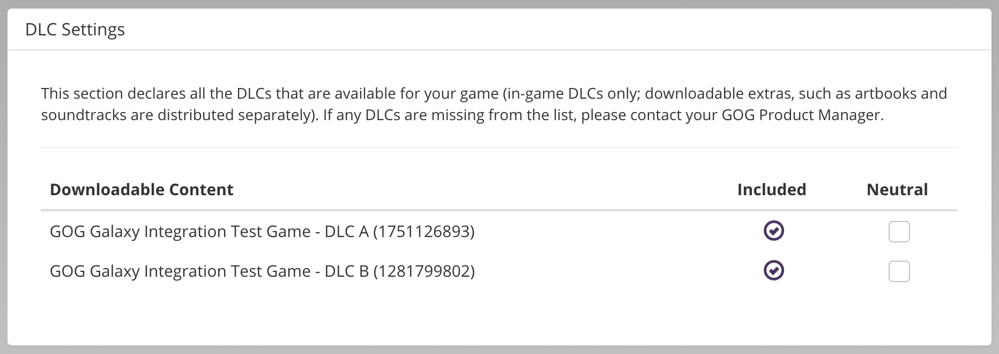

# DLC Settings

This section displays all DLC products that are assigned to your main product.

You can disable DLC products in your build by unchecking the *Included* checkbox next to a DLC name. Disabled DLCs will not be provided with the build.

!!! Important
    Please note that even if a DLC is depot-less — that is, it does not require any additional files to be downloaded — it still needs to be enabled, if you want to deliver this DLC to end-users.

If your game uses properties that would generate extra packages (e.g.: *Languages→Separate language builds*), checking the *Neutral* box next to a DLC name will make it universal, meaning that no matter how many packages the main product has, the DLC will only have one package.