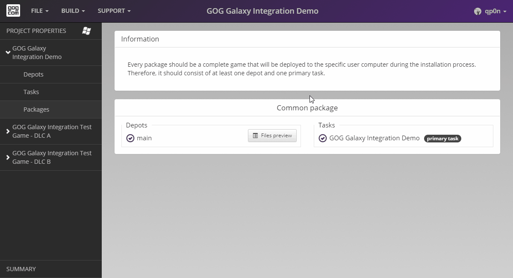

# DLCs

In this example, our game DLCs do not provide any additional assets, so we don’t need to add any depots or tasks for them.

If your game DLCs comes with additional files or tasks, you will have to repeat the following steps for each DLC:

1. [Product details](bc-product-details.md)
2. [Depots](bc-depots.md)
3. [Tasks](bc-tasks.md)
4. [Packages](bc-packages.md)

!!! Info
    Upon installation all GOG products will generate a so-called mini-manifest file, even if the product doesn’t have any depots or tasks defined. These mini-manifest files can be found in the game installation folder and are used by the GOG GALAXY SDK to [detect DLC presence](sdk-dlc-discovery.md) using the [`IsDlcInstalled`](https://docs.gog.com/galaxyapi/classgalaxy_1_1api_1_1IApps.html#a46fbdec6ec2e1b6d1a1625ba157d3aa2) method.

If you want to learn more about DLCs, please refer to [DLC Settings](bc-dlc-settings.md) article.