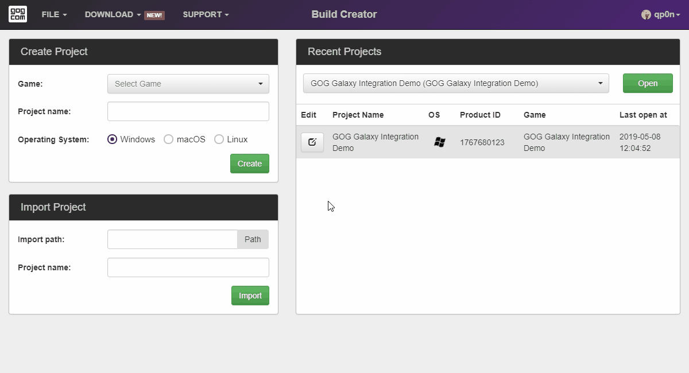

# Download Game Build

If you already uploaded a build of your game to the GOG Developer Portal, you can download it using Build Creator:

1. Click *Download* button visible on the top bar of the Build Creator main window.
2. Select *Browse for builds* from the drop-down menu.
3. From the *Game* drop-down list select a game that you want to download a build for.
4. Wait for Build Creator to fetch the list of available builds and select the build you want to download from the *Build* drop-down list.
5. Enter or select the *Download path* you want the build to be downloaded to.
6. Click *Download* button to start the download process.

Once the build is downloaded you will have the option to:

- close the window and do nothing by clicking *Close*,
- open the download folder by clicking *Show in folder*,
- or import the downloaded build project to Build Creator by clicking *Import downloaded project*.

