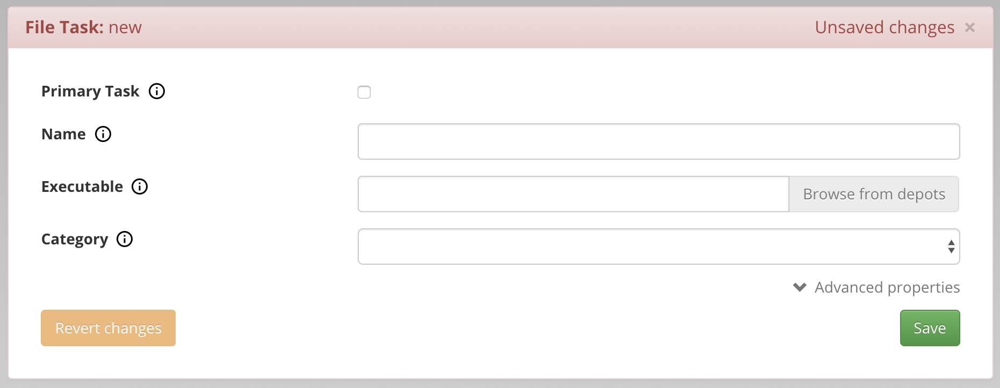
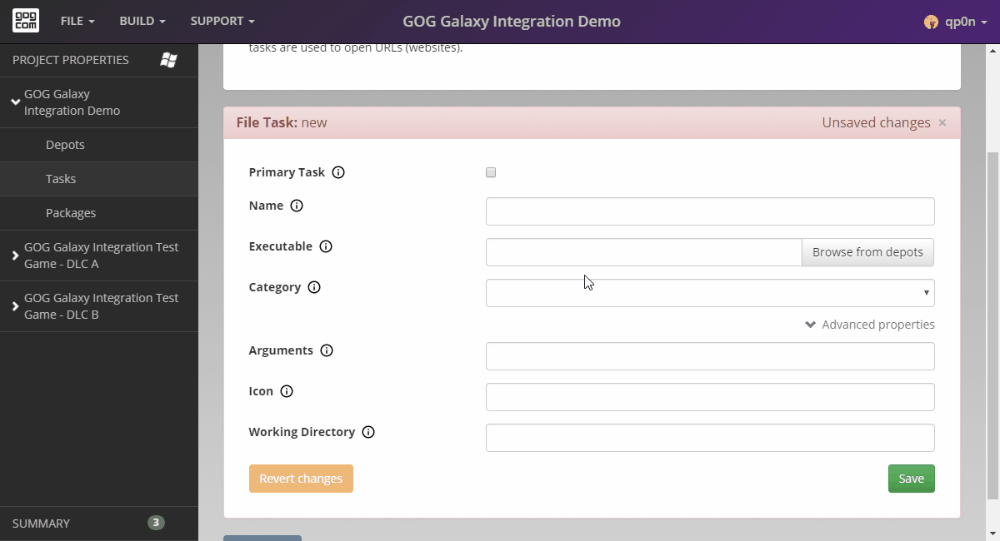
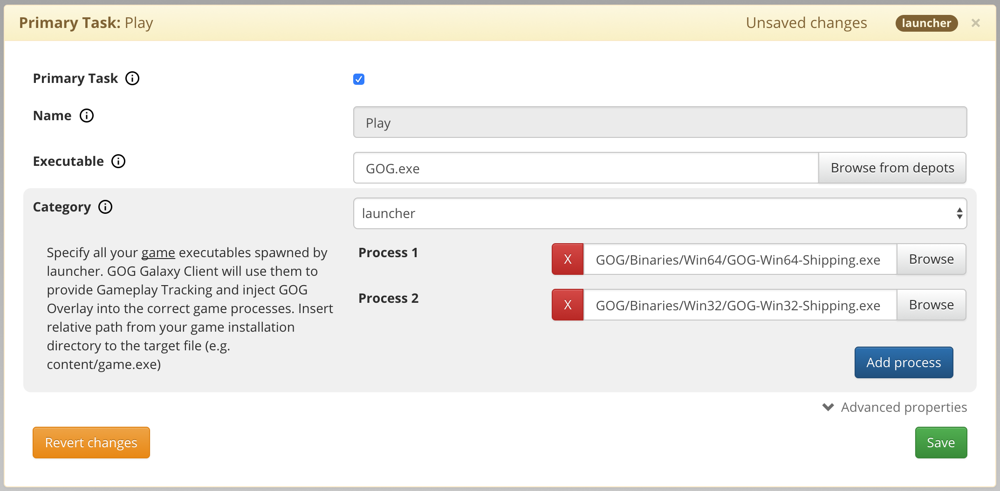

# File Tasks

File Tasks tell the GOG GALAXY client how to work with the files included in the depots. All task paths start at the installation directory: the root folder of a game.

## Basic Properties

- **Primary task**

    Primary tasks are used by the GOG GALAXY client to launch the game (when *Play* button is clicked) and to create the main shortcut to the game. Every package should have its own primary task.

- **Name**

    A task name that will be displayed in the GOG GALAXY client in *More→Other* dropdown menu of the game.

    The primary task name field will be automatically populated using the product name and it can’t be changed.

- **Executable**

    The file that will be run when the end-user executes this task. Please make sure to include the relative path from your game installation directory to the target file. For example:

    - *subdir/game.exe* in a Windows project, or
    - *Contents/MacOS/game* in a macOS project.

    You can use *Browse from depots* button to browse through all files included in the game depot and select the game executable:

  

!!! note "Executable Name in macOS"
    All [macOS app bundles](https://developer.apple.com/library/content/documentation/CoreFoundation/Conceptual/CFBundles/BundleTypes/BundleTypes.html#//apple_ref/doc/uid/10000123i-CH101-SW14) contain an executable file inside of them. Name of that executable will always be identical to the app bundle name minus the *.app* extension, and is usually located in *Contents/MacOS* folder. This is the file that the executable path of your macOS project has to point to.

!!! IMPORTANT "File Task in Unreal Engine Games"
    In case of **Unreal Engine** games, create a Primary Task, link it to your main game executable (located in the root directory of a game), for example *MyGame.exe*, select **Launcher** as its category, then specify all executables that are spawned by the launcher in their **Process #** input fields. These executables are located in subfolders created for each [package](https://docs.unrealengine.com/en-US/Engine/Basics/Projects/Packaging/index.html) prepared in Unreal Engine. Please see the screenshot below:

    

- **Category**

    Describes the type of a file your task should open:

    - **Game**

        Describes a task that will directly run the main executable of the game. The GOG GALAXY client will use it to provide Gameplay Tracking and inject the [GOG Overlay](gc-overlay.md).

    - **Launcher**

        Describes tasks that will run a launcher application that in turn may spawn game executables. If applicable, select **Launcher** as a primary task of your game.

        You will be prompted to add a path to the main executables of your game. Specify all executables spawned by the launcher. The GOG GALAXY client will use them to provide Gameplay Tracking and inject GOG Overlay for defined processes. The process path should be relative from your game installation directory to the target file, for example *content/game.exe*.

    - **Tool**

        Should be used with executables that are not part of the game itself, for example a map editor.

    - **Document**

        Should be used with documents such as a game manual or a strategy guide.

    - **Other**

        For all files that do not match any of the above categories.

## Advanced Properties

- **Arguments**

    Arguments that will be used when launching a given task.

- **Icon**

    An icon assigned to a given task. By default, it is a process or a system default icon.

    The Primary tasks use a standardized GOG Game icon created by our Design team.

- **Working directory**

    Overrides the working directory of executables. The file will be executed as if it was launched from this directory. All relative paths used by the executable will start here. When empty, it defaults to the [Installation Directory](bc-installation-dir.md) of the game.