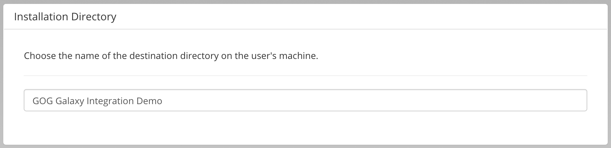
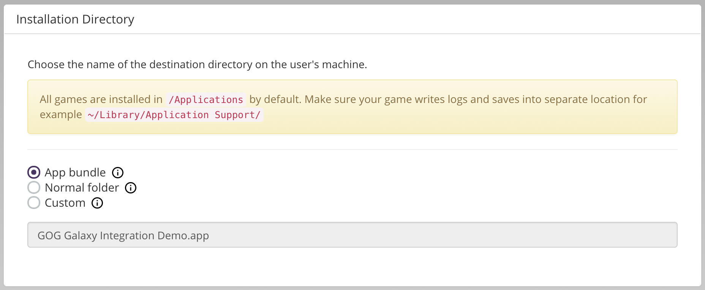

# Installation Directory

## Windows and Linux

Define the name of the folder, in which the game will be installed in. It defaults to the game name, but you can change it to any valid folder name.

## macOS

For macOS projects, we recommend installing your game as an app bundle. By default, Build Creator will generate a path with the *.app* extension.

If you want to install as a folder with the game files inside, please use the *Normal folder* option, and if you want to change the name of the installation directory, select *Custom*.

For more info, please see [Preparing Depots for macOS Application Bundle](bc-macos-depot.md).