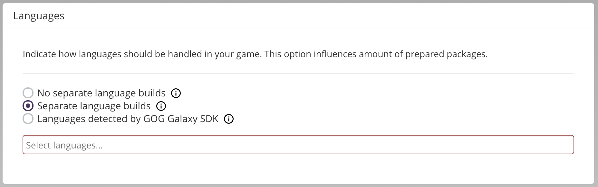

# Languages

This section describes how language selection is handled in your game.

### No separate language builds

- Your game has in-game language selection options or supports English only.
- This will generate only one package.

### Separate language builds

- Your game has language specific depots or tasks for each language, and you want the end-user to select a game language in the GOG GALAXY client.
- You will be prompted to select supported languages. New packages will be created for each of the specified languages.
- The end-user will be able to select a game language in the GOG GALAXY client or by downloading appropriate offline installers from GOG.com.
- The end-user will not be able to change languages when offline, but the download size will be smaller (only necessary localization files are downloaded).

### Languages detected by the GOG GALAXY SDK

- Your game uses the GOG GALAXY SDK to [detect the language](https://docs.gog.com/galaxyapi/classgalaxy_1_1api_1_1IApps.html#a3f9c65577ba3ce08f9addb81245fa305) chosen by the end-user.
- This will produce only one package.
- The end-user will be able to select the game language in the GOG GALAXY client or by downloading appropriate offline installers from GOG.com.
- The end-user will be able to switch languages when offline in the GOG GALAXY client, but the download size will be bigger (all localization files are downloaded).

!!! Tip
    If you want to use separate builds along with the GOG GALAXY SDK language selection methods, please choose *Separate language builds*.