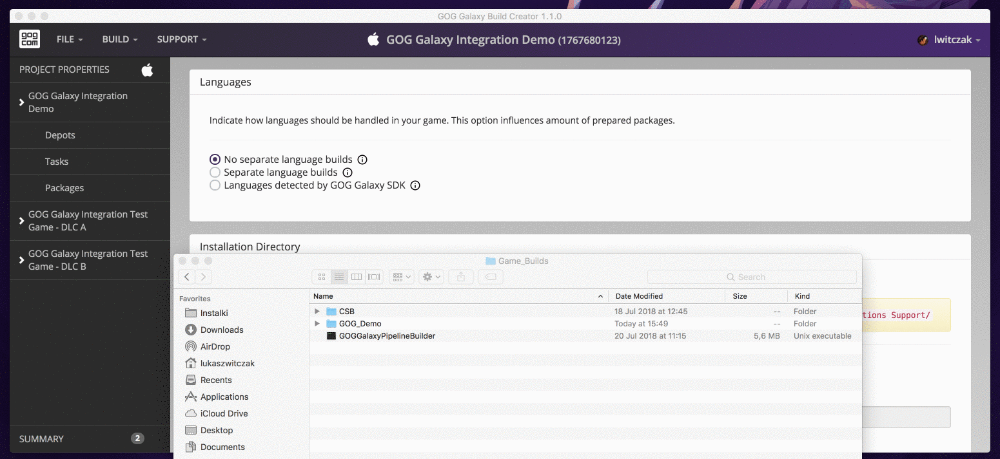
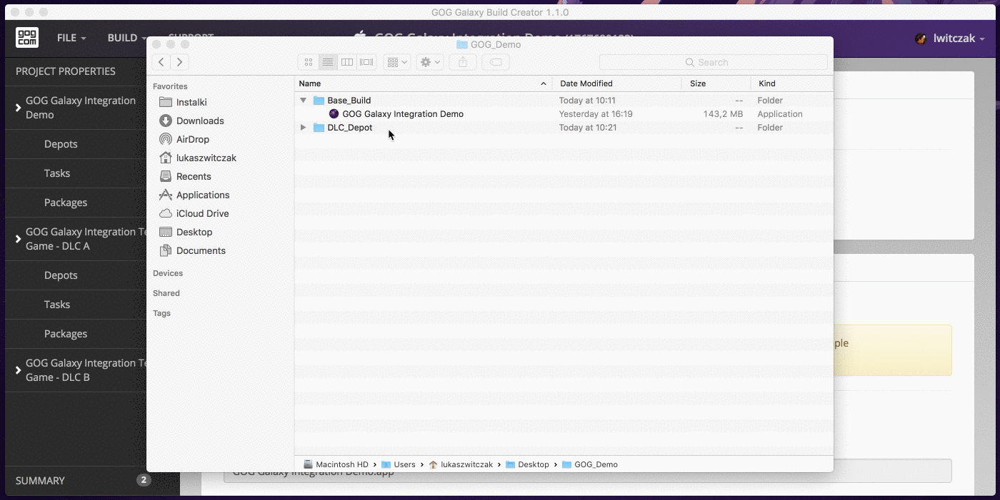

# Preparing Depots for macOS Application Bundle

The procedure for adding depots for the macOS application bundle is similar to the one [described before](bc-depots.md). However, the devil is in the details, so here we will explain the difference.

!!! Important
    Please make sure that your depot path ends at the **app bundle** level. You will also need to select *App bundle* in the [*Installation Directory*](bc-installation-dir.md) section of *Project Properties* window.

In the simplest case (only one depot), select your *.app* directory in the depot folder prompt:

In case of having multiple depots across the game and its DLCs, you need to remember that all depots in a specific package are merged during installation process into the same [installation directory](bc-installation-dir.md). Therefore, all files in depots should be placed in their target paths and all necessary folder structures need to be recreated in each depot.

For example, if your DLC folder path is *C:/myGame/macOS/game.app/Contents/Resources/myDLC*, you can:

1. Move the DLC folder to a separate location: *C:/myGame/macOS/my_dlc/Contents/Resources*.
2. Click the blue *Add depot* button.
3. Select *C:/myGame/macOS/my_dlc*

Now, both depots:

- main depot — *C:/myGame/macOS/==game.app==*
- DLC depot — *C:/myGame/macOS/==my_dlc==/Contents/Resources/myDLC*

start at the same **level** (*C:/myGame/macOS/*). Because of this, the folder structure on an end-user’s machine will look like:

*/Applications/<[Installation Directory](bc-installation-dir.md)>/Contents/Resources/myDLC*

You can preview the end-user’s folder structure in [package preview](bc-package-preview.md).