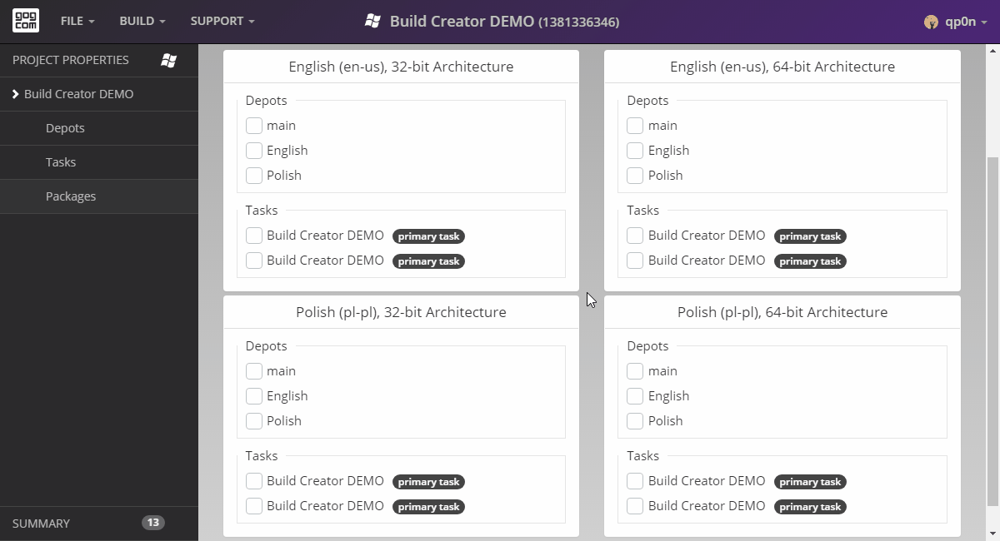

# Multiple Packages

If your project has multiple packages, please remember to add only appropriate depots and tasks to each package. 

To add a task or a depot to a package, simply click the checkbox next to that task or a depot name. Black tooltips help you to choose the right option — the details of an option are displayed, when you hover a mouse cursor over it:

