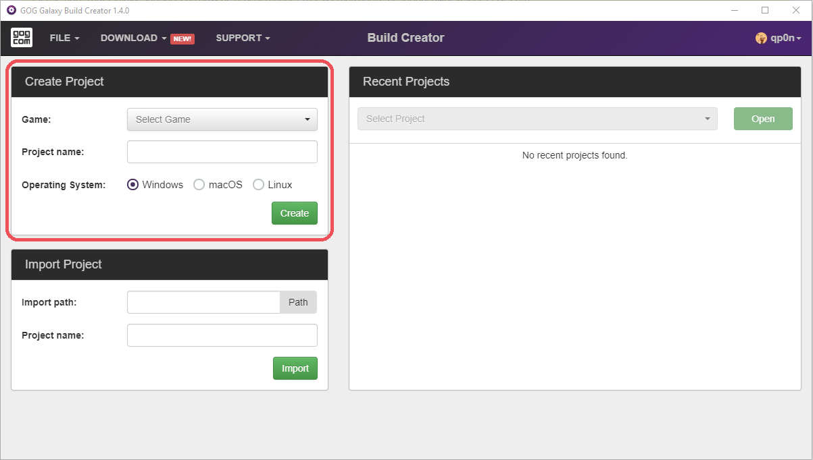

# New project

Follow these steps to start a new project in GOG GALAXY Build Creator:

1. Select the *Game* you want to create the project for. The *Game* drop-down list will be automatically populated with games that you have access to in the GOG Developer Portal.
2. Set the *Project Name* to anything you want. Project name will not be displayed to end-users and is here for your convenience only.
3. Select the *Operating System* for your current project.

!!! Important
    Please note that you will need to create seperate projects for **Windows**, **macOS** and **Linux** versions of your game.

Once all of the above is set, you can create the project by clicking the green *Create* button. The new project will be created and you will be taken to the project screen.