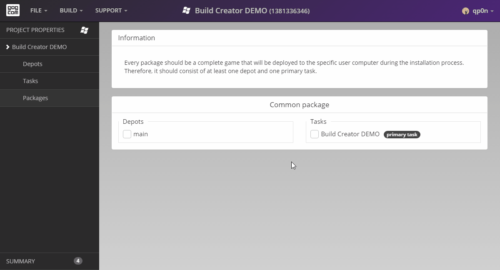

# One Package

Every single package is a complete game that will be deployed to end-users taking into account language of their choice and their OS architecture. The number of packages can be changed in the *Languages* and *Architecture* sections of *Project Properties* window. When preparing packages, you have to define which depots and tasks should be put together to create a certain build of your game as shown here and in the following articles.

If your project has only one package, you will need to add all of the created depots and tasks to that package.

To add a task or a depot to a package, simply click the checkbox next to that task or a depot name:

