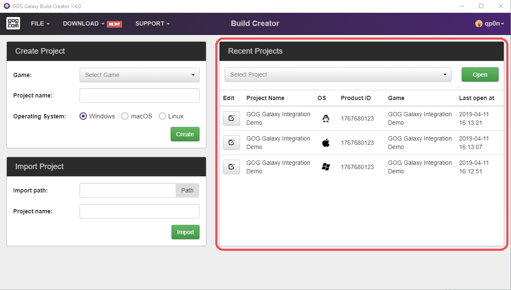
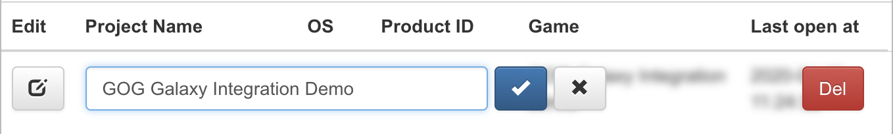

# Open/Edit an Existing Project

If you’ve already created a project, it will be available in the *Recent Projects* section. To open a project, simply select it from the list and then click the green *Open* button. You can also edit an existing project using the gray “pen and paper” button: 

In edit mode you can change the project name and confirm it using the blue tick button, or cancel using the gray “x” button. You can also remove the project entirely by clicking the red *Del* button (you will be asked to confirm this action).

