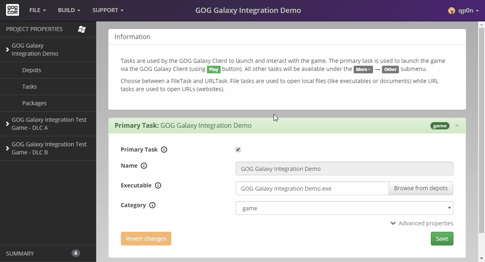

# Packages

*Packages* define which depots and tasks should be put together to create a working game build. Each package should contain all of the depots and tasks required to launch a game in the specified configuration.

Because our game uses a universal architecture (*Project Properties→Architecture→All architectures*) and has no separate language builds (*Project Properties→Languages→No separate languages build*), its project will have only one package. This package requires the *“main”* depot and the *“GOG GALAXY Integration Demo”* task to run, so let’s add them by checking boxes next to their labels:

For more on packages, please see:

- [One Package](bc-one-package.md)
- [Multiple Packages](bc-multiple-packages.md)
- [Package Preview](bc-package-preview.md)