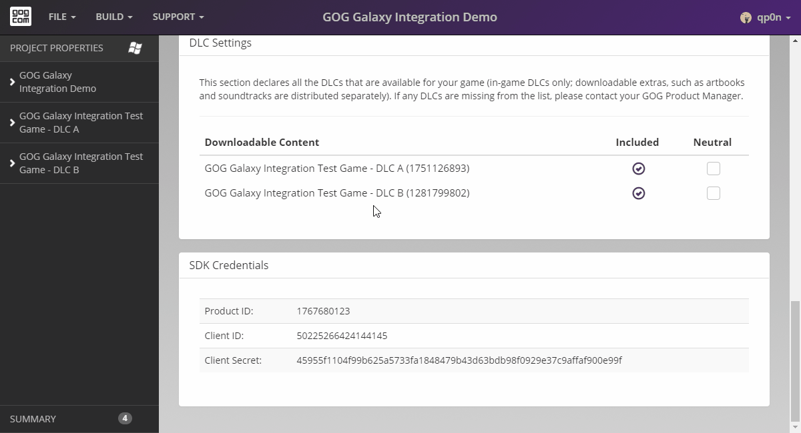

# Product Details

Clicking the product name displayed in the list on the left pane opens this product options: *Depots*, *Tasks* and *Packages*. Also, you will be taken to the Product page, which contains basic information about the product you selected: its **Name**, **ProductID** and **Type** (**baseProduct** or **DLC**).

If the product is a DLC, it will have an additional *Product Settings* section. This section replicates the options available in the [*DLC Settings*](bc-dlc-settings.md) section of Project Properties screen, but only for the selected product.

Let’s move on to the Depots page.