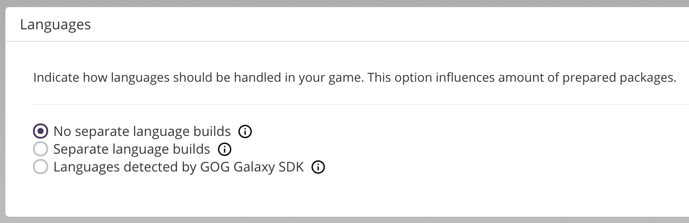
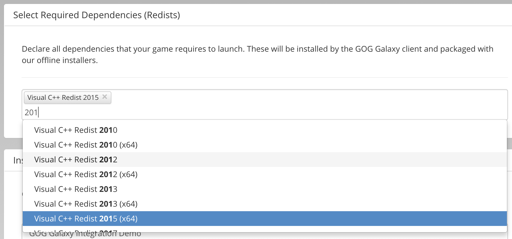
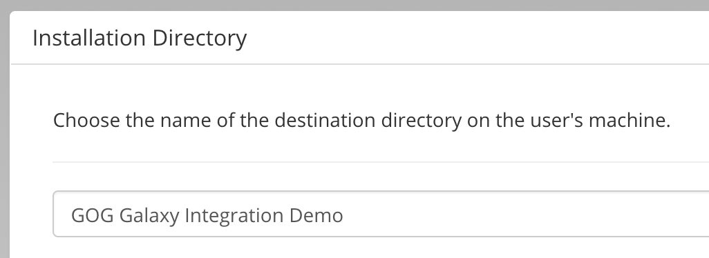
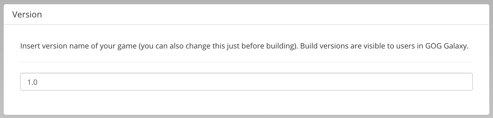
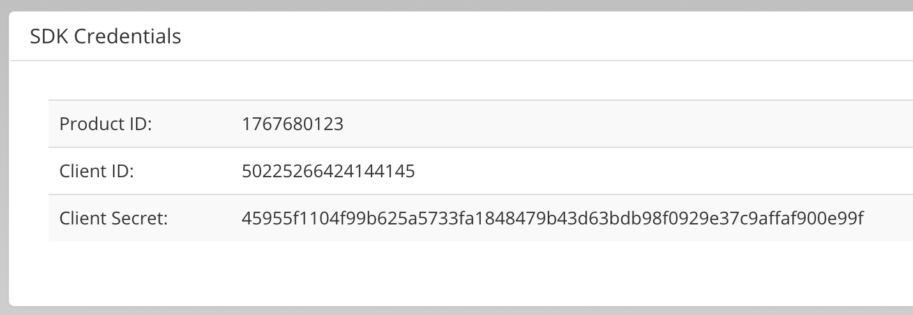
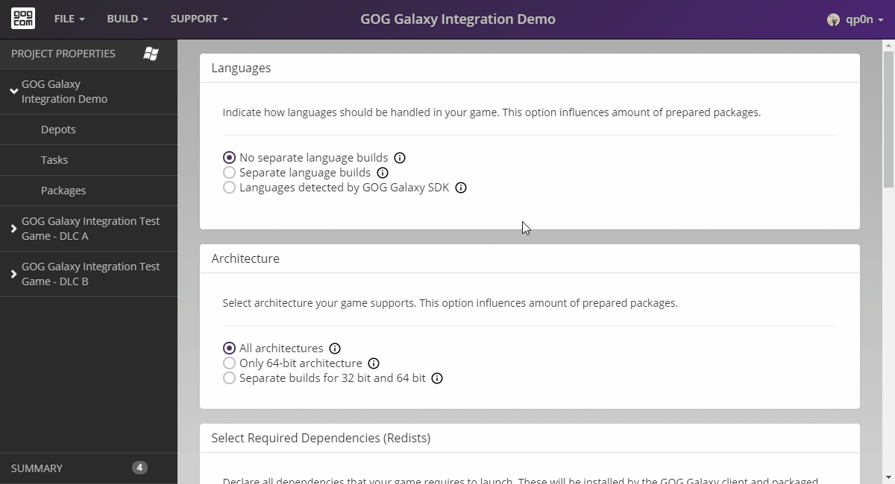

# Project Properties

Once the project is created, you will be taken to the Project Properties screen of your project. Here you define the base properties of the project based on the setup of your game.

Our sample game supports only one language in one build, and includes just a 32-bit executable that will be used on both 32- and 64-bit operating systems.

!!! Tip
    If you want to know more about a particular section of the Project Properties screen, just click its header and it will take you to the relevant article.

## [Languages](bc-languages.md)

As we do not have any separate language builds, we leave the *No Separate Language Builds* option checked in the *Languages* section of the Project Properties screen:

## [Architecture](bc-architecture.md)

Since we also provide a universal executable in our build, we leave the *All Architectures* option checked under *Architecture*:

## [Dependencies](bc-dependencies.md)

Next, we need to set our Windows project **dependencies**. Our example game uses Visual C++ 2015 32- and 64-bit versions. When we click the input field under *Select Required Dependencies (Redists)*, a drop-down menu will appear. However, we are searching for a specific entry and we can narrow the search by simply typing a part of the dependency name — in our case *2015*. Now we only see *Visual C++ Redist 2015* and *Visual C++ Redist 2015 (x64)*, and we need both of them, so we add them by simply clicking the names in the drop-down list:

## [Installation Directory](bc-installation-dir.md)

The installation directory is automatically populated with the game name, so there is no need to change anything here.

## [Version](bc-version.md)

We enter *1.0* as our version name:

## [DLC Settings](bc-dlc-settings.md)

We don’t need to change anything in the *DLC Settings* section because:

- we want to include all DLCs in our build,
- our project doesn’t have separate language or architecture builds, so it will only have one package.

## [SDK Credentials](bc-sdk-credentials.md)

The last section of the Project Properties page is *SDK Credentials* and it displays *ProductID*, *ClientID* and *ClientSecret* of your game:

!!! Note
    *Dependencies* and *Architecture* sections are Windows specific properties.

The whole flow for this page should look like this:

