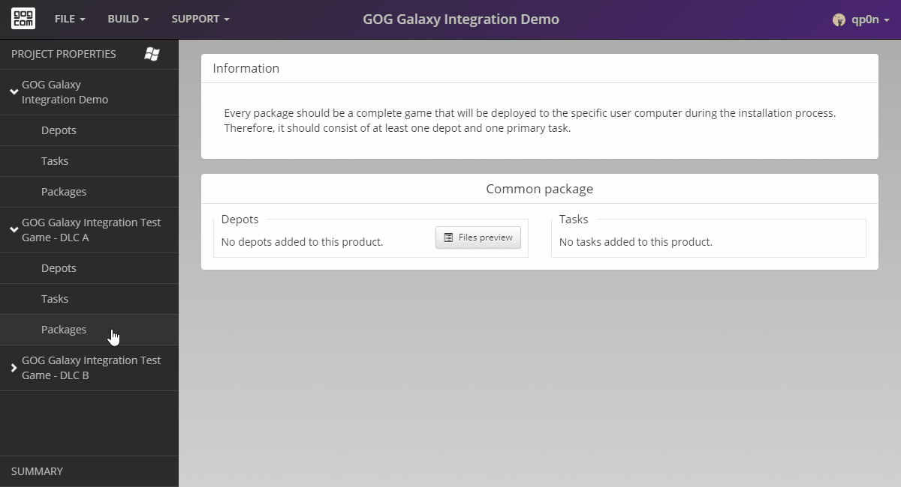

# Summary

Now that our build is fully set up, let’s check if there are any issues. To do that, please move to the *Summary* page:

It seems that the build was set up without any issues and we are ready to build our game. 

If you encounter any problems, please see [Solving Issues](bc-summary-issues.md).