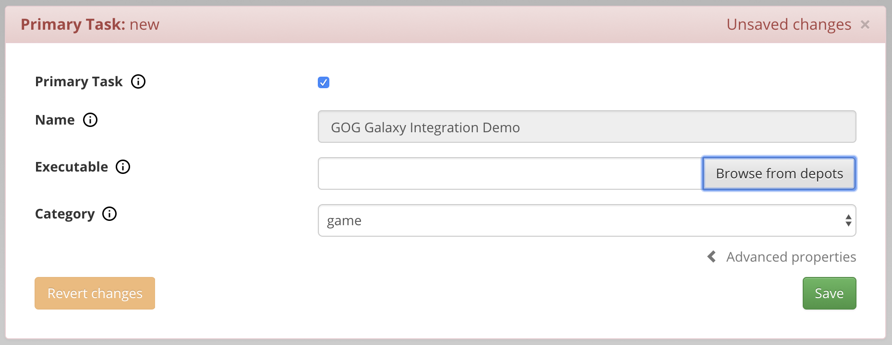
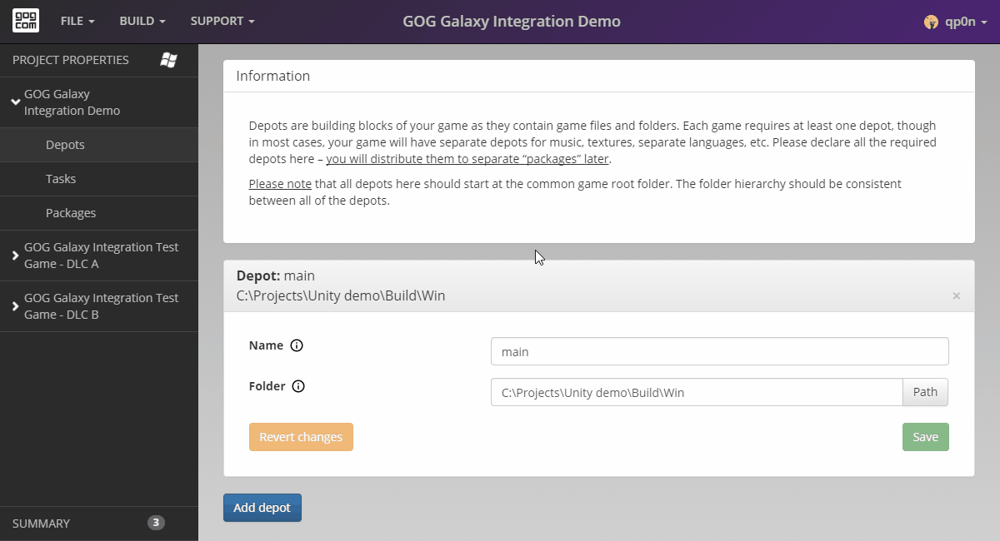

# Tasks

Now that Depots are ready, we need to take care of *Tasks*.

Tasks are used to launch and interact with the game in the GOG GALAXY client as well as Start Menu / Desktop shortcuts in Windows. There are two kind of tasks: [File Task](bc-file-tasks.md) and [URL Task](bc-url-task.md).

1. Open the Tasks page for our base product by clicking *Tasks* on the left pane.

2. To add a task, click the blue *Add Task* button and select the task type from the resulting drop-down menu. We want to add an executable, so select *FileTask*. New empty *FileTask* template will appear.

3. We want this to be the game primary executable (launched by the purple *Play* button in the GOG GALAXY client), so we need to check the *Primary Task* checkbox. When it’s checked, the *Name* field is automatically filled with the product name and locked from editing.

    Note that all tasks need to have a name. For tasks other than the primary play task, this name will be displayed in the GOG GALAXY client in *More→Others* menu.
   
4. Now we need to add the *Executable* path. This path is relative to the game root directory. We could enter the path manually, but it’s more convenient to use *Browse from depots* button. When clicked, this button displays a list of all files contained within depots defined in the previous step (if you don’t define any depot, this button will be inactive and grayed out). Our game main executable — *GOG Galaxy Integration Demo.exe* — is located in the game root directory, so it is immediately visible on the list. Select *GOG Galaxy Integration Demo.exe* from the file list and the path to that executable will be automatically added to the *Executable* path.

    

5. Last but not least, we need to select a *Category* for our file task. This is the game primary task and the *Executable* path points to the game main executable, which starts the game directly. Therefore, a proper file task *Category* in this case is *game*.

    Obviously, if the *Executable* path would point to a launcher, which starts the game, you would use the *launcher* category.

Our task is now ready, and we can save it by clicking the green *Save* button.

This process is illustrated below:

