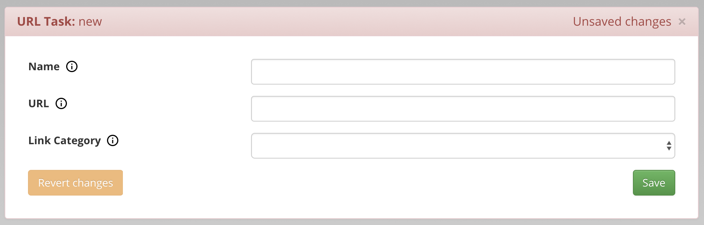

# URL Task

- **Name**

    A task name that will be displayed in the GOG GALAXY client under *More→Other* dropdown menu of the game.

- **URL**

    A web address that will be opened by this task.

- **Link Category**

    Describes the type of URL content your task should open:

    - **Tool**

        Should be used with any web-based tools that are not a part of the game itself, for example online editors.

    - **Document**

        Should be used with online documents, for example a game manual.

    - **Other**

        For all files that do not match any of the above categories.