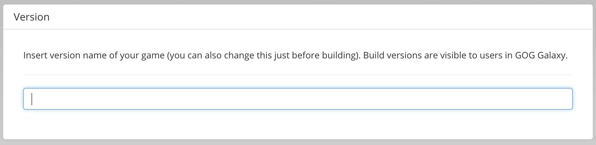

# Version

Allows you to set a version name of the current game build. The version name will be displayed in the game builds panel of the Developer Portal and in GOG GALAXY.

!!! Tip
    Please note that this can be also changed just before building the game in *Build Game* window.