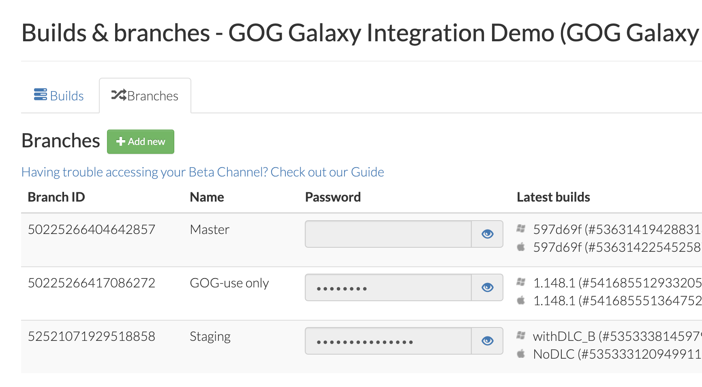

# Build Branches

There are two types of branches: Master and Beta. A user can switch between them with [Beta channels](gc-beta-channels.md) setting in the GOG GALAXY client.

| Feature                                                      | Master | Beta  |
| ------------------------------------------------------------ | :----: | :---: |
| Default public branch used whenever a user initializes an installation in the GOG GALAXY client | **✔︎**  | **✗** |
| Can be password protected                                    | **✗**  | **✔︎** |
| Can be accessed in the GOG GALAXY client before the game is available for sale | **✗**  | **✔︎** |
| Can be accessed in the GOG GALAXY client both before and after the game went on sale | **✔︎**  | **✔︎** |

Branch passwords can be viewed on the GOG Developer Portal and additional ones can be created on *Branches* tab of the *Builds & Branches* screen for a game:

By default, two password protected beta branches are created: *GOG-use only* and *Staging*.

- **GOG-use only** is a GOG internal branch, and we ask that you refrain from publishing to this branch.
- **Staging** is a branch for you to test the stability of your uploaded build (in the GOG GALAXY client) without publishing to a Master.

!!! Attention
    For security reasons, you cannot publish to the Master branch or any other public branch directly from the Build Creator.

Feel free to publish a build to the Master branch at any time from the GOG Developer Portal, but we ask that you conduct a preliminary check to ensure that the upload is functional and downloading correctly.

!!! Important
    We kindly request that you **do not unpublish any previous updates** that have been published to the Master branch. This allows users to make use of the [rollback feature](gc-rollback.md) in the [GOG GALAXY client](gc-client-overview.md) in case an update that has been published on the Master branch turns out to have been either prematurely published or exhibits major game-breaking bugs.

