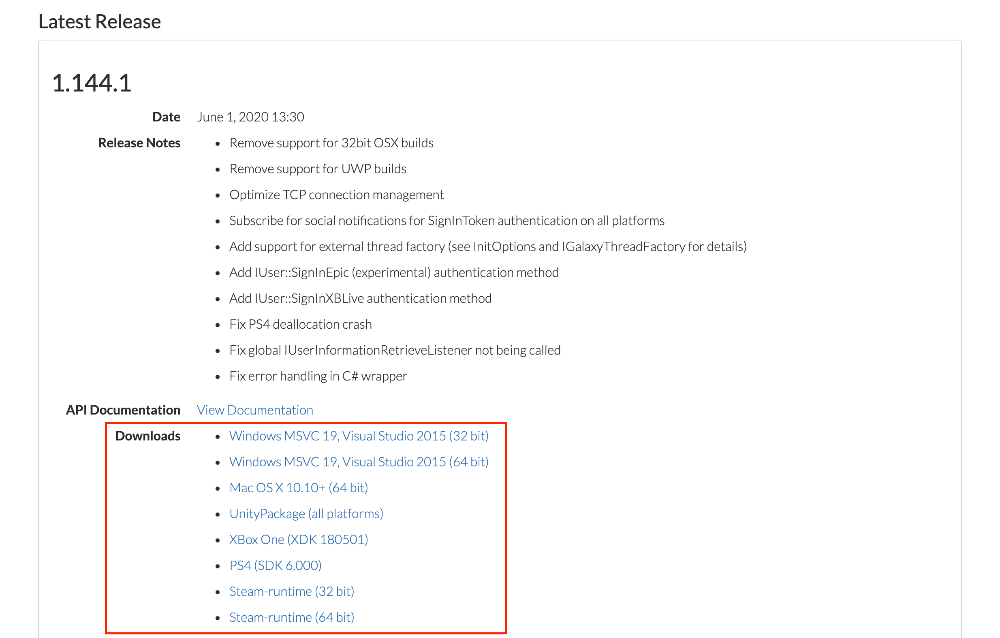

# C# Demo Game

## Project Description

This project is a sample implementation of the GOG GALAXY features in a Unity Engine game. It uses the GOG GALAXY SDK C# wrapper and demonstrates possible implementations of the following GOG GALAXY features:

- Achievements
- Statistics
- Leaderboards
- GOG GALAXY multiplayer with a lobby for 2 players
- Game invites
- DLC discovery
- Storage (debug options only).

Feel free to use it as a reference point for implementing our features into your game!

## First Steps

1. Redeem our demo game using [this redeem code](https://www.gog.com/redeem/IDDQD).
2. Once you redeemed the game, you can install it with the [GOG GALAXY client](https://www.gog.com/galaxy).
3. The source code of this project is available on our [GitHub](https://github.com/gogcom/galaxy-csharp-demo-game) page.

## Prerequisites

Although the GOG GALAXY SDK is written in C++, a C# wrapper is also available. The SDK and the wrapper are available in a number of releases: a 32- and 64-bit MSVC version, an OSX release, a UnityPackage (specific to the Unity Editor), as well as Xbox One and PS4 releases. All releases are available for download from the [GOG Developer Portal](https://devportal.gog.com/galaxy/components/sdk):

This tutorial focuses on the UnityPackage release.

1. To start using the UnityPackage, [download it](https://devportal.gog.com/galaxy/components/sdk) from the GOG Developer Portal. The package includes scripts that will take care of distributing the correct GOG GALAXY redistributables for you — both in the Unity Editor (when the package is imported), as well as for standalone players (when a new build is created).

2. Once the package is downloaded, open your game project in Unity and import the package. The simplest way to do this is to select *Assets→Import Package→Custom Package…* from the Unity Editor top bar.

   While the package is being imported (in the “InitializeOnLoad” phase), one of the included scripts (*RedistInstall.cs*) runs automatically. This script puts the correct distribution of the GOG GALAXY SDK libraries in your Assets/Plugins folder, so that the GOG GALAXY SDK methods can be used in the Unity Editor. Please make sure to restart the Unity Editor after importing the GOG GALAXY SDK UnityPackage.

When you create a new build of your game, another package script (*RedistCopy.cs*) runs instantly after the build process is complete (in the “PostProcessBuild” phase). This script makes sure that your new build includes the correct distribution of the GOG GALAXY SDK libraries. Once the game is built, you should be able to see these libraries in your game build folder.

Both processes should be seamless and the only thing that you will need to do is import the package to your Unity project. When your Unity project is ready, you can proceed to the next part of this tutorial, where we cover the GOG GALAXY SDK implementation in more detail.