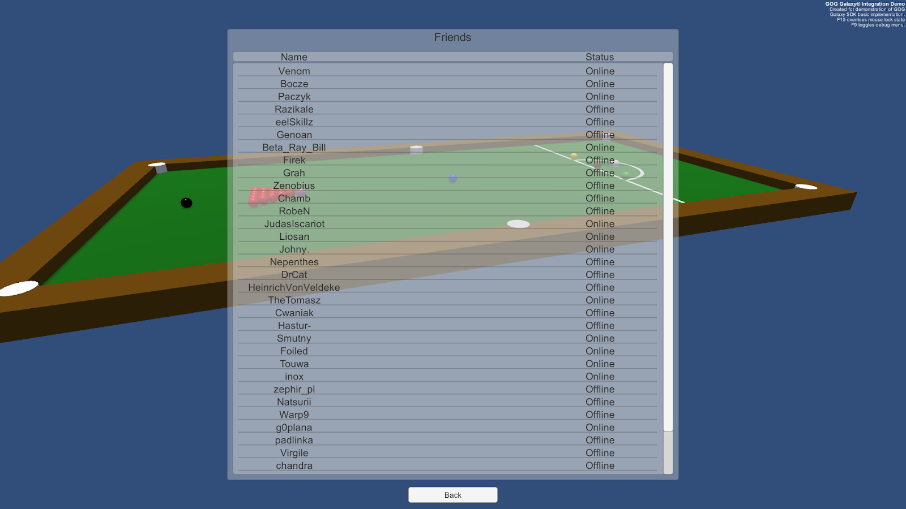

# Friends: Example of Implementation

## Displaying the GOG GALAXY Friends List

### User Experience

The simplest example of this class in action is displaying the friends list on screen. Launch the game and when the Main Menu scene is loaded, please click the *Friends* button (under *Statistics*). If you are logged in to GOG GALAXY, you should see a list of your friends with their current status displayed.



### Solution

This is accomplished in the **FriendsController** script, which is attached to the **FriendsScreen** GameObject in the **MainMenu** scene. The script itself can be found in *Assets/Scripts/UI/MainMenu*.

### Variables

The following variables are defined:

| Variable                                                     | Description                                                  |
| ------------------------------------------------------------ | ------------------------------------------------------------ |
| `public GameObject entries`                                  | Unity Game Object which serves as a container for displaying all friends entries |
| `public GameObject entryPrefab`                              | Prefab used to display usernames and statuses; it can be found in *Assets/Prefabs/UI/Entries/entryStatAchievementFriend* |
| `private List<GameObject> entryList`                         | This is used to store all currently displayed friends entries, so we can dispose of them easily when needed |
| `private Dictionary<Galaxy.Api.PersonaState, string> personaStateEnumToStringMap ` | Dictionary used as a map to transform **Galaxy.Api.PersonaState** enums into human readable strings |

### Methods and Usage

There are only two methods defined in this class:

- **DisplayFriendList** is called when the GameObject is enabled (i.e. when the Friends screen is displayed).
- **DisposeFriendList** is called when the GameObject is disabled (i.e. when the Friends screen is closed).

#### DisplayFriendList

```c#
    void DisplayFriendList()
    {
        uint friendsCount = GalaxyManager.Instance.Friends.GetFriendCount();
        for (uint i = 0; i < friendsCount; i++)
        {
            Galaxy.Api.GalaxyID galaxyID = null;
            Galaxy.Api.PersonaState personaStateEnum = Galaxy.Api.PersonaState.PERSONA_STATE_OFFLINE;
            string personaStateName = null;
            GameObject currentObject = null;
            galaxyID = GalaxyManager.Instance.Friends.GetFriendByIndex(i);
            personaStateEnum = GalaxyManager.Instance.Friends.GetFriendPersonaState(galaxyID);
            personaStateEnumToStringMap.TryGetValue(personaStateEnum, out personaStateName);
            currentObject = Instantiate(entryPrefab, entries.transform);
            currentObject.transform.GetChild(0).GetComponent<Text>().text = GalaxyManager.Instance.Friends.GetFriendPersonaName(galaxyID);
            currentObject.transform.GetChild(1).GetComponent<Text>().text = (personaStateName != null) ? personaStateName : "Unknown" ;
            entryList.Add(currentObject);
        }
    }
```

First, we get the current user friend count using **GetFriendCount** from the **Friends** class and assign it to an unsigned integer `friendsCount`. Once we have the friend count, we are ready to display the users list with a simple `for` loop. Inside the loop we:

1. Define variables:
    - `galaxyID` of the Galaxy.Api.GalaxyID type for storing the current user’s GalaxyID and assign it null value to initialize the variable,
    - `stateName` string variable for storing user readable state name,
    - `currentObject` GameObject variable for easier access to the currently edited GameObject.
2. Assign the GalaxyID of the currently processed user to the `galaxyID` variable, using the `GetFriendByIndex` method and passing the index of the `for` as a parameter.
3. Assign a value to the `personaStateEnum` variable using the `GetFriendPersonaState` method and passing `galaxyID` as a value.
4. Assign a user readable value to the `personaStateName` variable by calling `TryGetValue` method on **personaStateEnumToStringMap** and passing `personaStateEnum` and `personaStateName` as parameters.
5. Instantiate `entryPrefab` using entries GameObject transform as a parent. Please note that the entries GameObject is using Unity **VerticalLayoutGroup** to group all of its children.
6. We assign values to the text objects inside our prefab, using Unity Transform inheritance. Then we use the **GetFriendPersonaName** to set the name, and the previously assigned `stateName` variable to set the state of the displayed user.
7. Finally, we add the `currentObject` variable to the list of displayed objects.

#### DisposeFriendList

```c#
    void DisposeFriendList()
    {
        foreach (GameObject child in entryList)
        {
            Destroy(child);
        }
        entryList.Clear();
        entryList.TrimExcess();
    }
```

We iterate through all currently displayed friend entries using a `foreach` loop within the `entryList` created in the `DisplayFriendList` method to destroy all displayed entries. After the loop is finished, we clear and trim `entryList`.

## Displaying Invite Friends List

Very similar use of the **Friends** class can be seen in the **FriendInviteController** class, which can be found in *Assets/Scripts/UI/MainMenu*.

The biggest difference between this and the **FriendsController** class is that it displays entries only for friends that are currently online. Moreover, this class uses a different prefab, which includes a button and attaches a listener for the **onClick** event to that button that will send an invite to a specified friend.

More about invites in further articles.