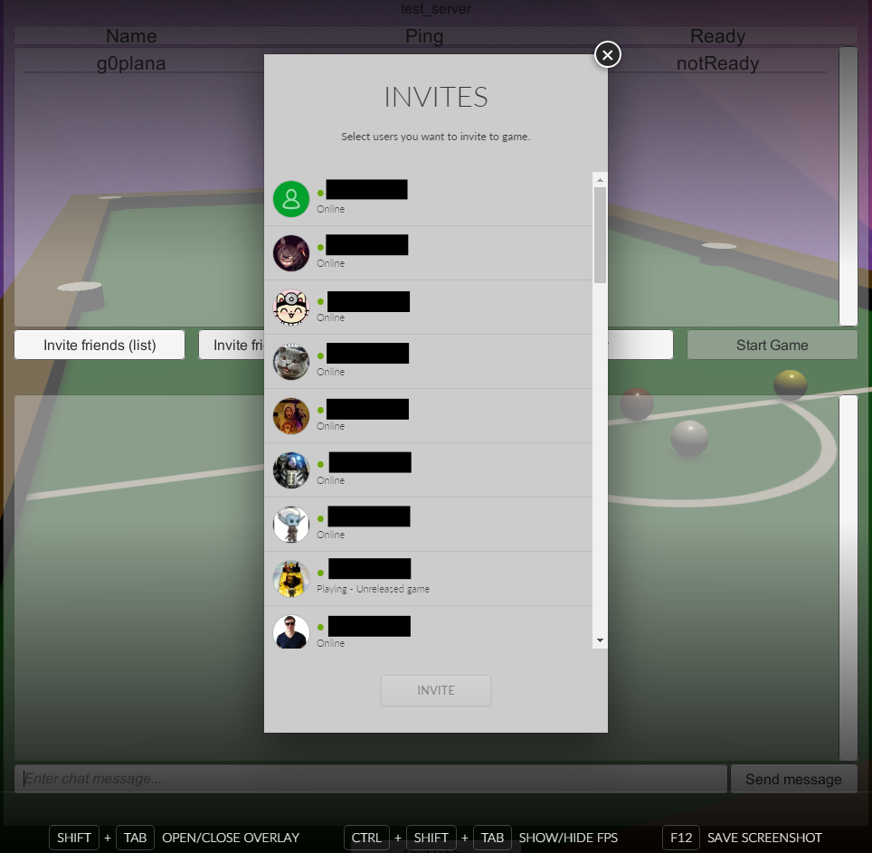

# Invitations: Examples of Implementation

## Sending an Invite to Another Player

There are two ways to invite a friend to your game: you can either use the [GOG GALAXY Overlay](gc-overlay.md) invite dialog or the in-game friends list. We’ll focus on the former in this example, since the alternative is very similar to the previously described solutions for displaying the friends list in-game.

### User Experience

The user creates an online game lobby. While in the online lobby menu, they are presented with the option to invite friends to their game. When they click *Invite Friends (overlay)*, the overlay is displayed over the game screen and the user is allowed to send invites to other users from their friend list:



### Solution

This is handled mostly by the **Matchmaking** and **OnlineWaitController** scripts.

**Matchmaking** can be found at *Assets/Scripts/GalaxyManager/Features/Matchmaking.cs* and **OnlineWaitController** can be found at *Assets/Scripts/UI/MainMenu/OnlineWaitController.cs*.

### Methods and Usage

#### OnlineWaitContoller.ShowOverlayInviteDialog

```c#
    public void ShowOverlayInviteDialog()
    {
        GalaxyManager.Instance.Matchmaking.ShowOverlayInviteDialog();
    }
```

This method is launched when the user clicks the button labeled *Invite Friends (overlay)* in the **OnlineWaitScreen** menu. It acts as a wrapper of the `Matchmaking.ShowOverlayInviteDialog()` method, and it is placed here for easier access from the Unity Editor.

#### Matchmaking.ShowOverlayInviteDialog

```c#
    public void ShowOverlayInviteDialog()
    {
        string connectionString = "--JoinLobby=" + currentLobbyID.ToString();
        Debug.Log("Trying to open overlay invite dialog");
        try
        {
            GalaxyInstance.Friends().ShowOverlayInviteDialog(connectionString);
            Debug.Log("Showing Galaxy overlay invite dialog");
        }
        catch (GalaxyInstance.Error e)
        {
            Debug.LogWarning("Could not show Galaxy overlay invite dialog for reason: " + e);
        }
    }
```

This method uses the already assigned `Matchmaking.currentLobbyID` variable to create a viable connection string by converting it to a string and adding a `--JoinLobby=` prefix.

`Matchmaking.currentLobbyID` is assigned because the user has already entered a lobby.

When the `connectionString` is ready, we call the [`Galaxy.Api.Friends().ShowOverlayInviteDialog(string connectionString)`](https://docs.gog.com/galaxyapi/classgalaxy_1_1api_1_1IFriends.html#ae589d534ed8846319e3a4d2f72d3c51a) method, passing our `connectionString` as the parameter.

## Accepting an Invite in the GOG GALAXY Client

### User Experience

The user has the game installed, but the game is not running at the moment. They receive an invite to an online match from a friend. Upon accepting the invitation, the game is launched and the user is automatically connected to the lobby they were invited to.

### Solution

When the user accepts an invite in the GOG GALAXY client, the client itself will launch the game with the received `connectionString` as an argument. When the game is launched, we need a script that will intercept the launch parameters, recognize the `connectionString` and join the specified lobby when the game is launched.

This is handled exclusively by the **Invitations** script. The script itself can be found at *Assets/Scripts/GalaxyManager/Features/Invitations.cs*.

### Methods and Usage

#### Invitations.OnEnable

```c#
    void OnEnable()
    {
        ListenersInit();
        CheckForInviteFromClient();
    }
```

Inside this method, we initialize all necessary listeners first and then run the `Invitations.CheckForInviteFromClient()` method.

#### Invitations.CheckForInviteFromClient

```c#
    void CheckForInviteFromClient()
    {
        Debug.Log("Checking for game invites accepted from client");
        // Get Command Line Arguments
        string[] args = Environment.GetCommandLineArgs();
        string connectionString = null;
        // First command line argument will always be the executable name
        if (args.Length > 1)
        {
            for (int i = 1; i < args.Length; i++)
            {
                if (args[i].StartsWith("--JoinLobby=")) 
                {
                    connectionString = args[i];
                    Debug.Log("Invite accepted from client detected. Connection string " + connectionString);
                    SetUpInviteFromClient(connectionString);
                    return;
                }
            }
        }
        Debug.Log("No invite accepted from client detected");
    }
```

First, we define 2 additional variables:

| Variable           | Description                                                  |
| ------------------ | ------------------------------------------------------------ |
| `args`             | String array for storing all command line arguments; we instantly assign command line arguments as the value using the `System.Enviroment.GetCommandLineArgs()` method |
| `connectionString` | Stores the entire connection string received in the accepted invite |

Then we check if the `args` array is not empty. The first argument returned by `System.Enviroment.GetCommandLineArgs()` is always the executable name, so it is of no use for us.

If the `args` array length is greater than one, we start a `for` loop, which will go through all command line arguments inside the `args` array and check whether the currently processed argument string starts with `--JoinLobby=`. If it does, we:

1. Set the `connectionString` to the current argument.
2. Call the `SetUpInviteFromClient(string connectionString)` method, passing `connectionString` as the parameter.
3. Exit the method using the `return` statement.

#### Invitations.SetUpInviteFromClient

```c#
    void SetUpInviteFromClient(string connectionString)
    {
        Debug.Log("Setting up the game for joining lobby from game invite accepted from client");
        pendingLobbyID = ParseLobbyIDFromConnectionString(connectionString);
        if (pendingLobbyID.IsValid())
        {
            if (SceneManager.GetActiveScene().name == "MainMenu")
            {
                Debug.Log("Main menu scene is already loaded, joining lobby");
                JoinLobby();
            }
            else
            {
                Debug.Log("Main menu scene not loaded, subscribing to SceneManager.sceneLoaded event");
                SceneManager.sceneLoaded += JoinLobbyOnceMainMenuIsLoaded;;
            }
        }
    }
```

1. We assign the return value of `ParseLobbyIDFromConnectionString(string connectionString)`, being a valid GalaxyID parsed from our `connectionString`, to the `Invitations.pendingLobbyID` variable.
2. We check if `pendingLobbyID` is valid using the `GalaxyID.IsValid()` method.
3. Once we have the `pendingLobbyID` variable ready and we know it is valid, we need to check if the main menu scene is loaded by now:
   - If it is, we simply join the lobby by calling the `JoinLobby()` method.
   - Otherwise, we subscribe to the event of a scene being loaded with the `JoinLobbyOnceMainMenuIsLoaded()` method. Therefore, the `JoinLobbyOnceMainMenuIsLoaded()` method will be launched every time a new scene is loaded.

#### Invitations.ParseLobbyIDFromConnectionString

```c#
    GalaxyID ParseLobbyIDFromConnectionString(string connectionString)
    {
        Debug.Assert(connectionString != null);
        Debug.Log("Parsing lobbyID from connection string " + connectionString);
        string lobbyIDString = connectionString.Remove(0, 12);
        UInt64 lobbyIDUint64 = Convert.ToUInt64(lobbyIDString);
        GalaxyID lobbyID = new GalaxyID(lobbyIDUint64);
        Debug.Log("LobbyID parsed from connection string to " + lobbyID);
        return lobbyID;
    }
```

1. We define the `lobbyIDString` variable of the **string** type and use it to store the extracted ID of the lobby in the **string** format. We extract the lobby ID by simply removing the `--JoinLobby=` part from the `connectionString` variable value.
2. We define a new **UInt64** variable — `lobbyIDUint64` — and use it to store the lobby ID converted from string to **UInt64**.
3. Finally, we define a new **GalaxyID** variable — `lobbyID` — and assign a new **GalaxyID** to it (which is created by passing the `lobbyIDUint64` as a parameter to the **GalaxyID** constructor).

!!! Important
    New **GalaxyID** can only be created from a variable of the **UInt64** type.

#### Invitations.JoinLobby

```c#
    void JoinLobby()
    {
        Debug.Log("Joining LobbyID " + pendingLobbyID);
        GalaxyManager.Instance.StartMatchmaking();
        GalaxyManager.Instance.Matchmaking.LobbyBrowsingListenersInit();
        GalaxyManager.Instance.Matchmaking.JoinLobby(pendingLobbyID);
        GameObject.Find("MainMenu").GetComponent<MainMenuController>().SwitchMenu(MainMenuController.MenuEnum.OnlineJoining);
        pendingLobbyID = null;
    }
```

1. Here we start **GalaxyManager.Matchmaking** class and all the listeners required to join a lobby by calling the  `GalaxyManager.Matchmaking.LobbyBrowsingListenersInit()` method.
2. Then we call the `GalaxyManager.Instance.Matchmaking.JoinLobby(GalaxyID lobbyID)` method and we pass `Invitations.pendingLobbyID` as a parameter.
3. We also need to switch to the proper menu inside the **MainMenu** scene, so the player can see that they are in fact in the process of joining a lobby. We do this by calling the `MainMenuController.SwitchMenu(MenuEnum menuToOpen)` method with `MainMenuController.MenuEnum.OnlineJoining` passed as a parameter.
4. Finally, we set the `pendingLobbyID` value back to null.

#### Invitations.JoinLobbyOnceMainMenuIsLoaded eventHandler

```c#
    void JoinLobbyOnceMainMenuIsLoaded(Scene scene, LoadSceneMode mode)
    {
        if (scene.name == "MainMenu")
        {
            JoinLobby();
            SceneManager.sceneLoaded -= JoinLobbyOnceMainMenuIsLoaded;
        }
    }
```

Assuming that **MainMenu** scene was not loaded by the time the **SetUpInviteFromClient** method was run, we did subscribe to the **SceneManager.SceneLoaded** event with the **JoinLobbyOnceMainMenuIsLoaded** eventHandler. Thanks to this the **JoinLobbyOnceMainMenuIsLoaded** eventHandler will be run every time a scene is loaded by Unity.

When activated, this will first check if the loaded scene name is *“MainMenu”*. If it is, the handler will call the `JoinLobby()` method and unsubscribe itself from the **SceneManager.SceneLoaded** event, so that we don’t end up trying to join a lobby every time we start the main menu scene.

## Accepting an Invite in the Game

### User Experience

The user is playing the game and receives an invite to an online match. No matter where in the game the user is at that moment, they should be able to accept the invite using the GOG GALAXY Overlay and join the lobby they were invited to.

### Solution

When the user receives an invite while the game is running, they will automatically receive a notification in the GOG GALAXY Overlay. This is done by the GOG GALAXY client and doesn’t require us to write any additional code. When the user opens the overlay and accepts the invite, the `GameJoinRequestedListener.OnGameJoinRequested(GalaxyID userID, string connectionString)` callback is fired. We use this callback to call the `Invitations.SetUpInviteInGame(string connectionString)` method, which will connect the user to a lobby specified in the connection string.

!!! Important "Enabling the Overlay"
    To receive a notification about getting an invite or to accept it in the GOG GALAXY Overlay, you must [enable the overlay](gc-overlay.md) in your game and in the GOG GALAXY client.

This is handled exclusively by the **Invitations** script, which can be found at *Assets/Scripts/GalaxyManager/Features*.

### Methods and Usage

#### GameJoinRequestedListener.OnGameJoinRequested Callback

```c#
        public override void OnGameJoinRequested(GalaxyID userID, string connectionString)
        {
            Debug.Log("OnGameJoinRequested userID: \"" + userID + "\" connectionString \"" + connectionString + "\"");
            GalaxyManager.Instance.Invitations.SetUpInviteInGame(connectionString);
        }
```

This callback is fired when the user accepts an invite while in-game. We use it to call the `Invitations.SetUpInviteInGame(string connectionString)` method, that will ensure that a proper scene is loaded and the user is connected to the lobby when it is ready.

#### Invitations.SetUpInviteInGame

This method works almost identically to the `Invitations.SetUpInviteFromClient()` method described in the [previous scenario](#invitationssetupinvitefromclient). The only difference is that when **MainMenu** is not the active scene, it will be loaded; otherwise the `JoinLobby()` method is called.

#### Invitations.ParseLobbyIDFromConnectionString

This method is described in the [previous scenario](#invitationsparselobbyidfromconnectionstring).

#### Invitations.JoinLobby

This method is described in the [previous scenario](#invitationsjoinlobby).

#### Invitations.JoinLobbyOnceMainMenuIsLoaded eventHandler

This handler is described in the [previous scenario](#invitationsjoinlobbyoncemainmenuisloaded-eventhandler).