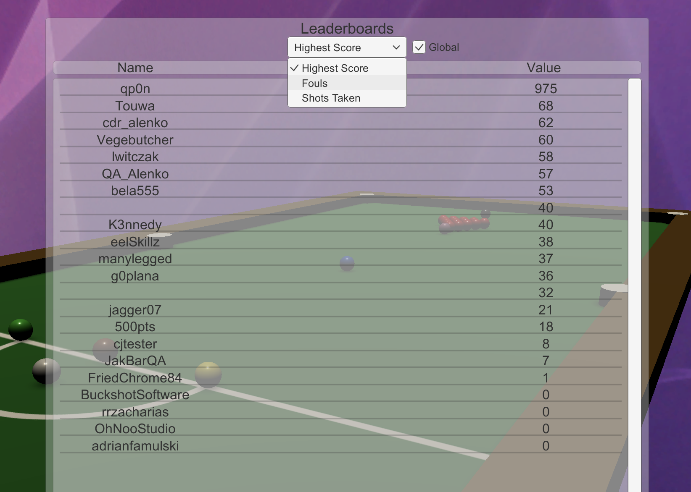

# Leaderboards: Example of Implementation

## Displaying the GOG GALAXY Leaderboards

### User Experience

The user opens the main menu and clicks the *Leaderboards* button. A new window is opened, leaderboard entries are downloaded and displayed on the screen. The user can change the displayed leaderboard at any point by selecting a different leaderboard from a drop-down menu. He/she can also exit the menu at any point, even when leaderboards are still being downloaded.



### Solution

This is handled by the **LeaderboardsController** script attached to the **LeaderboardsScreen** GameObject in the **MainMenu** scene. The script itself can be found in *Assets/Scripts/UI/MainMenu/LeaderboardsController.cs*.

### Variables

| **Variable**           | Description                                                  |
| ---------------------- | ------------------------------------------------------------ |
| `displayedLeaderboard` | Reference to a **dropdown** GameObject in the scene          |
| `globalToggle`         | Reference to a **toggle** GameObject in the scene, used to mark if the user wants to display Global leaderboards, or just the entries around the user (players in the current user’s vicinity on the leaderboard) |
| `message`              | Reference to a **text** GameObject in the scene, used to display a message to inform the user that the leaderboard entries could not be retrieved |
| `waitingCircularArrow` | Reference to an **image** GameObject, displayed when the user is waiting for the leaderboard entries to be retrieved |
| `entriesContainer`     | Reference to a GameObject, which will be used as a parent to all leaderboard entries |
| `entryPrefab`          | Prefab used to create leaderboard entries                    |
| `entriesList`          | List that contains all currently displayed entries (to be easily disposed of later) |

### Methods and Usage

#### LeaderboardsController.OnEnable

When the **LeaderboardScreen** menu is enabled, we automatically request the leaderboards for the default settings by calling `RequestLeaderboard(bool refresh)`.

#### LeaderboardsController.RequestLeaderboard

```c#
    public void RequestLeaderboard(bool refresh)
    {
        if (GameObject.Find("GalaxyManager") == null || !GalaxyManager.Instance.GalaxyFullyInitialized)
        {
            DisplayMessage("Galaxy not initialized");
        }
        else
        {
            message.gameObject.SetActive(false);
            waitingCircularArrow.SetActive(true);
            if (refresh)
            {
                DisposeLeaderboard();
            }
            string leaderboardKey;
            GalaxyManager.Instance.leaderboardNames.TryGetValue(displayedLeaderboard.captionText.text, out leaderboardKey);
            if (globalToggle.isOn)
            {
                GalaxyManager.Instance.Leaderboards.RequestLeaderboardEntriesGlobal(leaderboardKey, 0, 100);
            }
            else
            {
                GalaxyManager.Instance.Leaderboards.RequestLeaderboardEntriesAroundUser(leaderboardKey, 50, 49, GalaxyManager.Instance.MyGalaxyID);
            }
        }
    }
```

1. First, this method checks if **GalaxyManager** is enabled and working. If it is, we activate the **waitingCircularArrow** GameObject. It will be displayed while entries are being retrieved.

2. Next, we check if we need to dispose of the currently displayed entries by examining the bool `refresh` from the method parameters.

3. Finally, if the `globalToggle` is on, we request global leaderboard entries. Otherwise, we only request entries around the user.


#### LeaderboardEntriesRetrieveListener.OnLeaderboardEntriesRetrieveSuccess Callback

The callbacks from the above methods are handled by the **LeaderboardEntriesRetrieveListener** in **Leaderboards** class of **GalaxyManager** (*Assets/Scripts/GalaxyManager/Features/Leaderboards.cs*), described in the [previous article](demo-leaderboards.md#leaderboardentriesretrievelistener):

```c#
        public override void OnLeaderboardEntriesRetrieveSuccess(string leaderboardName, uint entryCount)
        {
            Debug.Log("Leaderboard \"" + leaderboardName + "\" entries retrieved\nEntry count: " + entryCount);

            leaderboardEntries.Clear();
            leaderboardEntries.TrimExcess();

            for (uint i = 0; i < entryCount; i++)
            {
                GalaxyID userID = new GalaxyID();
                uint rank = 0;
                int score = 0;
                string username = null;
                object[] entryDetails = new object[] { rank, score, username };
                
                GalaxyInstance.Stats().GetRequestedLeaderboardEntry(i, ref rank, ref score, ref userID);
                username = GalaxyManager.Instance.Friends.GetFriendPersonaName(userID);
                entryDetails[0] = rank;
                entryDetails[1] = score; 
                entryDetails[2] = username;
                Debug.Log("Created object #" + i + " | " + rank + " | " + score + " | " + username);
                leaderboardEntries.Add(entryDetails);
            }

            if (GameObject.Find("LeaderboardsScreen")) GameObject.Find("LeaderboardsScreen").GetComponent<LeaderboardsController>().DisplayLeaderboard();

        }
```

This callback is fired when the leaderboard entries are retrieved. We use it to gather all retrieved entries and their details in the `Leaderboards.leaderboardEntries` list, and then we call the `LeaderboardsController.DisplayLeaderboard()` method.

#### LeaderboardsController.DisplayLeaderboard

Let’s go back to the **LeaderboardsController** script [mentioned before](#solution):

```c#
    public void DisplayLeaderboard()
    {
        GameObject currentObject;
        waitingCircularArrow.SetActive(false);
        foreach (object[] entry in GalaxyManager.Instance.Leaderboards.LeaderboardEntries)
        {
            currentObject = Instantiate(entryPrefab, entriesContainer.transform);
            currentObject.transform.GetChild(0).GetComponent<Text>().text = entry[2].ToString();
            currentObject.transform.GetChild(1).GetComponent<Text>().text = entry[1].ToString();
            entriesList.Add(currentObject);
        }
    }
```

This method is called when all entries for a specified leaderboard are retrieved and ready to be displayed.

We start by defining the `currentObject` local variable for storing reference to the currently instantiated GameObject. Then we disable the **waitingCircularArrow** GameObject used to inform the user that leaderboards are still being downloaded. Next, we iterate through all object arrays in the `Leaderboards.leaderboardEntries` list with a `foreach` loop, inside of which we:

1. Instantiate GameObject using **entryPrefab** as the prefab and **entriesContainer** as the parent, and assign said GameObject to **currentObject**.
2. Set the value of the first text field in the currently instantiated GameObject to the currently processed user’s name.
3. Set the value of the second text field in the currently instantiated GameObject to the currently processed user’s score.
4. Add the currently instantiated GameObject to the list of displayed entries — `entriesList` — for easier disposal when needed.

#### LeaderboardsController.DisposeLeaderboard

```c#
    void DisposeLeaderboard()
    {
        waitingCircularArrow.SetActive(true);
        foreach (GameObject child in entriesList)
        {
            Destroy(child);
        }
        entriesList.Clear();
        entriesList.TrimExcess();
    }
```

This method is used to dispose of all currently displayed entries when the **LeaderboardScreen** GameObject is disabled, or when the currently displayed leaderboard is changed.

First, it enables **waitingCircularArrow** GameObject (so that it can be displayed when the user is waiting for the next leaderboard to be downloaded). Then, it iterates through all GameObjects in the `entriesList` list, and destroys them. Finally, it clears and trims `entriesList`.

#### LeaderboardsController.DisplayMessage

```c#
    public void DisplayMessage(string text)
    {
        message.text = text;
        message.gameObject.SetActive(true);
        waitingCircularArrow.SetActive(false);
    }
```

This method is used in the `LeaderboardEntriesRetrieveListener.OnLeaderboardEntriesRetrieveFailure(string leaderboardName, FailureReason failureReason)` callback, which is a wrapper for the [method from the GOG GALAXY SDK](https://docs.gog.com/galaxyapi/classgalaxy_1_1api_1_1ILeaderboardEntriesRetrieveListener.html#aa69003540d3702d8d93016b76df931f2) to display an appropriate message to inform the user that the leaderboard cannot be downloaded.

It sets the message text to match the one passed as its **text** parameter, enables the **message** GameObject, and disables the **waitingCircularArrow** GameObject.

#### LeaderboardsController.OnDisable

```c#
    void OnDisable()
    {
        DisposeLeaderboard();
        StopAllCoroutines();
    }
```

On disable, we make sure to call the `DisposeLeaderboard()` method so that everything is ready when **LeaderboardScreen** is opened again, and to stop all co-routines running inside this class.

## Setting a New Score in a Leaderboard

### User Experience

A user’s score is updated every time its value surpasses that of the one currently stored in the leaderboard. The process invisible to the user.

### Solution

This is done directly by calling the [`Leaderboards.SetLeaderboardScore(string leaderboardName, int score, bool forceUpdate)`](https://docs.gog.com/galaxyapi/classgalaxy_1_1api_1_1IStats.html#a95d5043fc61c941d882f0773225ace35) method whenever it is required in the game.

Let’s say we want to update the user’s *Highest score* leaderboard entry each time a single player match is finished. To that end, we have added a few lines to the **Local1PlayerGameManager** script, which can be found in *Assets/Scripts/GameManager*.

### Methods and Usage

#### Local1PlayerGameManager.Awake

```c#
        if (GameObject.Find("GalaxyManager") && GalaxyManager.Instance.GalaxyFullyInitialized && GalaxyManager.Instance.IsSignedIn())
        {
            galaxyManagerActive = true;
            fouls = GalaxyManager.Instance.StatsAndAchievements.GetStatInt("fouls");
            shotsTaken = GalaxyManager.Instance.StatsAndAchievements.GetStatInt("shotsTaken");
        }
```

In the `Awake()` method we check if **GalaxyManager** is active and we set the `GameManager.galaxyManagerActive` variable accordingly. We also take this opportunity to update user stats by getting them from the GOG backend for easier use later.

#### Local1PlayerGameManager.GameEnd

```c#
    public override void GameEnd()
    {
        if ((shotBallsOnTable.Count == 1 && shotBallsOnTable[0] == BallColorEnum.White) || shotBallsOnTable.Count == 0)
        {
            endMessage.SetActive(true);
            GameFinished = true;
            endPlayer1Score.text = "" + playerList[0].Score;
            if (galaxyManagerActive)
            {
                GalaxyManager.Instance.StatsAndAchievements.SetAchievement("winSPRound");
                GalaxyManager.Instance.StatsAndAchievements.SetStatFloat("highestScore", playerList[0].Score);
                GalaxyManager.Instance.StatsAndAchievements.SetStatFloat("lastScore", playerList[0].Score);
                GalaxyManager.Instance.Leaderboards.SetLeaderboardScore("highestScore", playerList[0].Score);
                GalaxyManager.Instance.Leaderboards.SetLeaderboardScore("fouls", GalaxyManager.Instance.StatsAndAchievements.GetStatInt("fouls"), true);
                GalaxyManager.Instance.Leaderboards.SetLeaderboardScore("shotsTaken", GalaxyManager.Instance.StatsAndAchievements.GetStatInt("shotsTaken"), true);
            }
        }
    }
```

When the game ends, we first check the value of `GameManager.galaxyManagerActive`. If it is set to `true`, we set the current user’s leaderboard with the API Key *highestScore* value to that user’s player score at the end of the game. We also perform a similar operation for two other leaderboards: *fouls* and *shotsTaken*).