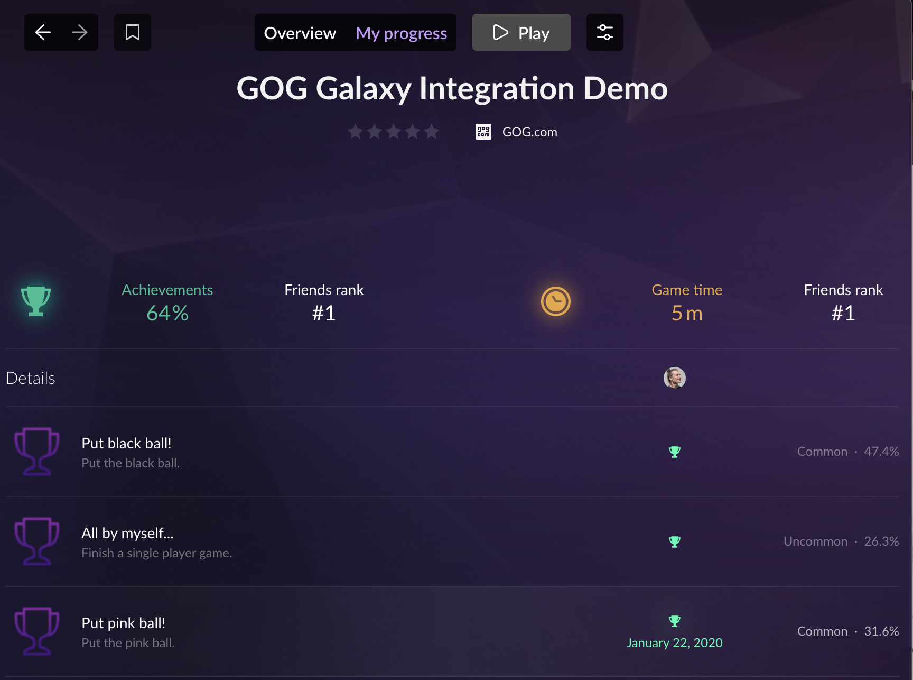
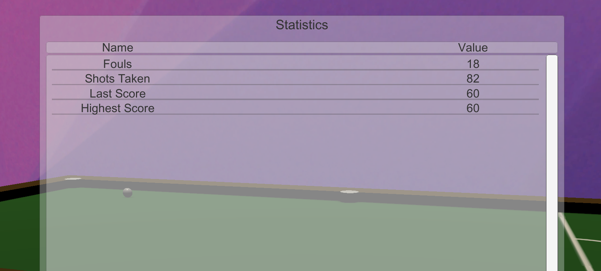
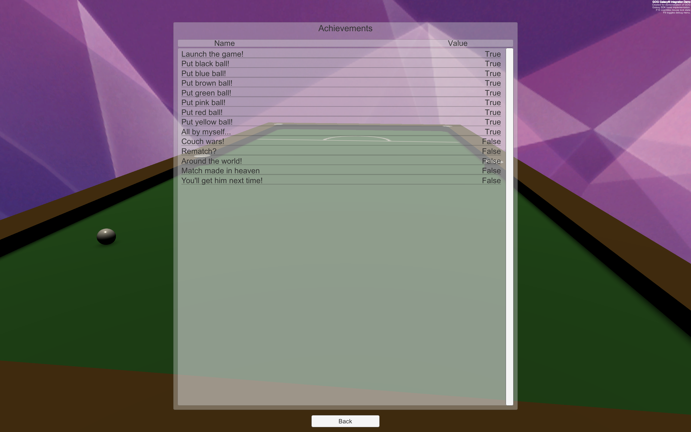

# Stats and Achievements: Example of Implementation

## Unlocking an Achievement

### User Experience

The goal is to unlock a particular achievement after a user performs a specific in-game action. If the user is signed in, is online and the GOG GALAXY Overlay is enabled, an appropriate overlay notification about unlocking the achievement should be displayed. The unlocked achievement should also be visible in the GOG GALAXY client, as well as in the in-game user achievements list (see *“Displaying Lists of Achievements”* section below).



### Solution

The `SetAchievement()` method is responsible for unlocking achievements. Achievements can be unlocked on various occasions and across different game modes, so this method is used in a number of different scripts: **GameManager**, **Local1PlayerGameManager**, **Local2PlayerGameManager** and **Online2PlayerGameManager** (they can be found under *Assets/Scripts/GameManager*).

It is also possible to unlock every achievement from [*Debug Menu*](demo-general-remarks.md#debug-menu) available in game (press **F9** to show the Debug Menu screen, click the *Achievements* button, choose an achievement to set, and click the *SetAchievement* button).

### Methods and Usage

In this demo, a player can unlock 14 different achievements. The list of available achievements is initialized in the **GalaxyManager** class. Below you can find a list of steps needed for our achievements implementation:

- Before you can call the `SetAchievement()` method, you must request user achievements with the `RequestUserStatsAndAchievements()` method. In the demo, we perform this request when enabling the **StatsAndAchievements** script with `StartStatsAndAchievements()` (located inside the `OnAuthSuccess()` method of the **AuthenticationListener**). After a successful request, we set the `public bool retrieved` inside **UserStatsAndAchievementsRetrieveListener** to `true`, so that it can be checked later (when using other methods on achievements):

  ```c#
      public void RequestUserStatsAndAchievements()
      {
          Debug.Assert(!achievementRetrieveListener.retrieved && GalaxyManager.Instance.IsSignedIn());
          Debug.Log("Requesting Stats and Achievements");
          try
          {
              GalaxyInstance.Stats().RequestUserStatsAndAchievements();
          }
          catch (GalaxyInstance.Error e)
          {
              Debug.LogWarning("Achievements definitions could not be retrieved for reason: " + e);
          }
      }
  ```

- The actual unlocking of an achievement is performed inside the script responsible for the game mechanic related to that particular achievement. For example, the *putBlue* achievement is unlocked when a player puts the blue ball in a pocket. The `SetAchievement("putBlue")` call takes place inside of the `ScoreCounter()` method in the **GameManager** class.

- Inside the `SetAchievement()` method, we call two Galaxy SDK methods: [`Stats().SetAchievement()`](https://docs.gog.com/galaxyapi/classgalaxy_1_1api_1_1IStats.html#aa5f8d8f187ae0870b3a6cb7dd5ab60e5) and [`Stats().StoreStatsAndAchievements()`](https://docs.gog.com/galaxyapi/classgalaxy_1_1api_1_1IStats.html#a0e7f8f26b1825f6ccfb4dc26482b97ee). This ensures that every time a player unlocks an achievement, the information about this is stored automatically:

  ```c#
      public void SetAchievement(string apiKey)
      {
        Debug.Log("Trying to unlock achievement " + apiKey);
          Debug.Assert(achievementRetrieveListener.retrieved);
          try
          {
              GalaxyInstance.Stats().SetAchievement(apiKey);
              GalaxyInstance.Stats().StoreStatsAndAchievements();
          }
          catch (GalaxyInstance.Error e)
          {
              Debug.LogWarning("Achievement " + apiKey + " could not be unlocked for reason: " + e);
          }
      }
  ```

## Setting User Statistics

### User Experience

The goal here is to set a proper value of a relevant user statistic after the user performs a specific in-game action. There are two types of user statistics: integers and floats. In this demo, we implemented four different user statistics (two of float type and two of integer type). The list of all in-game statistics (along with their values) can be viewed by clicking the *Stats* button in the main menu:



### Solution

There are two GOG GALAXY SDK methods specific for each statistic type: [`SetStatInt()`](https://docs.gog.com/galaxyapi/classgalaxy_1_1api_1_1IStats.html#adefd43488e071c40dc508d38284a1074) and [`SetStatFloat()`](https://docs.gog.com/galaxyapi/classgalaxy_1_1api_1_1IStats.html#ab6e6c0a170b7ffcab82f1718df355814). There is no difference between them in the way they work, it’s just different types of stats they deal with. Just like with achievements, particular statistics are set at specific moments in the game, so the `SetStatInt()` and `SetStatFloat()` methods are used across a number of scripts related to gameplay: **GameManager**, **Local1PlayerGameManager**, **Local2PlayerGameManager** and **Online2PlayerGameManager**.

It’s also possible to set every statistic from the in-game [*Debug Menu*](demo-general-remarks.md#debug-menu) (press **F9** to show Debug Menu screen, click the *Statistics* button, choose the desired statistic and click the *SetStatInt* or *SetStatFloat* button).

### Methods and Usage

Both types of statistics — float and integer — can be marked as “*Increment only*” in the [Developer Portal](statistics.md). This will result in the statistics only accepting a value higher than the current one. You can also assign a maximum value for each statistic in the Developer Portal.

In order to be able to set user statistics, we performed the following steps:

- Before calling either of the `SetStat…()` methods, you must request statistics definitions with `RequestUserStatsAndAchievements()`. In the demo, we perform this request when enabling the **StatsAndAchievements** script with `StartStatsAndAchievements()` (located inside the `OnAuthSuccess()` method of **AuthenticationListener**). After a successful request, we set the `public bool retrieved` inside **UserStatsAndAchievementsRetrieveListener** to `true`, so that it can be checked later (when using other methods on statistics).

- Setting a value for a particular statistic is performed inside the script responsible for the game mechanic related to that particular statistic. For example, the *highestScore* statistic is updated after finishing a game in any mode. To that end, the `SetStatFloat("highestScore", value)` call takes place in the `GameEnd()` method present in **Local1PlayerGameManager**, **Local2PlayerGameManager** and **Online2PlayerGameManager**.

- Inside both `SetStat…()` methods, we have implemented two GOG GALAXY SDK methods: `GalaxyInstance.Stats.SetStatFloat()` / `GalaxyInstance.Stats.SetStatInt()`, and [`GalaxyInstance.Stats.StoreStatsAndAchievements()`](https://docs.gog.com/galaxyapi/classgalaxy_1_1api_1_1IStats.html#a0e7f8f26b1825f6ccfb4dc26482b97ee). This ensures that every time the value of a user’s statistic changes, the information about this is stored automatically:

  ```c#
      public void SetStatFloat(string apiKey, float statValue)
      {
          Debug.Log("Setting stat " + apiKey);
          Debug.Assert(achievementRetrieveListener.retrieved);
          try
          {
              GalaxyInstance.Stats().SetStatFloat(apiKey, statValue);
              GalaxyInstance.Stats().StoreStatsAndAchievements();
              Debug.Log("Stat " + apiKey + " set to " + statValue);
          }
          catch (GalaxyInstance.Error e)
          {
              Debug.LogWarning("Could not set value of statistic " + apiKey + " for reason: " + e);
          }
      }
  ```

!!! Important "Lots of Stats Which Change Often"
    If you intend to have a large number of statistics with often changing values, you should consider calling `GalaxyInstance.Stats.StoreStatsAndAchievements()` from time to time only, and also when the player quits the game.

## Displaying Lists of Achievements

### End User Experience

To display a list of user’s achievements, click the *Achievements* button in the *Statistics* section of the main menu while logged in to GOG GALAXY. The list of all in-game achievements will be displayed, along with their unlock status:



### Solution

The implementation of the achievements list is realized by the **AchievementsController** script, attached to the **AchievementsScreen** GameObject in the **MainMenu** scene. The script itself can be found in *Assets/Scripts/UI/MainMenu*.

### Variables

We have defined the following variables:

| Variable                              | Description                                                  |
| ------------------------------------- | ------------------------------------------------------------ |
| public GameObject `entries`           | Unity GameObject that serves as a parent for all achievements entries |
| public GameObject `entryPrefab`       | Prefab used to display the names and unlock status of achievements; it can be found in *Assets/Prefabs/UI/Entries/entryAchievements* |
| private List\<GameObject> `entryList` | List used to store all current entries, so that we can easily dispose of them when necessary |

### Methods and Usage

This class uses two methods in order to display the list of achievements:

- `DisplayAchievements()` is called when the GameObject is enabled, i.e. when the Friends screen is displayed.
- `DisposeAchievements()` is called when the GameObject is disabled, i.e. when a screen with the list is closed.

#### DisplayAchievements Method

```c#
    void DisplayAchievements()
    {

        int i = 0;
        GameObject currentObject;

        foreach (string entry in GalaxyManager.Instance.achievementsList)
        {
            currentObject = Instantiate(entryPrefab, entries.transform);
            currentObject.name = entry;
            currentObject.transform.GetChild(0).GetComponent<Text>().text = "" + GalaxyManager.Instance.StatsAndAchievements.GetAchievementName(entry);
            currentObject.transform.GetChild(1).GetComponent<Text>().text = "" + GalaxyManager.Instance.StatsAndAchievements.GetAchievement(entry);
            entryList.Add(currentObject);
            i++;

        }

    }
```

We define the `currentObject` GameObject variable for easier access to the currently edited GameObject. Then we iterate over all achievements stored in the `achievementsList` variable. Inside this loop we do the following:

- Instantiate **entryPrefab** using GameObject entries transform as a parent. Note that the GameObject entries are using Unity VerticalLayoutGroup to list all of the elements.
- Assign values to the text objects inside our prefab, using Unity transform inheritance. We use the `StatsAndAchievements.GetAchievementName()` to set the name and `StatsAndAchievements.GetAchievement()` to set the current unlock state of the achievement.
- Lastly, we add **currentObject** to the list of displayed objects (`entryList`).

#### DisposeAchievements Method

```c#
    void DisposeAchievements()
    {

        foreach (GameObject child in entryList)
        {

            Destroy(child);

        }

        entryList.Clear();
        entryList.TrimExcess();

    }
```

We iterate through all of the currently displayed achievement entries using a `foreach` loop within the `entryList` (created earlier in the `DisplayAchievements()` method) in order to destroy all entries. At the end of the loop, we clear the `entryList`.
