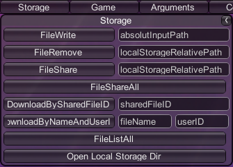

# Storage: Example of Implementation

!!! Important "Proof of Concept"
    This implementation is for demo purposes only and it has no practical use in the game.



All methods needed for the Storage feature to work are included in the **Storage** class available at *Assets/Scripts/GalaxyManager/Features/Storage.cs*.

## Sharing a File

### User Experience

A user wants to share a file, or files, from their local storage. In the *FileWrite* input field of the *Debug Menu* they provide an absolute path to a file that they want to share. When the file is copied to the local cache of the cloud storage in GOG GALAXY, a user can choose to share a particular file using the *FileShare* input field and providing its name, or share all files in the cloud storage using the *FileShareAll* button.

### Solution

We use the `CopyFileToLocalStorage()` method to write the selected file to the local cache of the cloud storage in GOG GALAXY and then the `ShareFileFromLocalStorage()` or `ShareAllFilesFromLocalStorage()` methods to upload the file(s) to the Cloud Storage and assign a `FileSharedID` so that the file(s) can be downloaded by other players.

### Methods and Usage

#### CopyFileToLocalStorage

```C#
    public void CopyFileToLocalStorage (string absoluteInputPath)
    {
        string fileName = null;
        byte[] data = null;

        if (File.Exists(absoluteInputPath))
        {
            fileName = Path.GetFileName(absoluteInputPath);
            data = File.ReadAllBytes(absoluteInputPath);
        }
        else
        {
            Debug.Log("File " + absoluteInputPath + " does not exist");
            return;
        }

        try
        {
            Debug.Log("Writing file " + absoluteInputPath + " to local storage.");
            GalaxyInstance.Storage().FileWrite(fileName, data, (uint)data.Length);
        }
        catch (GalaxyInstance.Error e)
        {
            Debug.LogWarning ("Could not write file " + absoluteInputPath + " to local storage for reason: " + e);
        }
    }
```

This method reads a specified file from your drive and copies it to the local cache, from where it will be synchronized with the cloud storage in GOG GALAXY. Basically, it’s a wrapper for the GOG GALAXY SDK [`FileWrite`](https://docs.gog.com/galaxyapi/classgalaxy_1_1api_1_1IStorage.html#a1c3179a4741b7e84fe2626a696e9b4df) method.

!!! Tip
    You can use the GOG GALAXY SDK `FileWrite` method to write bytes from memory to a file in the local cache, i.e. create a new file instead of copying an existing one.

First, we check if a file of a specified name exists in the provided location. If it does, then its name is derived from the absolute path provided by the user and stored in the `fileName` variable, whereas all of its content is read as bytes, using the `System.IO.File.ReadAllBytes` method, and stored in the `data` variable. Then, we use the [`FileWrite`](https://docs.gog.com/galaxyapi/classgalaxy_1_1api_1_1IStorage.html#a1c3179a4741b7e84fe2626a696e9b4df) method from the GOG GALAXY SDK to write the file to the local cache.

#### ShareFileFromLocalStorage

```c#
    public void ShareFileFromLocalStorage (string fileName)
    {
        try
        {
            Debug.Log("GalaxyInstance.Storage.FileShare method started");
            GalaxyInstance.Storage().FileShare(fileName);
        }
        catch (GalaxyInstance.Error e)
        {
            Debug.LogWarning ("Error " + e + " occured during execution of GalaxyInstance.Storage.FileShare method");
        }
    }
```

In this simple method a specified file is immediately uploaded from the local cache to the cloud storage in GOG GALAXY and shared using the [`FileShare`](https://docs.gog.com/galaxyapi/classgalaxy_1_1api_1_1IStorage.html#a10cfbb334ff48fcb8c9f891adc45ca1d) method from the GOG GALAXY SDK. The shared file can be downloaded by other users thanks to the `SharedFileID` assigned to the file. `SharedFileID` can be obtained from the [`FileShareListener`](demo-storage-implementation.md#filesharelistener).

#### ShareAllFilesFromLocalStorage

```c#
    public void ShareAllFilesFromLocalStorage ()
    {
        uint fileCount = GalaxyInstance.Storage().GetFileCount();
        string fileName = null;
        try
        {
            for (uint i = 0; i < fileCount; i++)
            {
                fileName = GalaxyInstance.Storage().GetFileNameByIndex(i);
                ShareFileFromLocalStorage(fileName);
                Debug.Log("File " + fileName + " share request sent");
            }
        }
        catch (GalaxyInstance.Error e)
        {
            Debug.LogWarning("Sharing one of the files from local storage failed for reason: " + e);
        }
    }
```

With this method we can share all files present in the local cache in one fell swoop. It uses the `ShareFileFromLocalStorage` method described above in a `for` loop iterating over all files stored in the local cache.

We use two additional GOG GALAXY SDK **IStorage** methods in order to share all files at once:

- [`GetFileCount`](https://docs.gog.com/galaxyapi/classgalaxy_1_1api_1_1IStorage.html#a17310a285edce9efbebb58d402380ef8) to get the total number of files in the cache and use it as the maximum index for the `for` loop
- [`GetFileNameByIndex`](https://docs.gog.com/galaxyapi/classgalaxy_1_1api_1_1IStorage.html#abac455600508afd15e56cbc3b9297c2d) to retrieve the name of a file at a specified index within the `for` loop.

#### FileShareListener

```c#
    public class FileShareListener : GlobalFileShareListener
    {
        public override void OnFileShareSuccess(string fileName, ulong sharedFileID)
        {
            try
            {
                GalaxyInstance.User().SetUserData(fileName, sharedFileID.ToString());
            }
            catch (GalaxyInstance.Error e)
            {
                Debug.LogWarning("Could not assign file " + fileName + " to user for reason " + e);
            }
            Debug.Log("File " + fileName + " was shared and assigned ID " + sharedFileID);
        }

        public override void OnFileShareFailure(string fileName, FailureReason failureReason)
        {
            Debug.Log("Failed to share file " + fileName + " for reason " + failureReason);
        }
    }
```

When a user shares a file, it is assigned a `sharedFileID`. As of right now, the `sharedFileID` is only accessible to a person who shared a file, but we want other players to be able to download the shared file. In our demo, we do this by storing the `sharedFileId` value under the key equal to the file name in the user data.

Once the `FileShareListener.OnFileShareSuccess` callback fires, we can be sure that the file was successfully shared and this is where we receive the `sharedFileID` of the shared file. We use this opportunity to save the `sharedFileID` in user data using the [`SetUserData`](https://docs.gog.com/galaxyapi/classgalaxy_1_1api_1_1IUser.html#a2bee861638ff3887ace51f36827e2af0) method from the GOG GALAXY SDK. Now other users don’t need to know the `sharedFileID`; they only need the file name and the ID of a user.

## Downloading a Shared File

### User Experience

When a user shares a file, other users may start downloading it. They open the *Debug Menu* and either provide the `sharedFileID` of the file in the *DownloadBySharedFileID* input field or the name of the file along with the userID of a user who shared the file – the file owner – in the appropriate *DownloadByNameAndUser* input fields.

### Solution

These two download options are handled by the `DownloadSharedFileBySharedFileID` and `DownloadSharedFileByUserIdAndFileName` methods, respectively, with help from the `GetSharedFileIDFromUser` method for the latter.

`DownloadSharedFileBySharedFileID` is pretty straightforward: if you know the `sharedFileID`, you only need to download the file.

However, the `DownloadSharedFileByUserIdAndFileName` method is a bit more complicated. We want to allow users to download files based on their names. To do so, we first need to grab the `sharedFileID` of the files from the file owner’s user data, but we need to request the said user data first.

!!! Note
    The `sharedFileID` is retrieved by the **[FileShareListener](#filesharelistener)** and saved to user data.

### Methods and Usage

#### DownloadSharedFileByUserIdAndFileName

```c#
    public void DownloadSharedFileByUserIdAndFileName(GalaxyID userID, string fileName)
    {
        specificUserDataListener.fileName = fileName;
        sharedFileDownloadListener.userID = userID.ToString();
        try
        {
            GalaxyInstance.User().RequestUserData(userID, specificUserDataListener);
        }
        catch (GalaxyInstance.Error e)
        {
            Debug.Log("Could not request user data for reason " + e);
        }
    }
```

We want to allow players to download a file by its name (the `fileName` parameter) and the `userID` of the file owner.

First, we need to perform the following steps:

- Set the `specificUserDataListener.fileName` variable to the name of the file, so we can use it later in the listener for grabbing the `sharedFileID` of the specified file.
- Set the `sharedFileDownloadListener.userID` variable to the `userID` of the user, so we can use it later in the listener for saving user specific files in respective folders.

We also need to grab the `sharedFileID` from the file owner’s user data. However, before we can grab any data from the user, we need to request it using the [`IUser::RequestUserData()`](https://docs.gog.com/galaxyapi/classgalaxy_1_1api_1_1IUser.html#a8e77956d509453d67c5febf8ff1d483d) method from the GOG GALAXY SDK.

The callback to this request comes to **SpecificUserDataListener** (described below), which handles grabbing the `sharedFileID` and downloading of the file.

#### SpecificUserDataListener

```c#
    public class SpecificUserDataListener : ISpecificUserDataListener
    {
        public string fileName = "";
        private ulong sharedFileID = 0;

        public override void OnSpecificUserDataUpdated(GalaxyID userID)
        {
            Debug.Log("User " + userID + " data received");
            sharedFileID = GalaxyManager.Instance.Storage.GetSharedFileIDFromUser(userID, fileName);
            GalaxyManager.Instance.Storage.DownloadSharedFileBySharedFileID(sharedFileID);
            fileName = "";
            sharedFileID = 0;
        }

    }
```

Note that `SpecificUserDataListener` inherits from [`ISpecificUserDataListener`](https://docs.gog.com/galaxyapi/classgalaxy_1_1api_1_1ISpecificUserDataListener.html), not [`GlobalSpecificUserDataListener`](https://docs.gog.com/galaxyapi/classgalaxy_1_1api_1_1IUserDataListener.html) from the GOG GALAXY SDK. This means that this listener will only be used for methods that have specifically registered to it (note how we specify the listener as the second parameter when calling `GalaxyInstance.User().RequestUserData(userID, specificUserDataListener)` in the `DownloadSharedFileByUserIdAndFileName` method).

Once the `OnSpecificUserDataUpdated` is called, we are ready to grab the `sharedFileID` from the user data using the `GetSharedFileIdFromUser` method (described below). Now that we have the `sharedFileID`, we can proceed to download the file using the [`DownloadSharedFileBySharedFileID`](#downloadsharedfilebysharedfileid) method. Finally, we set the variables back to their default values.

#### GetSharedFileIDFromUser

```c#
    public ulong GetSharedFileIDFromUser(GalaxyID userID, string fileName)
    {
        ulong sharedFileID = 0;
        if (fileName == null) return sharedFileID;
        try
        {
            sharedFileID = ulong.Parse(GalaxyInstance.User().GetUserData(fileName, userID));
        }
        catch (GalaxyInstance.Error e)
        {
            Debug.Log("Could not get SharedFileID for file " + fileName + " for user " + userID.ToString() + " for reason " + e);
        }
        fileName = null;
        return sharedFileID;
    }
```

This helper method called in the `SpecificUserDataListener.OnSpecificUserDataUpdated` callback described above retrieves the `sharedFileID` for a file with a specified name. It simply calls the **User** interface from the GOG GALAXY SDK ([`GetUserData`](https://docs.gog.com/galaxyapi/classgalaxy_1_1api_1_1IUser.html#aa060612e4b41c726b4fdc7fd6ed69766)) to read and return the value of a specified key in user data.

#### DownloadSharedFileBySharedFileID

```c#
    public void DownloadSharedFileBySharedFileID(ulong sharedFileID)
    {
        if (sharedFileID == 0) return;
        try
        {
            GalaxyInstance.Storage().DownloadSharedFile(sharedFileID);
        }
        catch (GalaxyInstance.Error e)
        {
            Debug.LogWarning("Could not download shared file for reason " + e);
        }
    }
```

It’s a simple method that makes use of the [`DownloadSharedFile`](https://docs.gog.com/galaxyapi/classgalaxy_1_1api_1_1IStorage.html#aabdcf590bfdd6365e82aba4f1f332005) method from the GOG GALAXY SDK to download a file with a specified `sharedFileID`.

!!! Note "Remember: It’s Just a Demo!"
    Since **Storage** is for demo purposes only, the *DownloadSharedFileBySharedFileID* feature is not fully functional: a user has to obtain the `sharedFileID` somehow in order to use it. We didn’t implement any method to pass this ID to other users, but when a file is shared, its `sharedFileID` can be obtained from the logs.

#### SharedFileDownloadListener

```c#
    public class SharedFileDownloadListener : GlobalSharedFileDownloadListener
    {
        public string userID = "0";
        public override void OnSharedFileDownloadSuccess(ulong sharedFileID, string fileName)
        {
            Debug.Log("Shared file with ID " + sharedFileID + " downloaded. Proceeding to write the file ");
            try
            {
                uint downloadedSharedFileSize = GalaxyInstance.Storage().GetSharedFileSize(sharedFileID);
                byte[] downloadedSharedFileBuffer = new byte [downloadedSharedFileSize];
                string saveFileName = userID + "/" + fileName;
                GalaxyInstance.Storage().SharedFileRead(sharedFileID, downloadedSharedFileBuffer, downloadedSharedFileSize);
                GalaxyInstance.Storage().FileWrite(saveFileName, downloadedSharedFileBuffer, downloadedSharedFileSize);
                Debug.Log("Downloaded shared file written to: " + saveFileName);
            }
            catch (GalaxyInstance.Error e)
            {
                Debug.LogWarning(e);
            }
            finally {
                GalaxyInstance.Storage().SharedFileClose(sharedFileID);
                userID = "0";
            }
        }

        public override void OnSharedFileDownloadFailure(ulong sharedFileID, FailureReason failureReason)
        {
            Debug.Log("Failed to download file with ID " + sharedFileID + " for reason " + failureReason);
            userID = "0";
        }
    }
```

This is the listener for the [`DownloadSharedFile`](https://docs.gog.com/galaxyapi/classgalaxy_1_1api_1_1IStorage.html#aabdcf590bfdd6365e82aba4f1f332005) method from the GOG GALAXY SDK. Once the `OnSharedFileDownloadSuccess` callback runs, we know that the file was downloaded to memory, and in our implementation we want to save it in the user’s local cache:

1. Get the shared file size, using the [`GetSharedFileSize`](https://docs.gog.com/galaxyapi/classgalaxy_1_1api_1_1IStorage.html#af389717a0a383175e17b8821b6e38f44) method from the **Storage** interface of the GOG GALAXY SDK.
2. Create a byte array for reading the shared file.
3. Set up a download path to include the owner’s UserID and the file name. If the file was not downloaded from a specified player, a default value of `0` will be used.
4. Read the shared file using the [`SharedFileRead`](https://docs.gog.com/galaxyapi/classgalaxy_1_1api_1_1IStorage.html#af4bbf0a1c95571c56b0eca0e5c3e9089) method from the GOG GALAXY SDK.
5. Write the file to the local cache using the [`FileWrite`](https://docs.gog.com/galaxyapi/classgalaxy_1_1api_1_1IStorage.html#a1c3179a4741b7e84fe2626a696e9b4df) method from the GOG GALAXY SDK.
6. In the `finally` part we make sure to call [`SharedFileClose`](https://docs.gog.com/galaxyapi/classgalaxy_1_1api_1_1IStorage.html#a3f52b2af09c33a746891606b574d4526) to free up memory, and then we reset the `userID` variable to its default value.

!!! Note
    We are using the `try…catch…finally` keywords to ensure that we catch any exceptions, close the file, and free up the memory.

## Removing a File from the Local Cache

### User Experience

A user enters the name of a file to be removed from the local cache and presses the *FileRemove* button in the *Debug Menu*.

### Solution

The `RemoveFileFromLocalStorage` method removes the specified file from the local cache of the cloud storage. It uses two GOG GALAXY SDK methods:

- [`FileExists`](https://docs.gog.com/galaxyapi/classgalaxy_1_1api_1_1IStorage.html#a3e0e304228ce32f9adf541cebf9c5056) to check if a file of a given name is present in the cache
- [`FileDelete`](https://docs.gog.com/galaxyapi/classgalaxy_1_1api_1_1IStorage.html#a51d41b83fca88ea99f4efbf8eb821759) to delete the file.

### Methods and Usage

#### RemoveFileFromLocalStorage

```c#
    public void RemoveFileFromLocalStorage (string fileName)
    {
        try
        {
            if (GalaxyInstance.Storage().FileExists(fileName))
            {
                GalaxyInstance.Storage().FileDelete(fileName);
            }
            else
            {
                Debug.Log("File " + fileName + " could not be removed because it does not exist");
            }
        }
        catch (GalaxyInstance.Error e)
        {
            Debug.LogWarning("Could not remove file " + fileName + " for reason " + e);
        }
    }
```

If the file with a given `fileName` is present in the cache, it’s deleted.

When using this method, remember that:

1. The file needs to be in your local cache.
2. If you remove the file while the game is running, the information about the removal will be sent to the cloud storage when the game is closed.
3. The files that you removed manually while the game was not running will be downloaded again when the game is launched.

## Displaying a List of All Files in the Local Cache

### User Experience

A user presses the *FileListAll* button in the *Debug Menu* in order to get a list of all files in their local cache.

!!! Note
    The files will be listed in logs.

### Solution

In the `ListAllFilesFromOnlineStorage` method we use the same GOG GALAXY SDK methods as in the [`ShareAllFilesFromLocalStorage`](#shareallfilesfromlocalstorage) method to get the list of all files:

- [`GetFileCount`](https://docs.gog.com/galaxyapi/classgalaxy_1_1api_1_1IStorage.html#a17310a285edce9efbebb58d402380ef8) to get the total number of files in the local cache and use it as the maximum index for the `for` loop
- [`GetFileNameByIndex`](https://docs.gog.com/galaxyapi/classgalaxy_1_1api_1_1IStorage.html#abac455600508afd15e56cbc3b9297c2d) to retrieve the name of a file at a specified index within the `for` loop.

### Methods and Usage

#### ListAllFilesFromOnlineStorage

```c#
    public string[] ListAllFilesFromOnlineStorage ()
    {
        uint fileCount = 0;
        string[] nameList;
        try
        {
            fileCount = GalaxyInstance.Storage().GetFileCount();
            nameList = new string[fileCount];
            for (uint i = 0; i < fileCount; i++)
            {
                nameList[i] = GalaxyInstance.Storage().GetFileNameByIndex(i);
            }
            Debug.Log("List of files in storage received.");
            return nameList;
        }
        catch (GalaxyInstance.Error e)
        {
            Debug.LogWarning("Getting file list from storage failed for reason: " + e);
        }
        return null;
    }
```

In this method, we iterate through the files in the local cache, retrieving their names one by one and adding to the file list (the `nameList` variable) in the `for` loop.

!!! Info
    Files in the cloud storage in GOG GALAXY that are not present in its local cache will NOT be listed.
