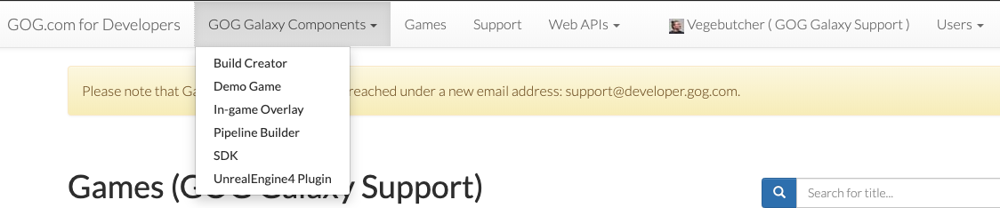
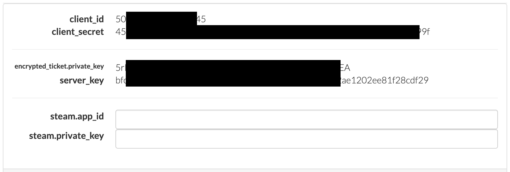

# Developer Portal Guide

The GOG Developer Portal is your command center, where you manage your builds and updates for Windows, macOS, and Linux and implement features available in our SDK.

!!! Tip
    If you have not yet received an invitation to our Developer Portal, please contact your Product Manager.

The GOG GALAXY ecosystem includes:

- **GOG GALAXY Pipeline** — [Build Creator](bc-quick-start.md), [Pipeline Builder](pb-quick-start.md)
- [**GOG GALAXY SDK**](sdk.md) — Multiplayer, Achievements, Leaderboards, Statistics, Overlay, DLC discovery
- [**GOG GALAXY client (desktop application)**](gc-client-overview.md)

## Menu

|                          Item | Function                                                     |
| ----------------------------: | ------------------------------------------------------------ |
|       *GOG GALAXY Components* | Redirects to product pages with basic info and download links for [Build Creator](bc-quick-start.md), [Demo Game](demo-desc-and-prerequisities.md), In-game [Overlay](gc-overlay.md), [Pipeline Builder](pb-quick-start.md), [SDK](sdk.md) and UnrealEngine4 Plugin |
|                       *Games* | Displays all products under the developer account and their product IDs. Allows to manage product settings such as [leaderboards](leaderboards.md), [achievements](achievements.md), [statistics](statistics.md), SDK Credentials, [DLCs](dlc-and-extras.md), [builds & branches](build-branches.md) and Devportal user permissions |
|                     *Support* | Allows access to all existing articles and documentation. If anything seems unclear or is missing, please contact our dedicated GOG GALAXY Support team: [support@developer.gog.com](mailto:support@developer.gog.com) |
|                    *Username* | If your user account is assigned to more than one developer account, you can switch between those in the dropdown next to your username in Devportal |
| [*Users*](user-management.md) | Allows you to manage users, invite new ones, and add licenses to accounts of your choosing |

## Games Screen: Product Buttons

- *Galaxy Features* is the place to set up [leaderboards](leaderboards.md), [achievements](achievements.md) and [statistics](statistics.md).
- *SDK Credentials* will allow you to see and input the following information:

!!! Note
    *Steam.app_id* and *steam.private_key* is only required when implementing [crossplay](sdk-crossplay.md).

- [*DLC*](dlc-and-extras.md) lets you see all the DLCs related to the base product.
- *Builds* opens [*Builds & branches*](build-branches.md) page — the only place that will allow you to **publish builds and [updates](updates.md)** on the Master branch, making it available to all authorized users. **This function is not accessible in Build Creator.** You can view all of the uploaded builds here and see what branches they’re published on. You can also create your own branches in this menu (for example, a Beta branch for testing, protected with a password of your choice).
- *Admin* opens the *Permissions* screen, where you can set Devportal [user permissions](user-management.md) for a particular product.
