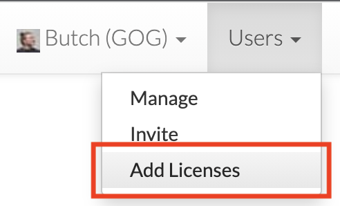
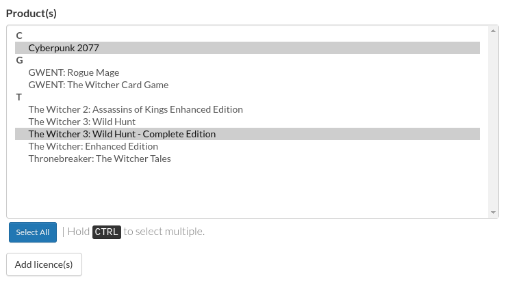

# Game Licenses (Keys)

This allows users with user admin privileges to grant licenses for selected games under the developer account to another user, which can be done with the *Users→Add Licences* option (see image below). They do not require a Developer Portal account to receive the licenses, but they do require a GOG account, which they can create on the [GOG homepage](https://www.gog.com/).

Please allow up to 15 minutes for the licenses to be added to a user account.

By default, all accounts that are registered under your developer account receive licenses for games assigned to this developer account. Licenses are synced with each login to the Developer Portal, so if a game has been added to your developer account and you still don’t see it in your library, please log in to the Developer Portal. Please allow up to 15 minutes for the licenses to be added to your account.

!!! Info
    Accounts with the “Users” Privilege will also be able to grant or revoke License Privileges.

!!! Tip "Extra Keys for Your Games"
    If you need keys for certain titles or, for example, would like to test scenarios without DLCs first, you can also ask your PM for a set of generated codes.

## Selection

 * Use mouse to select desired game(s).
 * Hold **CTRL** (or **⌘** on OSX) to select multiple titles.
 * Use **Select All** button to automatically select all games on the list.

!!! Important "Licence for DLC"
    Granting licence for game will also grant licences for any related DLC. If you want to give licence without DLC or with a specific DLC only you can ask your PM for a set of generated codes.

## Example

John and Mary are both developers in your team, with John having a GOG Developer account and Mary not. At the time John’s GOG account was added to your developer account, there were 3 games assigned to that developer account and John automatically got licenses to them. Mary was granted licenses manually with the *Add Licenses* option.

Now that you have added a new game, you and your team have to log out and log back in again to the Developer Portal in order to see the game in your library. John will get the license automatically, while you will have to repeat the manual process of granting the license to Mary for that new game.
