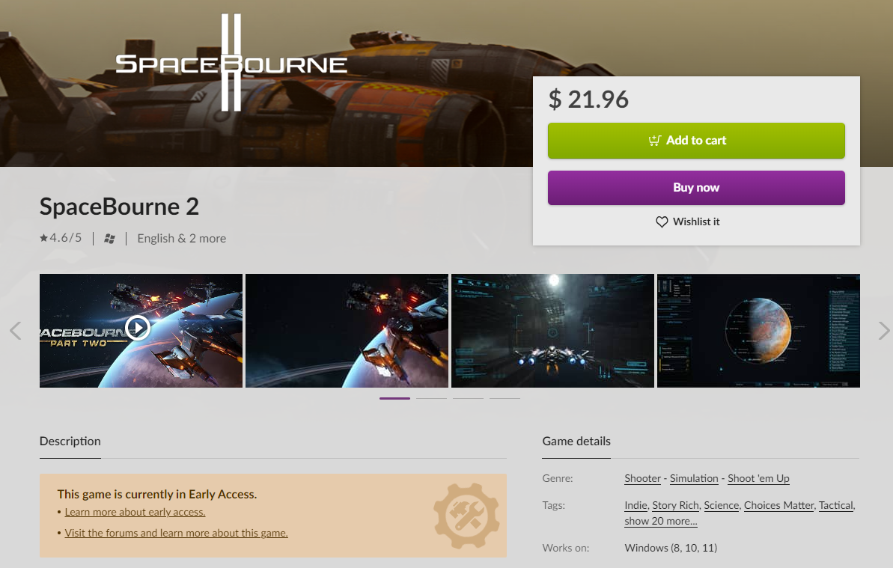

# Games In Development

Games in Development are early access titles on GOG, i.e. releasable games that are not finished yet. Though they are quite similar to a fully developed game on GOG, there are a few key distinctions that set them apart.

Games in Development are highlighted in two places on the website: an orange banner is added to the store page, and the “InDev” label is displayed on the game card on a user’s shelf. Furthermore, an “In Dev FAQ” thread is sticked in the sub-forum: this is the place, where developers can provide information about a game and their plans for its development.

If you want to publish a game that’s still being developed, please contact our Business Development team and share any ideas or wishes regarding the product. Or — if you are not signed with us yet — please refer to the steps outlined in the [*Getting Started*](quick-start.md#access-to-the-gog-developer-portal) article.

Along with being highlighted, Games in Development also have a 30-day refund policy: users can download, play, and refund any game in development within 30 days of purchase, no questions asked.

Besides the aforementioned distinctions, Games in Development are treated similarly to a full release on GOG.com. We request the same assets and information to prepare the store page and the build will undergo the same building and QA processes.

## Rollback Feature

One of the unique features of the GOG GALAXY client is our Rollback feature, which allows a user to select and play a previous version of the game. This can be done once the game has been installed, by opting to install game updates manually in the game settings in the GOG GALAXY client (see below). While a helpful feature for all of our titles, Rollback is particularly advantageous for Games in Development; it allows users to enjoy an older version of the game to better experience the development changes, or to rollback should they encounter a critical bug or issue. You will be able to manage these previous versions using our Developer Pipeline tools and Developer Portal.

!!! Info
    Please note that we will not conduct a full playthrough of your game during our QA process. However, should we encounter any bugs or issues during our testing, we’ll surely notify you and work with you to resolve any serious or significant ones.

