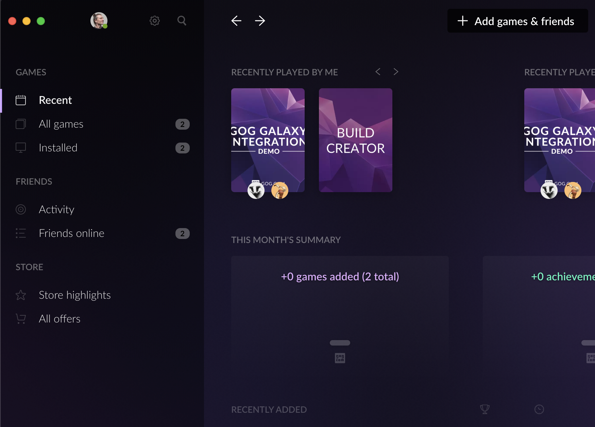
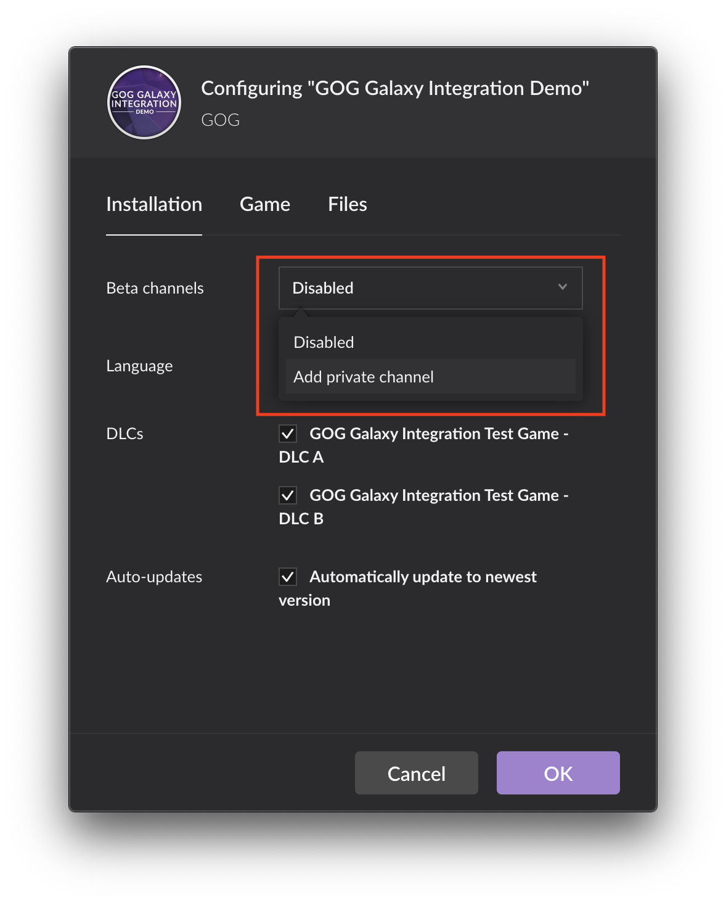
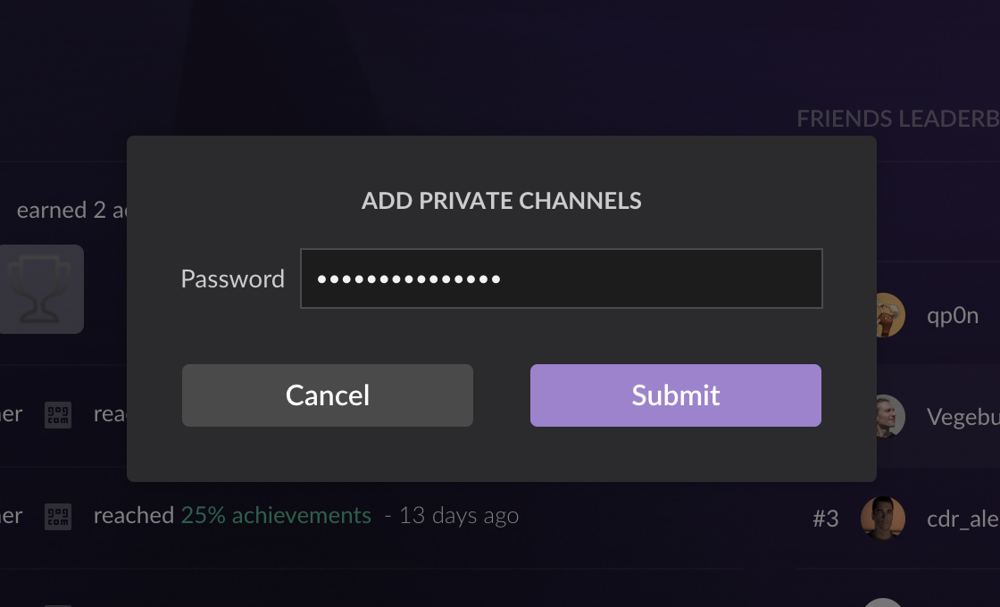
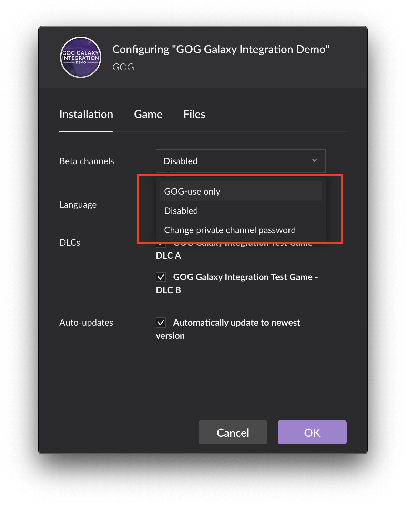
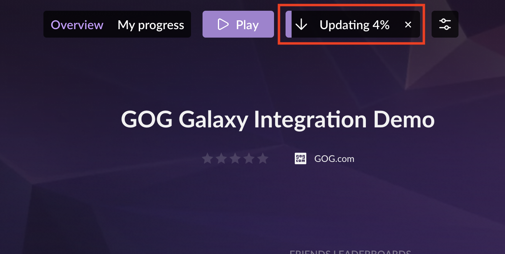

# Beta Channels

This article will guide you through accessing the Beta Channels for your game in the GOG GALAXY client:

1. Proceed to the game card for your game in the GOG GALAXY client.

    

2. Enter game settings by clicking *Settings* icon, then selecting *Manage Installation→Configure…* from the drop-down menu:

    

3. On the game configuration screen, click *Installation* tab and then *Beta channels* drop-down list. If your channel is not password protected, you can now select it from the list. If it is password protected, select *Add private channel*:

    

4. Enter the password for the channel when prompted (you will see the available channels/branches and their passwords on *Branches* tab of *Builds & Branches* screen, when you click *Builds* button for your game in the [Games](https://devportal.gog.com/panel/games) section of the Developer Portal):

    

5. The Beta channel should now be available in the drop-down list, so you can select it:

    

6. Your game should now automatically update with the build from your selected Beta channel:

    