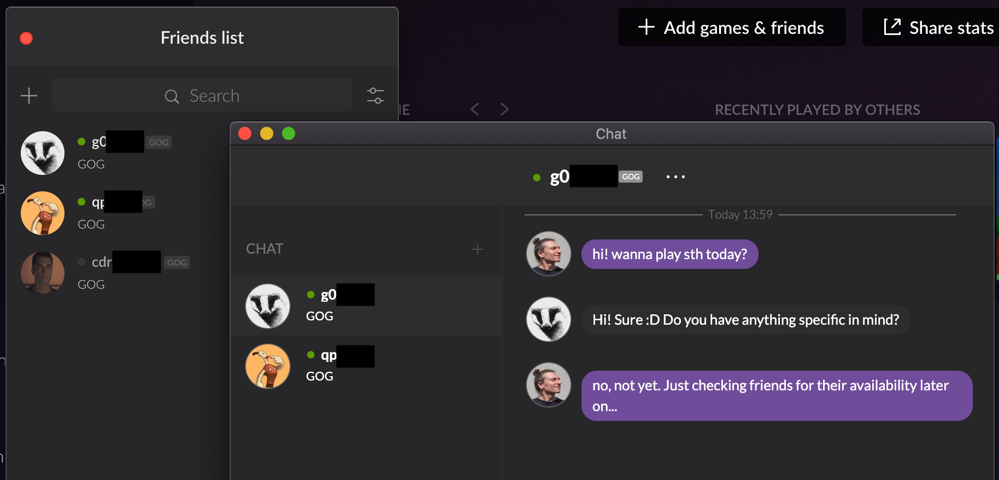

# Chat

GOG GALAXY users can always chat with each other regardless of other messaging options available in games. GOG chat is available on the [website](https://www.gog.com/account/chat) (after a user logs in), in the [overlay](gc-overlay.md) and in the GOG GALAXY client application (when a user clicks a friend on the friends list window), and can be accessed directly by a game using the [GOG GALAXY SDK](sdk-chat.md):

