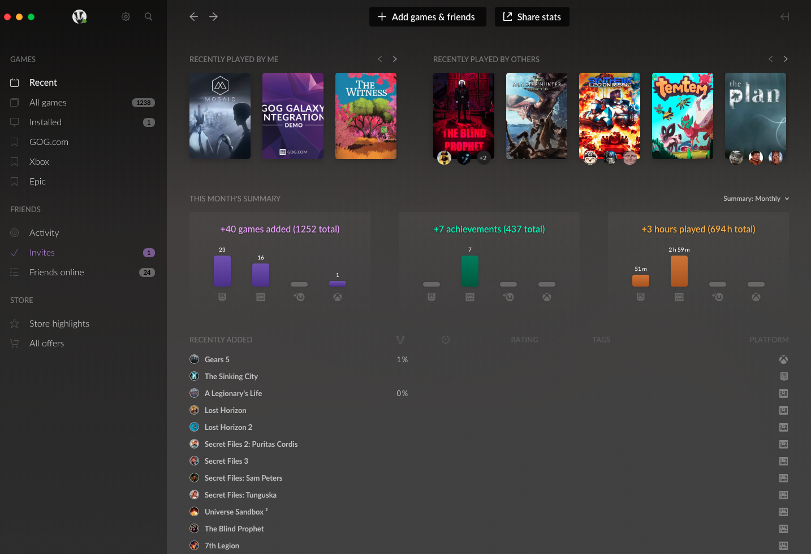

# GOG GALAXY Client

The GOG GALAXY client is a desktop application used to access GOG.com store and a user’s games library. With version 2.0 of the client and no additional actions required from game developers, it is possible to gather game libraries from other game platforms and manage them in one place, as well as have all friends, achievements and statistics in one application.

The most important benefit of using the GOG GALAXY client application is that it enables special features in games:

- [GOG GALAXY Overlay](gc-overlay.md)
- [Cloud Saves](gc-cloud-saves.md)
- [Beta Channels](gc-beta-channels.md) (if provided by a developer)
- [Rollback](gc-rollback.md)
- [Chat](gc-chat.md) for GOG GALAXY users (independent from an in-game chat).
