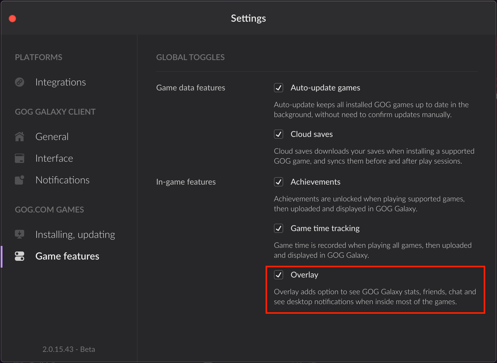

# GOG GALAXY Overlay

## Overview

The GOG GALAXY Overlay can be displayed in a game after pressing **Shift+Tab** keys, and it allows players to use a bunch of cool features while playing a game:

- Managing their friends list
- Chatting with friends
- Sending and receiving invites to a multiplayer game (if a game allows it)
- Taking screenshots (**F12** key)
- Displaying the FPS counter (toggled with **Ctrl+Shift+Tab** keys)
- Receiving notifications about unlocking a game achievement.

By default, the overlay is enabled in the GOG GALAXY client, but can be disabled in the application settings by the user:



!!! Tip
    You can always resort to the GOG GALAXY SDK and use the [`IUtils::GetOverlayState()`](https://docs.gog.com/galaxyapi/classgalaxy_1_1api_1_1IUtils.html#ace3179674f31b02b4dcd704f59c3e466) method or the [`IOverlayInitializationStateChangeListener::OnOverlayStateChanged()`](https://docs.gog.com/galaxyapi/classgalaxy_1_1api_1_1IOverlayInitializationStateChangeListener.html#af55f5b8e0b10dde7869226c0fbd63b35) callback to check whether Overlay is initialized.

## Testing Overlay Locally

You don’t have to worry about enabling the overlay in your game. We will take care of it for you during our QA process before your game is released. Please make sure that the game task is correctly specified in your game project. To read more on how to set up your game project, please refer to the articles on [Build Creator](bc-quick-start.md).

However, if you would like to test the overlay before we enable it globally, you can turn it on locally on your machine. Follow these steps:

1. Go to

    - *C:\ProgramData\GOG.com\Galaxy* on **Windows**, or

    - *~/Users/Shared/GOG.com/Galaxy* on **macOS**.

2. Open the *config.json* file.

3. Add the following line to *config.json*:

    ```
    "forceEnableOverlay": true
    ```

    Make sure that all lines containing parameters with exception of the last one end with a comma (`,`).

4. Save the file and restart the GOG GALAXY client.

Now you can run your game and test the overlay by pressing **Shift+Tab**, even if it is not enabled globally.

!!! Important
    Please remember that the overlay works only when a game was launched by clicking the *Play* button in the GOG GALAXY client by a logged in user with a valid game license. Of course, the overlay has to be enabled in the GOG GALAXY client (see the screenshot above).

!!! Info "Overlay on macOS"
    Please be aware that we enable the overlay on macOS wherever possible, but sometimes we have to disable it after our QA process, when we discover that the overlay does not work correctly with the macOS version of the game.

!!! Attention "Games Using EasyAntiCheat"
    If your game makes use of EasyAntiCheat, then please let your Product Manager know so that they can put in a request to turn on EAC compatibility features in the overlay for your game.