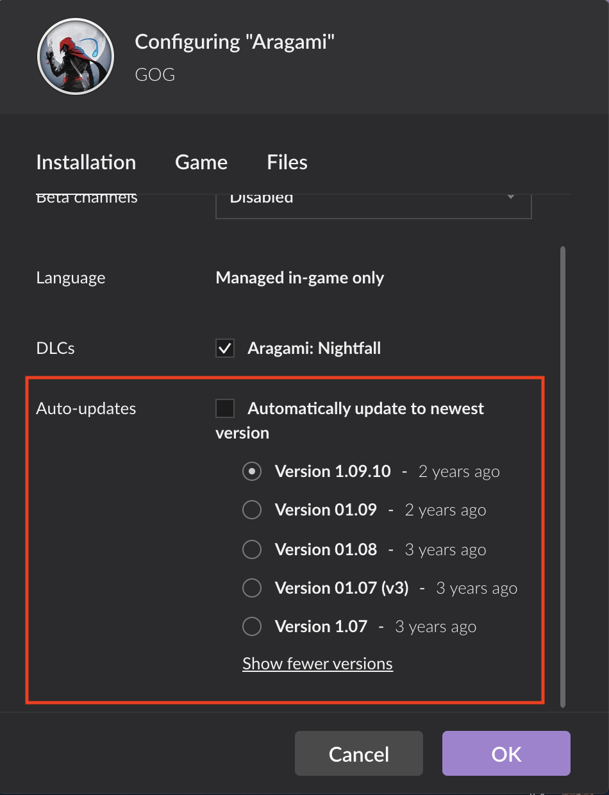

# Rollback Feature

The rollback feature is unique to the GOG GALAXY client, not available in other game platforms, which allows a user to select and play a previous version of the game. This can be done once the game has been installed, by opting to install game updates manually in the game settings in the GOG GALAXY client (see below). It is especially useful for [games in development](games-in-development.md) or when an [update](updates.md) went south and caused troubles.

For this feature to work with your game, please **do not unpublish any previous updates** that have been published to the [Master branch](build-branches.md).

