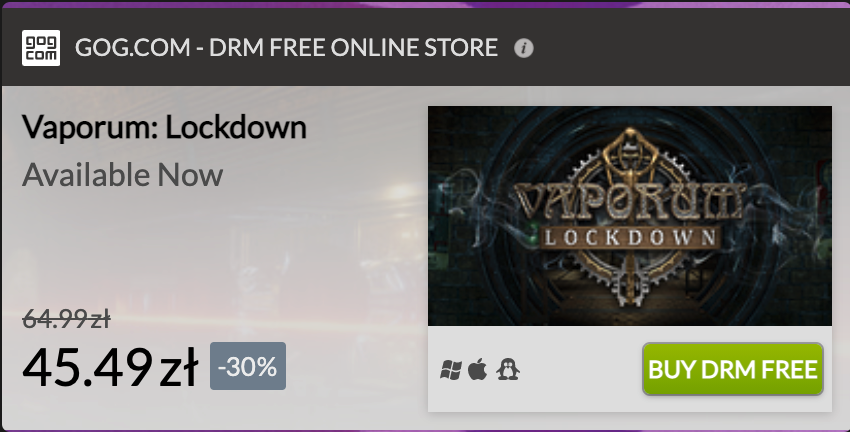

# GOG Store Widget

Once your game is available for purchase on our site, you can create a widget that displays the current price of your game, any discounts, and a purchase button to help you promote and display your title on your site. 



This widget will keep up to date as you change your product price or discount, add platforms, or update your branding image with the assistance of your Product Manager. Clicking the green *Buy DRM Free* button from the widget will take customers to the GOG store with the item in their cart where they can then purchase the game.

## Adding The Widget To Your Page

!!! Important
    The `{gameID}` value can be retrieved by visiting your [Games panel](https://devportal.gog.com/panel/games) while logged in your Developer Portal account and copying the [Product ID for your game](developer-portal.md#games-screen-product-buttons). If your game has not been added to your Developer Portal account, please make sure to contact your Product Manager. 

If you wish to add a GOG store widget to your page then please add this script to the `<head>` section:

```XML
<html>
    <head>
		...
        <script>
            (function(w,d,s,i){
                function load () {
                    var elScript = d.createElement(s);
                    elScript.type = 'text/javascript';
                    elScript.async = true;
                    elScript.src = 'https://api.gog.com/v1/distributors/widget-latest.js'
                    elTarget = d.getElementsByTagName(s)[0];
                    elTarget.parentNode.insertBefore(elScript, elTarget);
                    w['gogWidgetDistributorId'] = i;
                }
                if (w.attachEvent)
                    w.attachEvent('onload', load);
                else
                    w.addEventListener('load', load, false);
            })(window, window.document, 'script', '52756712356612660')
        </script>
		...
    </head>
	...
</html>
```

Next, you will need to add the DOM element in any place you want the widget to be visible:

```XML
<html>    
    ...
    <body>
      ...
        <div class="gog-widget" data-game="{gameID}"></div>
   </body>
</html>
```

If you have more than one title on our site and you would like to have multiple widgets displayed on your site, then please use the following code: 

```XML
<html>    
    ...
    <body>
      ...
        <div class="gog-widget" data-game="{gameID1}"></div>
        <div class="gog-widget" data-game="{gameID2}"></div>
        <div class="gog-widget" data-game="{gameID2}"></div>
   </body>
</html>
```
