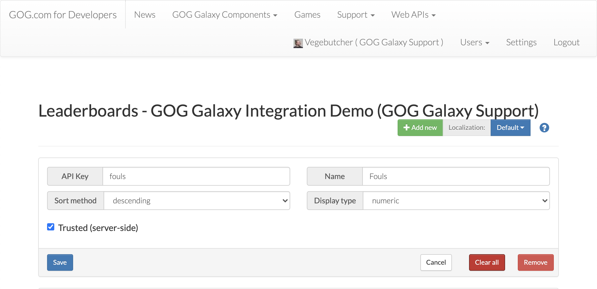
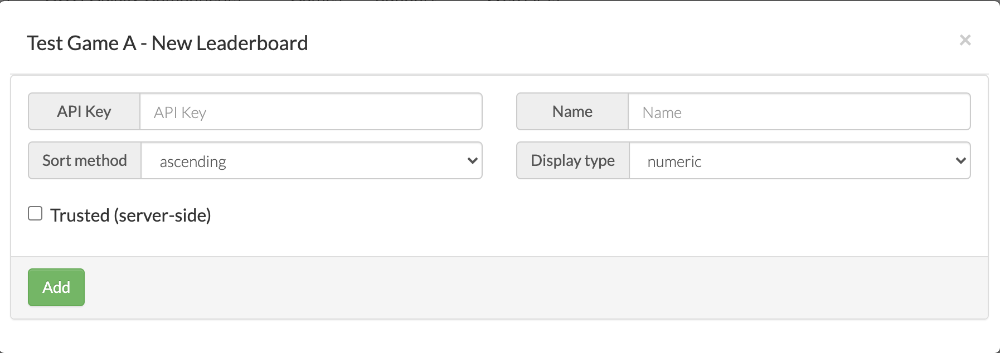
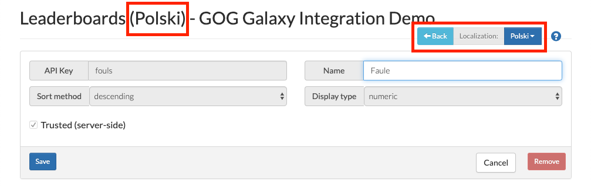

# Leaderboards Screen

This is the place in the Developer Portal for setting up and manage leaderboards implemented with the [GOG GALAXY SDK](sdk-leaderboards.md) in your game. You can add new statistics or edit/remove existing ones. It’s also possible to define different leaderboards names based on a chosen game language (localization).

## Adding a New Leaderboard

To add a new leaderboard:

1. Click the green *Add new* button.

2. In the resulting *New Leaderboard* window, fill in the following fields:
   
    
   
    - *API Key* — a unique key used in your game source code; please note that it shouldn’t contain any special characters except dots (.) and underscores (_)
    - *Name* — name of the leaderboard
    - *Sort method* — specifies whether a leaderboard will be sorted in ascending or descending order
    - *Display type* — specifies the type of a leaderboard score: it can be numeric or time-related (displayed in seconds or milliseconds).
   
3. Decide on whether the leaderboard should be *Trusted (server-side)* — if you check this box, the leaderboard can be updated only by requests coming from the game server.

4. Click the green *Add* button.

## Editing an Existing Leaderboard

Editing an existing leaderboard is similar to adding a new leaderboard, only without steps #1 and #4 and on the main *Leaderboards* screen.

## Clearing All Leaderboard Entries

The red *Clear All* button deletes all leaderboard entries permanently. Please use this with caution as the operation cannot be undone.

## Setting Localized Versions of Leaderboards

If you want to provide localized names for leaderboards in your game, you can do it here:

1. Click the blue button next to *Localization* (labelled *Default* by default 😉).

2. Select the desired language from a drop-down list of languages supported by GOG GALAXY. The page title will change to reflect the chosen language:

    

3. Enter the localized version of a name for a particular leaderboard (all other fields and options are unavailable for editing).

4. Make sure to click the blue *Save* button for each localized leaderboard.

5. If you want to create more localizations, just repeat the above steps. When you’re done, click the blue *Back* button at the top of the screen to return to the main *Leaderboards* screen.
