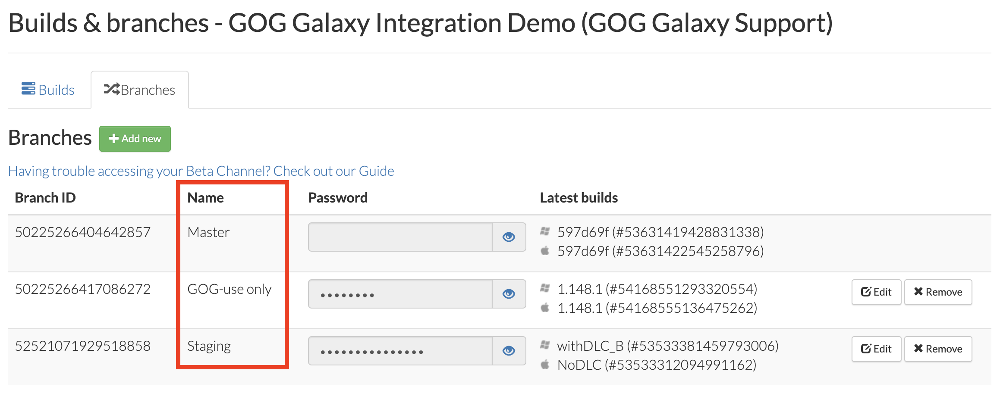
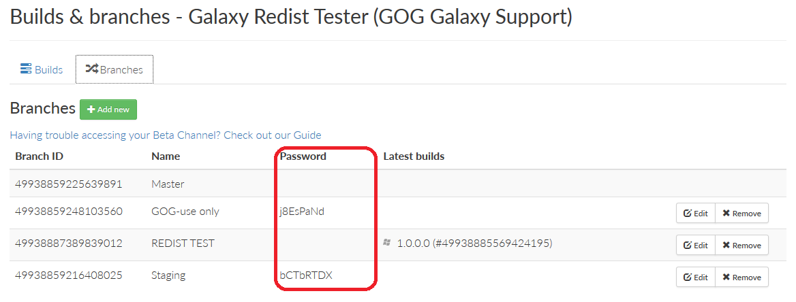
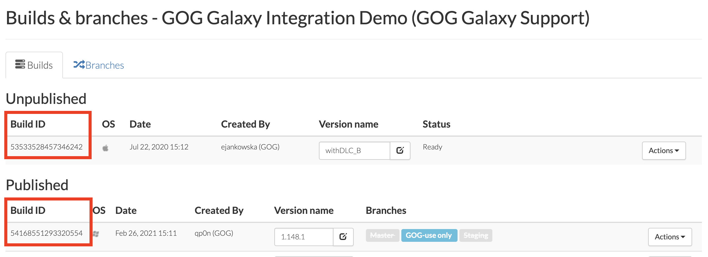

# Commands and Arguments

## General Syntax

### Windows

```
GOGGalaxyPipelineBuilder.exe <command> <required arguments> <optional arguments>
```

!!! Example
    ```
    GOGGalaxyPipelineBuilder.exe build-game project.json --output "game_repository"
    GOGGalaxyPipelineBuilder.exe --help
    ```

### macOS and Linux

```
./GOGGalaxyPipelineBuilder <command> <required arguments> <optional arguments>
```

!!! Example
    ```
    ./GOGGalaxyPipelineBuilder build-game project.json --output "game_repository"
    ./GOGGalaxyPipelineBuilder --help
    ```

### Optional Arguments

| Argument       | Description                                                  |
| -------------- | ------------------------------------------------------------ |
| `-h`, `--help` | Displays help: all commands and arguments available for the command preceding it |
| `--version`    | Displays GOG Pipeline Builder version                        |

## Arguments Values

While using some of the GOG GALAXY Pipeline Builder commands and arguments, you may be required to input values that can be found on the Developer Portal. Here we explain how and where to find them.

- **Branch name** can be found on the *Build & Branches* screen (click *Games* in the main menu of the [Developer Portal](https://devportal.gog.com/), then click the *Builds* button for a particular product and click *Branches* tab). Please refer to the image below:

    

- **Branch password** can be found on the same *Branches* tab as above. Please refer to the image below:

    

- **Build ID** can be found on the *Builds* tab of the same *Build & branches* screen. Please refer to the image below:

    