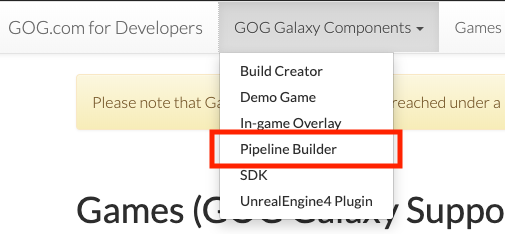
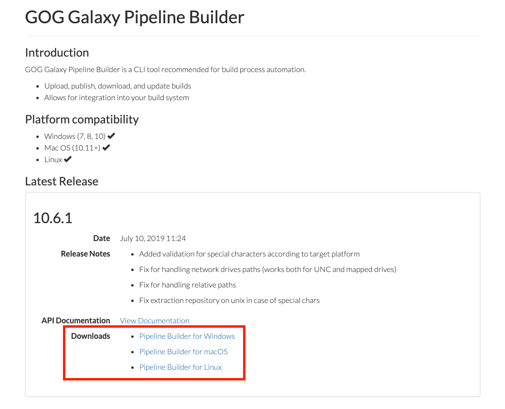

# Quick Start

GOG GALAXY Pipeline Builder is a command line (CLI) tool recommended for build process automation. It can be used to build and upload a game to the Developer Portal, as well as to download and extract repositories.

## Downloading and Installing GOG GALAXY Pipeline Builder

To download the GOG GALAXY Pipeline tools:

1. Log in to the [Developer Portal](https://devportal.gog.com/).

2. Click *GOG GALAXY Components* and select *Pipeline Builder* from the drop-down list:

    

3. In the *Download* section near the bottom of the opened GOG GALAXY Pipeline Builder page, you will find three links: for **Windows**, **macOS** and **Linux**. Click the link to download the right version.

    

    !!! Tip
        If you don’t see *Pipeline Builder* under *GOG GALAXY Components* menu in the **Developer Portal**, it means that you do not currently have access to the GOG GALAXY Pipeline. Please contact your Product Manager for more information.

4. After downloading the tool, you can use it in Command Line or Terminal (see below).

## Using GOG GALAXY Pipeline Builder

After you have downloaded GOG GALAXY Pipeline Builder, you can access it from Command Prompt in Windows, or Terminal in macOS/Linux:

- **Windows Command Prompt**

    To open Windows Command Prompt, press **Windows+R** keys, type `cmd` and confirm with **Enter**.
    
- **macOS Terminal**

    To open Terminal.app, press **⌘+Space** keys, type `terminal` and confirm with **Enter**.

- **Linux Terminal**

    To open Terminal, press **Super** key, type `terminal` and confirm with **Enter**.

Syntax for all commands in this document is presented as if they were executed from the GOG GALAXY Pipeline Builder directory. Therefore, please make sure to navigate to the GOG GALAXY Pipeline Builder folder before executing any commands. See the examples below:

- **Windows**

    Let’s say you have downloaded *GOGGalaxyPipelineBuilder.exe* to *C:\GalaxyPipeline\\*. To navigate to that directory, you’ll use the “change directory” command in the command prompt:

    ```
    cd C:\GalaxyPipeline\
    ```

- **macOS**

    Let’s say you have downloaded *GOGGalaxyPipelineBuilder* to *~/Downloads/*. To navigate to that directory, you’ll use the “change directory” command in Terminal:

    ```
    cd "~/Downloads/"
    ```

    It’s also good to add executable permissions:

    ```
    sudo chmod +x GOGGalaxyPipelineBuilder
    ```

- **Linux**

    Let’s say you have downloaded *GOGGalaxyPipelineBuilder* to *~/Downloads/*. To navigate to that directory, you’ll use the “change directory” command in Terminal:

    ```
    cd "~/Downloads/"
    ```

    It’s also good to add executable permissions:

    ```
    sudo chmod +x GOGGalaxyPipelineBuilder
    ```