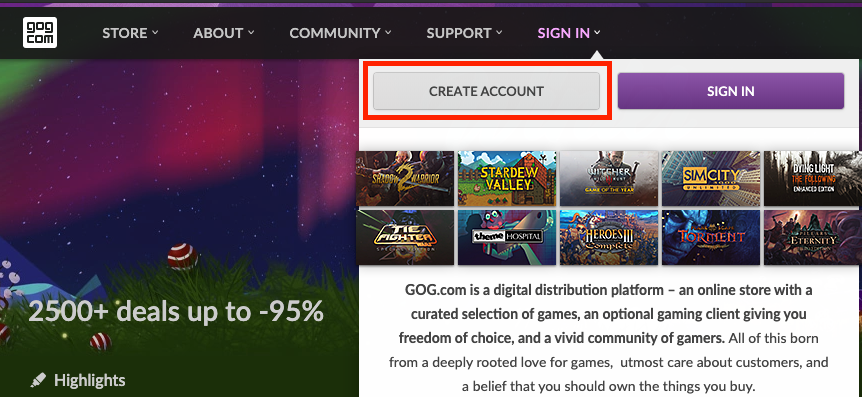
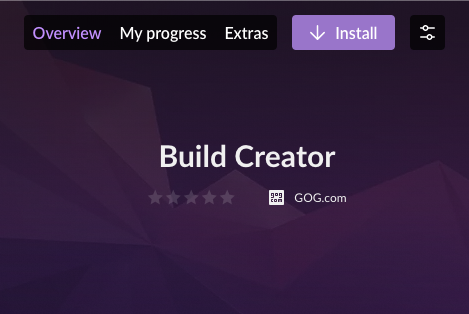
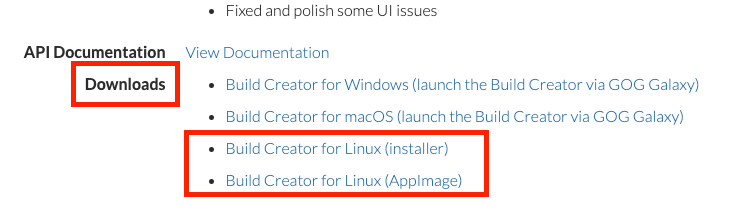

# Getting Started

To start your GOG journey, you need to have the following:

- GOG account
- GOG GALAXY client
- Access to the GOG Developer Portal
- Build Creator and/or Pipeline Builder
- GOG GALAXY SDK

## GOG Account

This is the easiest part: just go to [GOG.com](https://www.gog.com/), hover your mouse over *Sign In* in the top menu bar and then click *Create Account* button from the drop-down menu:



Fill in the fields in the resulting form, submit the data and voilà! — you have just created your GOG account.

## GOG GALAXY Client

Your next step is to download and install the [GOG GALAXY client](gc-client-overview.md) from the [GOG GALAXY homepage](https://www.gog.com/galaxy).

In order to add your own game to the GOG platform, you must obtain an account on our Developer Portal.

## Access to the GOG Developer Portal

If you are not signed with us yet then please  [submit your game for review](https://www.gog.com/indie). Otherwise, please ask your GOG BizDev contact or Product Manager for access to the GOG Developer Portal.

Once you are granted access to the GOG Developer Portal, you will receive an invitation e-mail. After opening the link from that e-mail, your GOG account will be linked to your Company account in the [GOG Developer Portal](https://devportal.gog.com/welcome).

### Game License

When you log in to the GOG Developer Portal, your GOG account will be granted licenses for all games and DLCs that are assigned to your account in the GOG Developer Portal. This works both retro- and proactively.

## Build Creator / Pipeline Builder

These tools are necessary to make builds of your games for our platform. The difference between the two is in their user interface: the former is based on GUI, the latter — on command line. Simply put, Build Creator is easier to use and better for single game releases, while Pipeline Builder is recommended for build process automation.

Pipeline Builder for Windows, macOS and Linux platforms is available for download from the [Developer Portal](https://devportal.gog.com/galaxy/components/pipeline).

In case of Build Creator, there are two paths depending on the target platform:

### Windows and macOS

1. With the granted access to the GOG Developer Portal, launch your GOG GALAXY client and log in to your GOG account there.

2. In the left pane, click *All games*. You should see a product named **Build Creator**, click it and you’ll be taken to the game card for this product. If you don’t see Build Creator, just start typing its name in the *Search* box at the top of the client window.

3. Click the purple *Install* button to download and install Build Creator.

   

### Linux

If you are using Linux, you can download GOG Build Creator from its [page on the GOG Developer Portal](https://devportal.gog.com/galaxy/components/build_creator) (look for the *Downloads* section at the bottom of the page). We provide two options to install the build creator on Linux:



- An installer for Ubuntu (version 16.04 and later), which can be found in *Downloads* section as a *Build Creator for Linux (installer)* link. This installer is the same as the ones we use to distribute games to our Linux users. Once the installer is downloaded, add the permission:
  
    ```
    chmod +x GOGGalaxyBuildCreator.sh
    ```
  
    then simply launch it and follow the instructions.
  
- If you are using any Linux distro other than Ubuntu, you can use the appimage, which can be found in *Downloads* section as a *Build Creator for Linux (AppImage)* link. Before starting the app image, you will need to add executable permission to the file:
  
    ```
    chmod +x GOGGalaxyBuildCreator.AppImage
    ```
  
  For more info on how to work with app images, please refer to the [*Running AppImages*](https://docs.appimage.org/user-guide/run-appimages.html) document.

## GOG GALAXY SDK

That’s it! You don’t need any additional steps to offer your game on GOG.com — if you don’t want to offer any online functionalities to your players. However, by embracing the GOG GALAXY SDK, you can enrich your game experience with the following online features:

- [Statistics and Achievements](sdk-stats-and-achievements.md)
- [Leaderboards](sdk-leaderboards.md)
- [Multiplayer](sdk-multiplayer.md) (with P2P packets and lobby messaging)
- [Friends lists and game invites](sdk-friends.md)
- [Chat](sdk-chat.md)
- [Crossplay](sdk-crossplay.md)
- [Storage](sdk-storage.md)

The GOG GALAXY SDK also allows to [discover DLCs](sdk-dlc-discovery.md) or [retrieve the language](https://docs.gog.com/galaxyapi/classgalaxy_1_1api_1_1IApps.html#a3f9c65577ba3ce08f9addb81245fa305) of the game or DLC.

For more information, please refer to the [GOG GALAXY SDK chapter](sdk.md).