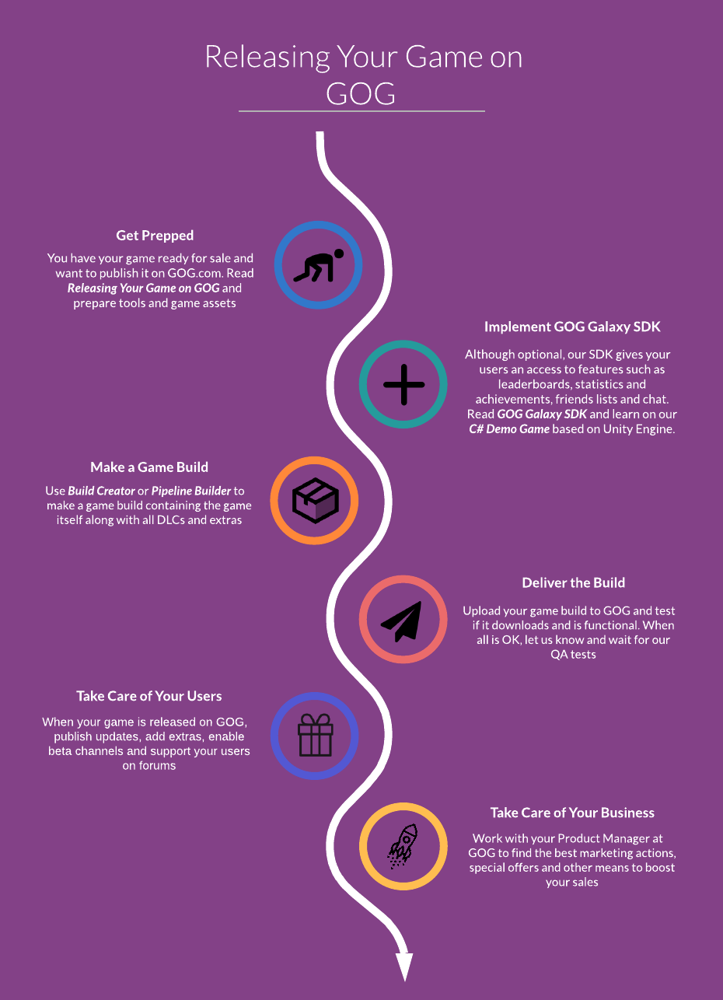

# Game Release Flow

There are four major steps necessary to release your game and two more to make your released game a successful one:

1. [Get prepped](basic-game-assets.md)
2. Implement the [GOG GALAXY SDK](sdk.md) by learning on our [C# Demo Game](demo-desc-and-prerequisities.md)
3. Make a game build using [Build Creator](bc-quick-start.md) or [Pipeline Builder](pb-quick-start.md)
4. Deliver and test the build
5. Take care of your users
6. Take care of your business