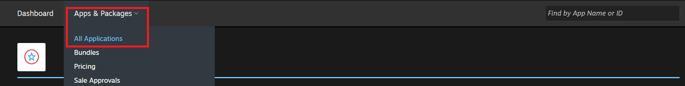
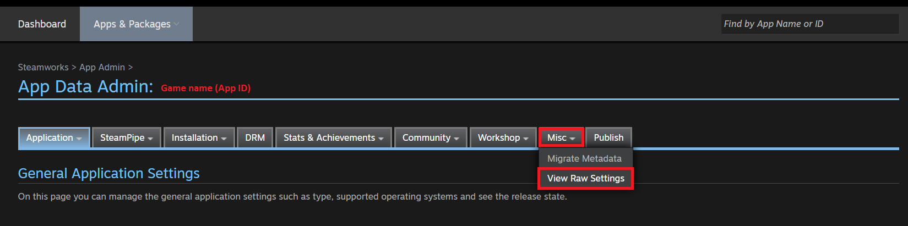
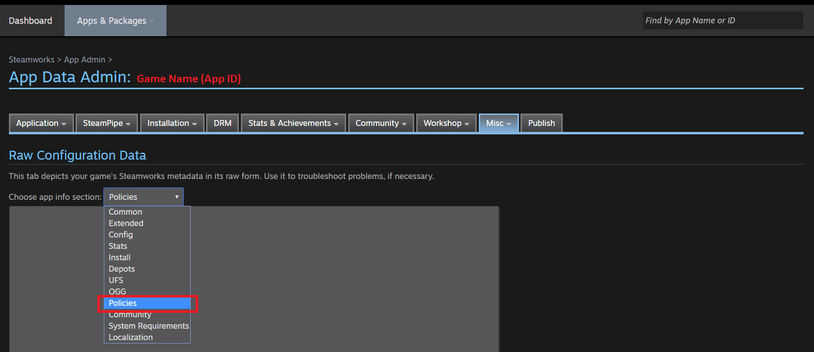
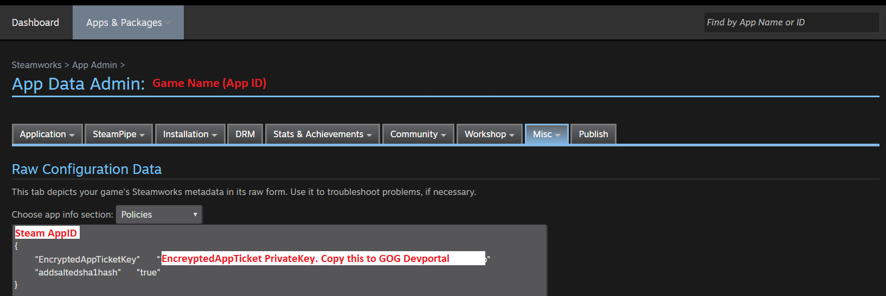
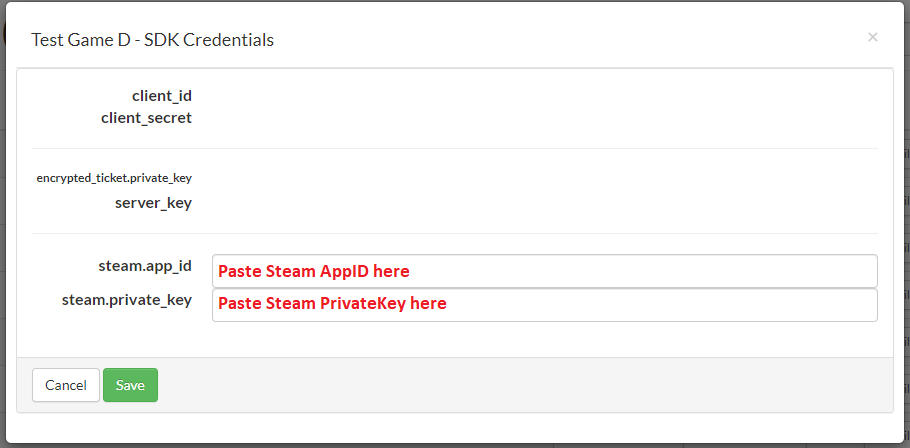

# User Authentication Based On Other Services

It is possible to authenticate users in GOG GALAXY using credentials for your game obtained in other services such as Steam, XBOX, PlayStation, etc.

A successful authorization of external services ends the same way as normal GOG authorization by calling [`IAuthListener::OnAuthSuccess`](https://docs.gog.com/galaxyapi/classgalaxy_1_1api_1_1IAuthListener.html#aa824226d05ff7e738df8e8bef62dbf69). After that, you will be able to use the GOG GALAXY SDK crossplay features such as:

- [`IUser`](https://docs.gog.com/galaxyapi/classgalaxy_1_1api_1_1IUser.html)
- [`IMatchmaking`](https://docs.gog.com/galaxyapi/classgalaxy_1_1api_1_1IMatchmaking.html), [`INetworking`](https://docs.gog.com/galaxyapi/classgalaxy_1_1api_1_1INetworking.html)
- [`IUtils`](https://docs.gog.com/galaxyapi/classgalaxy_1_1api_1_1IUtils.html) (except for the Overlay related features)

Some interfaces might not be working fully, since they rely on the GOG GALAXY desktop application.

## Steam

### Obtaining Steam Credentials

First, you need to obtain `PrivateKey` for  `EncryptedAppTicket` and `AppID`  of your game in Steam and store it in the GOG Developer Portal:

1. Log in to your [Steam Partner account](https://partner.steamgames.com/).

2. In the *Apps & Packages* drop-down menu, select *All Applications*:

    

3. In the resulting list of your applications, select the *App Admin* option for your game.

4. On the *App Data Admin* page for your game, select *View Raw Settings* from the *Misc* drop-down menu:

    

5. In the *Raw Configuration Data* section, you’ll see an option to *Choose App info section*. Select *Policies* from its drop-down list:

    

6. You will see the Steam `AppID` of your game. Copy both the `AppID` and the value next to the `EncryptedAppTicketKey` entry — it’s the `PrivateKey` of your application:

    

7. Now, log in to your account in the [GOG Developer Portal](https://devportal.gog.com).

8. Click *Games* in the main menu and in the resulting list of your games, click the [*SDK Credentials*](developer-portal.md#games-screen-product-buttons) button for your desired game:

    

9. Paste both Steam `AppID` and `PrivateKey` copied from the Steam’s administration panel into the appropriate fields of the SDK Credentials page:

    

### Authorization

Assuming the Steam Client is running and authenticated, and Steamworks SDK is initialized successfully in your game:

1. Request Steam `EncryptedAppTicket`:

    `SteamUser()->RequestEncryptedAppTicket(nullptr, 0)`

2. Once `EncryptedAppTicketResponse_t` is ready for the request, retrieve the `EncryptedAppTicket` and `UserName`:

    ```c++
    std::array<uint8, 1024> rgubTicket;
    uint32 cubTicket;
    if ( ! SteamUser()->GetEncryptedAppTicket(rgubTicket.data(), rgubTicket.size(), &cubTicket))
    {
        std::cerr << "Failed to get encrypted app ticket" << std::endl;
        return;
    }
    const auto* userName = SteamFriends()->GetPersonaName();
    ```

3. Having both `EncryptedAppTicket` and `UserName`, you are ready to authenticate in the GOG GALAXY SDK by calling [`SignInSteam`](https://docs.gog.com/galaxyapi/classgalaxy_1_1api_1_1IUser.html#a7b0ceddf3546891964e8449a554b4f86) method:

    ```c++
    galaxy::api::User()->SignInSteam(rgubTicket.data(), cubTicket, userName);
    ```


## PlayStation 4

### Backend Configuration

In order to integrate a PS4 account with the GOG GALAXY SDK, you should configure the PSN backend:

1. Create a separate product of *App Server/Website* for a *Title*. This product should be bound together with the Game (*App*) product, using PSSDC service.
2. Having the product configured, you need to request GOG to bind the created product with the GOG GALAXY **ClientID**. You can achieve this by sending a request to your GOG Product Manager with a generated *clientID* and *clientSecret* of a newly created *App Server/Website* product. After that, the backend setup is complete.

!!! Info
    The *clientID* should be in the following format (the same ID should be passed to the [`SignInPS4`](https://docs.gog.com/galaxyapi/classgalaxy_1_1api_1_1IUser.html#a820d822d8e344fdecf8870cc644c7742) method from the next paragraph):
    
    `xxxxxxxx-xxxx-xxxx-xxxx-xxxxxxxxxxxx`
    
    The *clientSecret* should be in the following format:
    
    `xxxxxxxxxxxxxxxx`

### Authorization

The PS4 integration is done the same way as with other platforms, which means that for each PSN user that will try to sign in, GOG will create a connected GOG account.

To pass the PS4 credentials to the GOG GALAXY SDK, please use the [`SignInPS4`](https://docs.gog.com/galaxyapi/classgalaxy_1_1api_1_1IUser.html#a820d822d8e344fdecf8870cc644c7742) method from the [`IUser`](https://docs.gog.com/galaxyapi/classgalaxy_1_1api_1_1IUser.html) interface.

### PlayStation Certification

When applying for a PS certification, bear in mind these rules:

- The code should be compiled with the `-fPIC -fstack-protector-all -fstack-protector-strong` flags.
- The multiplayer feature has to be limited not to use P2P connections — all the game traffic will be routed via GOG GALAXY servers.


## Xbox One / Xbox Live

### Configuring Xbox Live Service

1. Generate a Business Partner Certificate and a Relying Party Certificate (please consult Xbox Developer support on how to do that).

2. Log in to Xbox Developer Portal.

3. In the Web Services section, create a new WebService.

4. For this WebService, setup a Business Partner Certificate by adding an endpoint with the following parameters:
    - **Host Type:** FQDN

    - **Protocol:** https

    - **Host Name:** auth.gog.com

    - **Port:** (leave empty)

    - **Path:** token

      (The above fields should result in `https://auth.gog.com/token` address)

    - **Check** the *Requires Single Sign On Token* option

    - **Token Type:** JWT

    - **Token definition → Click** *Add New*

    - Use *RP_Cert.cer* from Relying Party Certificate as the **Encryption Certificate**

    - Make sure that the **delegation token claim** is added

5. Send a request to your GOG Product Manager with the following information allowing us to bind your game with our ClientID:

    - generated Relying Party Certificate

    - generated Business Partner Certificate

    - title_id

    - title_product_id

    - SCID

6. In case of Xbox Live, you need to obtain an Xbox Secure Token Service (XSTS) token by following [these instructions](https://docs.microsoft.com/en-us/gaming/xbox-live/features/custom-services/single-sign-on/live-single-sign-on).

After that, the backend setup is complete.

### Implementation in Your Game Code

#### XboxOne

You have to put the following entry in the *Package.appxmanifest* file in the *Applications/Application/Extensions* section.

`RequireXboxLive` states if the game is allowed to run in the offline mode:

```
<mx:Extension Category="xbox.live">
    <mx:XboxLive TitleId="<title_id>" PrimaryServiceConfigId="<SCID>" RequireXboxLive="false" />
<mx:Extension>
```

The data (`title_id` and `SCID`) can be found in XDP on the *Product Instance* page.

In addition, the following capability has to be added in the *Package.appxmanifest* document root (same level as Applications):

```
<Capabilities>
  <Capability Name="internetClientServer" />
</Capabilities>
```

Inside the game code itself, you should use the [`SignInXB1()`](https://docs.gog.com/galaxyapi/classgalaxy_1_1api_1_1IUser.html#a4d4843b5d3fb3376f793720df512194e) authorization method of the [`IUser`](https://docs.gog.com/galaxyapi/classgalaxy_1_1api_1_1IUser.html) interface, where the `xboxOneUserID` parameter is an index of the signed in Xbox Live user on a console (as it is possible to have multiple Xbox Live users signed in).

Here you can find an example of finding the first signed in Xbox user:

```c++
Windows::Xbox::System::User^ loggedInUser = nullptr;
for (int i = 0; i < Windows::Xbox::System::User::Users->Size; ++i, loggedInUser = nullptr)
{
    loggedInUser = Windows::Xbox::System::User::Users->GetAt(i);
    if (loggedInUser->IsSignedIn)
        break;
}
 
if (!loggedInUser)
{
    Logger::Log("SignInXB1: there is no logged in user");
    return false;
}
galaxy::api::User()->SignInXB1(loggedInUser->Id);
```

#### Xbox Live

```c++
/**
 * Initializes the Galaxy Peer based on XBOX LIVE tokens.
 *
 * This call is asynchronous. Responses come to the IAuthListener
 * (for all GlobalAuthListener-derived and optional listener passed as argument).
 *
 * @remark Information about being signed in or signed out also comes to
 * the IOperationalStateChangeListener.
 *
 * @param [in] token - The XSTS token.
 * @param [in] signature - The digital signature for the HTTP request.
 * @param [in] marketplaceID - The Marketplace ID.
 * @param [in] locale - The user locale (e.g.: EN-US, FR-FR).
 * @param [in] listener - The listener for specific operation.
 */
virtual void SignInXBLive(const char* token, const char* signature, const char* marketplaceID, const char* locale, IAuthListener* const listener = NULL) = 0;
```

