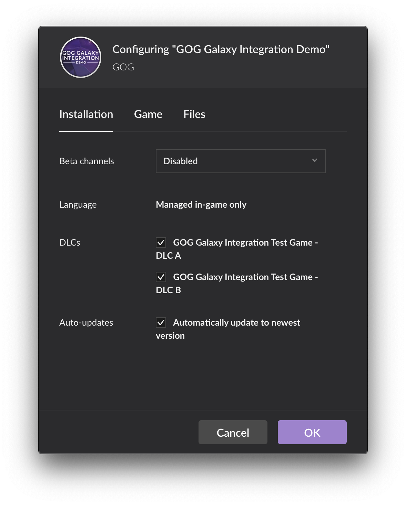

# DLC Discovery

DLC Discovery is a GOG GALAXY SDK method that you can use to verify that a downloadable content pack (DLC) has been installed correctly. This method, when added to your code, checks for the presence of a metadata file that is generated when a user (that owns the DLC) installs the DLC via the GOG GALAXY client, or via the offline installers provided on the GOG.com website.

!!! Tip "DLCs in Builds for Linux"
    The GOG GALAXY SDK is not available on Linux, so this solution can’t be used on Linux operating systems. If needed, you can add the DLC and required files to the game project: the best way to do so is to create a dummy .txt file (one for each DLC) and connect it to the game bin (if the file is present, a user has an access to the DLC content), then add these files as DLC depots in [Build Creator](bc-quick-start.md).
    
    The other way is to add code to the bin file that checks for the presence of the file named *goggame-<dlcID\>.info*, which is always automatically generated by our installer. With this method, you don’t need to add anything to the DLC depot.

To begin using this feature, please follow these steps:

## Contact Your Product Manager

Contact your assigned GOG Product Manager to notify them that you wish to add a DLC to the game. They will then generate a Product ID for the DLC and will add the DLC to your game in the Developer Portal. The DLC license will be automatically added to your GOG account. You can find out more about this feature in [*Game Licenses (Keys)*](game-licenses.md).

## Implement the GOG GALAXY SDK in Your Game Code

Include the [`galaxy::api::IsDlcInstalled()`](https://docs.gog.com/galaxyapi/classgalaxy_1_1api_1_1IApps.html#a46fbdec6ec2e1b6d1a1625ba157d3aa2) method into your game code, supplying the Product ID of the DLC as a parameter.

!!! Important
    While testing the `IsDlcInstalled()` method, please make sure that the mini-manifest file named *goggame-<dlcID\>.info* for the DLC is present in the root folder of the game. If the mini-manifest file is not present, please build your game first using GOG GALAXY Build Creator or GOG GALAXY Pipeline Builder.

Below is an example of how the code could be implemented (please note that `client_id` and `client_secret` have sample values; make sure to use your real data here):

```c++
const char* client_id = "012345678901";
const char* client_secret = "1a2bcde34f56ghijk789lm10111213nopqrs14u15vwxy16z0";
bool dlc_present = false;
galaxy::api::Init(InitOptions{client_id, client_secret});
galaxy::api::ProductID dlc_prod_id = 0123456789;
if (galaxy::api::Apps()->IsDlcInstalled(dlc_prod_id)) dlc_present = true;
```

Now you can use the  `dlc_present` variable to handle game logic:

```c++
galaxy::api::User()->SignInGalaxy();
```

As we can see from the example above, the `galaxy::api::IsDlcInstalled()` method is called after `galaxy::api::Init()` as `Init()` is required to be called before all GOG GALAXY methods.

!!! Important
    The `IsDlcInstalled()` call is NOT dependent on the operational state of the GOG GALAXY SDK, provided the `galaxy::api::Init()` call has been made beforehand.

We recommend calling the `galaxy::api::IsDlcInstalled()` method before `galaxy::api::User()->SignInGalaxy()`, as this ensures that the `IsDlcInstalled` method is not dependent on the user status. Since the GOG GALAXY client is optional, the DLC discovery method cannot be dependent on the presence of the GOG GALAXY client or the result of the `galaxy::api::Init()` call, as described in the article on [authorization in GOG GALAXY](sdk-galaxy-feats-and-states.md).

## Upload Your Builds

Upload your new game build with the DLC Discovery feature implemented to GOG.com. The process depends on the tool you are using to make your build.

### Using Build Creator

1. Import the [.json file](bc-import-project.md) associated with your game to Build Creator.
2. Update the project to include the new DLC.
3. Upload the entire project using the [Build function](bc-build-game.md).
1. Once your upload has finished, please publish to the *Staging* beta branch, or another [Beta branch](bc-branches.md) of your choosing for testing.
2. Install the build using the GOG GALAXY client.
3. Make sure that the DLC content has been enabled for your game: this can be done using *Settings→Manage Installation→Configure…* menu for your game in the GOG GALAXY client.
   
4. In the root folder of the game, a mini-manifest file named *goggame-<dlcID\>.info* should be present, thus unlocking the DLC content for your game.
8. You can now test that the DLC is available and functional in the game that you installed using the GOG GALAXY client. We highly recommend running several test scenarios to ensure that the DLC discovery feature is working as intended, e.g. testing for unlock when the GOG GALAXY client is not present on the user’s system, or when the user is logged out of the GOG GALAXY client.

### Using Pipeline Builder

1. Update the .json file associated with your game to include the new DLC.
2. Once the .json has been updated and the files are ready, please upload the entire game, including DLC, to the GOG content system using Content System Builder.
3. Once your upload has finished, please publish to the *Staging* beta branch, or another [Beta branch](bc-branches.md) of your choosing for testing.
4. Install the build using the GOG GALAXY client.
5. Please ensure that the DLC content has been enabled for your gamethis can be done using *Settings→Manage Installation→Configure…* menu for your game in the GOG GALAXY client (*see the screenshot above*).
6. In the root folder of the game, a mini-manifest file named *goggame-<dlcID>.info* should be present, thus unlocking the DLC content for your game.
7. You can now test that the DLC is available and functional in the game that you installed using the GOG GALAXY client. We highly recommend running several test scenarios to ensure that the DLC discovery feature is working as intended, e.g. testing for unlock when the GOG GALAXY client is not present on the user’s system, or when the user is logged out of the GOG GALAXY client.

## Notes

The DLC metadata file — a so-called *mini-manifest* — is generated, when the game is uploaded to our content system using one of our tools: Build Creator or Pipeline Builder. Mini-manifests are downloaded to end-users’ machines only in two cases:

- when a user that owns the DLC in their GOG account installs and updates it using the GOG GALAXY client, or
- when a user downloads and runs an offline installer for the DLC.

Therefore, provided everything has been set up correctly in your game, it is safe for you to upload a build and publish to any **not public** branches before the DLC release.

!!! Attention
    DLC released as pre-order for an already released game will be accessible for download if published to Master branch before release date.

As with all features of the GOG GALAXY SDK, we are more than happy to conduct implementation tests for the integration of your game. Simply send an email to your GOG Product Manager, letting them know where they can access the build. They will confirm with you that testing has begun, and will follow up afterwards to confirm the results of the tests.

!!! Attention
    We once again wish to stress that this DLC Discovery feature is purely to check for the presence of the DLC metadata file; it should not be dependent on the results of the `galaxy::api::Init()` or `galaxy::api::User()->SignInGalaxy()` calls.

If you encounter any issues with this process, or have any feedback or questions, please contact [our support team](https://devportal.gog.com/support/contact)
