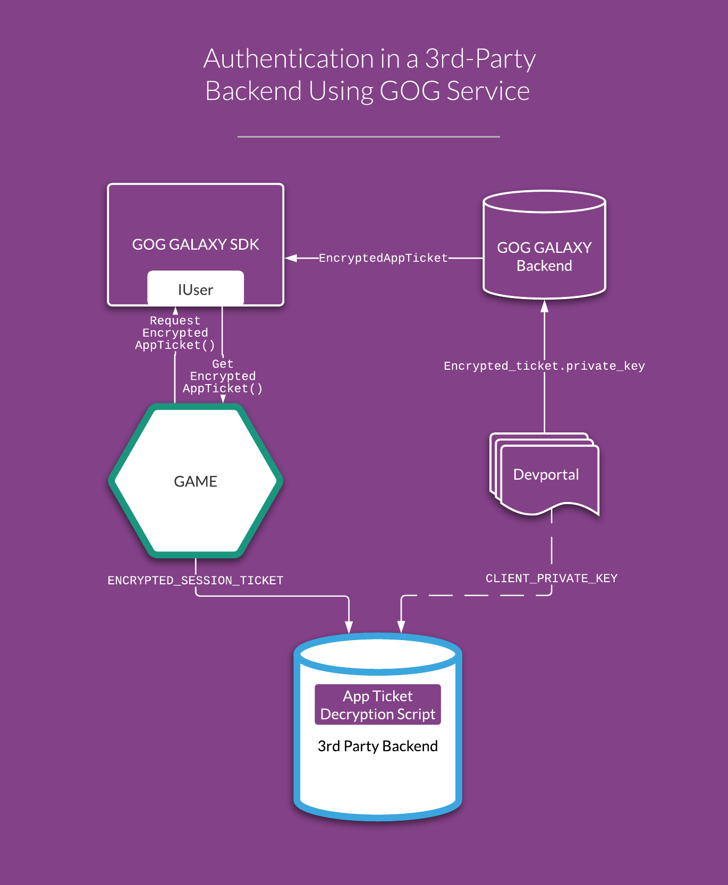
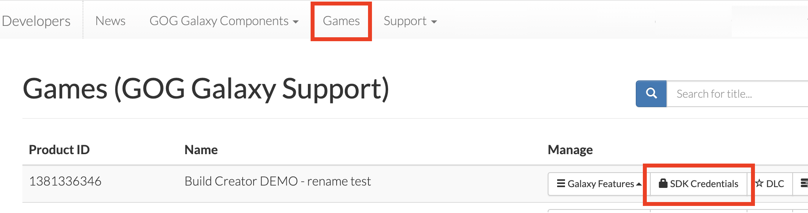
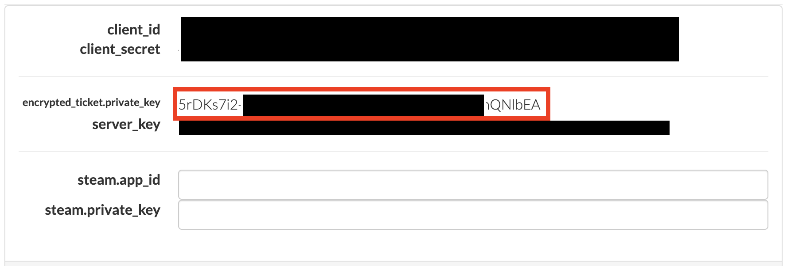

# Authorizing GOG GALAXY Users in Third-Party Services

The GOG GALAXY SDK provides access to Encrypted App Tickets, which can be used by a game for seamless GOG user authorization in any third-party backend.

Encrypted App Tickets are created and encrypted in the GOG GALAXY backend using a shared Private Key. The game can request the ticket for the current user, and the ticket can be passed to any third-party backend that also knows the Private Key and will be able to decrypt the data and thus confirm the user’s identity and their license for the game. The whole process is shown on the following picture:



## Retrieving the Encrypted App Ticket

1. Request the ticket using the [`IUser::RequestEncryptedAppTicket()`](https://docs.gog.com/galaxyapi/classgalaxy_1_1api_1_1IUser.html#a29f307e31066fc39b93802e363ea2064) method of the GOG GALAXY SDK and provide any additional elements in its `data` parameter. By default, the following data is enclosed in the ticket:
    - `user_id`

    - `client_id`

    - timestamp of ticket generation.

2. The response to this call comes to [`IEncryptedAppTicketListener`](https://docs.gog.com/galaxyapi/classgalaxy_1_1api_1_1IEncryptedAppTicketListener.html).
3. If the request was successful ([`OnEncryptedAppTicketRetrieveSuccess()`](https://docs.gog.com/galaxyapi/classgalaxy_1_1api_1_1IEncryptedAppTicketListener.html#ae5ad1ca3940e9df9ebc21e25799aa084)), you can retrieve the ticket with the [`IUser::GetEncryptedAppTicket() `](https://docs.gog.com/galaxyapi/classgalaxy_1_1api_1_1IUser.html#a96af6792efc260e75daebedca2cf74c6) method.

## Using the Ticket in a Third-Party Backend

App Tickets are encrypted using [AES (Rijndael)](https://en.wikipedia.org/wiki/Advanced_Encryption_Standard) with a 128-bit block size, 256-bit encryption key in the CBC mode.

In order to use the ticket, first you will need to transfer `encrypted_ticket.private_key` for your game to your backend service:

1. Go to the [GOG Developer Portal](https://devportal.gog.com).

2. Click *Games* in the main menu.

3. In the resulting list of your games, click the *SDK Credentials* button for your desired game:

    

4. A pop-up window appears with the SDK Credentials. Copy the value of the third entry (`encrypted_ticket.private_key`):

    

5. Use this value for the `CLIENT_PRIVATE_KEY` variable in either of the scripts.

The following scripts are sample implementations of decoding EncryptedAppTickets in a third-party backend.

=== "PHP"

    In our [GitHub repository](https://github.com/gogcom/galaxy-session-tickets-php) you will find a simple PHP library which decodes encrypted tickets. The script below makes use of this library in a PHP-based backend.
    
    ``` php
    <?php
    
    require_once('vendor/autoload.php');
    
    $mcryptPlaintext = \GOG\SessionTickets\MCryptSessionTicketDecoder::decode(
        \GOG\SessionTickets\ExampleData::ENCRYPTED_SESSION_TICKET,
        \GOG\SessionTickets\ExampleData::CLIENT_PRIVATE_KEY
    );
    
    $openSSLplaintext = \GOG\SessionTickets\OpenSSLSessionTicketDecoder::decode(
        \GOG\SessionTickets\ExampleData::ENCRYPTED_SESSION_TICKET,
        \GOG\SessionTickets\ExampleData::CLIENT_PRIVATE_KEY
    );
    
    if ($openSSLplaintext === $mcryptPlaintext && $mcryptPlaintext === \GOG\SessionTickets\ExampleData::PLAINTEXT_SESSION_TICKET) {
        echo $openSSLplaintext."\n";
    } else {
        throw new \Exception('Encrypted Session Ticket decryption failed');
    }
    ```

=== "Python"

    ``` python
    from Crypto.Cipher import AES
    import base64
    
    ENCRYPTED_SESSION_TICKET = "galaxy::api::User()->GetEncryptedAppTicket()"
    CLIENT_PRIVATE_KEY =   # enter encrypted_ticket.private_key here
    
    encrypted_ticket = base64.urlsafe_b64decode(ENCRYPTED_SESSION_TICKET)  # both app ticket and private key
    clientPrivateKey = base64.urlsafe_b64decode(CLIENT_PRIVATE_KEY)        # are UrlSafe Base64 encoded, so there's no need to encode them again
    
    IV = encrypted_ticket[:16]  # IV is the first 16 bytes of the ticket
    cipher = AES.new(clientPrivateKey, AES.MODE_CBC, IV)
    
    encrypted_data = encrypted_ticket[16:]  # encrypted_data is the rest of the encrypted_ticket
    print(cipher.decrypt(encrypted_data))
    ```