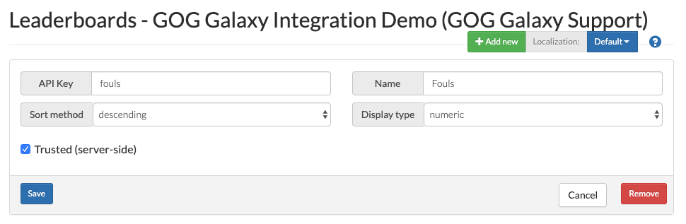

# Leaderboards

## Creating a Leaderboard

The GOG GALAXY SDK allows you to handle leaderboards in 2 ways:

- **Predefined leaderboards** — defined in the Developer Portal first, then retrieved with the [`FindLeaderboard()`](https://docs.gog.com/galaxyapi/classgalaxy_1_1api_1_1IStats.html#ace79a09f5cc55acdc502b9251cdb0898) method.

- **Created at runtime** — to create a leaderboard during the game runtime, you can call the [`FindOrCreateLeaderboard()`](https://docs.gog.com/galaxyapi/classgalaxy_1_1api_1_1IStats.html#a1854172caa8de815218a0c44e2d04d8c) method. It performs a request for a definition of a specified leaderboard, and creates the leaderboard if it does not exist yet. It might be useful if you want to create e.g. daily/weekly leaderboards.

## Setting a User’s Leaderboard Score

In order to set a user’s score for a particular leaderboard, you need to call the following methods:

1. [`RequestLeaderboards()`](https://docs.gog.com/galaxyapi/classgalaxy_1_1api_1_1IStats.html#a7290943ee81882d006239f103d523a1d) — downloads leaderboards definitions; you have to call it before making any other calls related to leaderboards. Please keep in mind that this call is asynchronous, and you should wait for the callback on [`LeaderboardsRetrieveListener`](https://docs.gog.com/galaxyapi/classgalaxy_1_1api_1_1ILeaderboardsRetrieveListener.html).
2. [`SetLeaderboardScore()`](https://docs.gog.com/galaxyapi/classgalaxy_1_1api_1_1IStats.html#a95d5043fc61c941d882f0773225ace35) or [`SetLeaderboardScoreWithDetails()`](https://docs.gog.com/galaxyapi/classgalaxy_1_1api_1_1IStats.html#a089a1c895fce4fe49a3be6b341edc15c) — these methods allow you to set a score for a particular leaderboard for the current user.

Please keep in mind that these calls are asynchronous, so remember to initialize adequate listeners ([`LeaderboardsRetrieveListener`](https://docs.gog.com/galaxyapi/classgalaxy_1_1api_1_1ILeaderboardsRetrieveListener.html) and [`LeaderboardScoreUpdateListener`](https://docs.gog.com/galaxyapi/classgalaxy_1_1api_1_1ILeaderboardScoreUpdateListener.html)) and wait for callbacks after calling these methods.

In order to reset leaderboards, you have to delete and create them anew. This can be done in the Developer Portal.

!!! Important
    Please note that there is no possibility to reset the leaderboards using the GOG GALAXY SDK call.

## Setting a Leaderboard Score Does Not Work — What Should I Do?

- Have you called [`RequestLeaderboards()`](https://docs.gog.com/galaxyapi/classgalaxy_1_1api_1_1IStats.html#a7290943ee81882d006239f103d523a1d) and waited for a callback to its listener before calling any other leaderboard methods?
- Are you calling [`ProcessData()`](https://docs.gog.com/galaxyapi/group__Peer.html#ga1e437567d7fb43c9845809b22c567ca7) frequently enough?
- Have you set up appropriate listeners properly?
- Have you set up error handling? It is possible to catch errors within the GOG GALAXY SDK methods or use the [`GetError()`](https://docs.gog.com/galaxyapi/group__api.html#ga11169dd939f560d09704770a1ba4612b) method to check if any errors occurred.

## Requesting Leaderboard Entries

To retrieve leaderboard entries, for example to display them in game, you may use one of following methods:

| Method                                                       | Function                                                     |
| ------------------------------------------------------------ | ------------------------------------------------------------ |
| [`RequestLeaderboardEntriesAroundUser()`](https://docs.gog.com/galaxyapi/classgalaxy_1_1api_1_1IStats.html#a1215ca0927c038ed5380d23d1825d92d) | Performs a request for entries of a specified leaderboard for and near the specified user. The start and the end of the range of entries are passed as arguments. |
| [`RequestLeaderboardEntriesForUsers()`](https://docs.gog.com/galaxyapi/classgalaxy_1_1api_1_1IStats.html#ac06a171edf21bb4b2b1b73db0d3ba994) | Performs a request for entries of a specified leaderboard for specific users |
| [`RequestLeaderboardEntriesGlobal()`](https://docs.gog.com/galaxyapi/classgalaxy_1_1api_1_1IStats.html#a8001acf6133977206aae970b04e82433) | Performs a request for entries of a specified leaderboard in a global scope, i.e. without specifying users |

Please remember that all these calls are asynchronous and responses indicating their success or failure will come to [`LeaderboardsRetrieveListener`](https://docs.gog.com/galaxyapi/classgalaxy_1_1api_1_1ILeaderboardsRetrieveListener.html).

For more detailed information about Leaderboards and their related GOG GALAXY SDK methods, please visit the [GOG GALAXY SDK API documentation](https://devportal.gog.com/galaxy/components/sdk/latest_documentation).